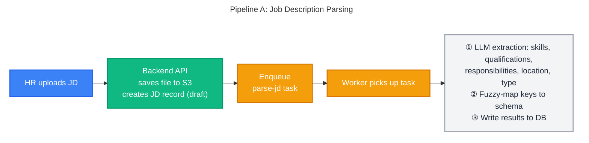
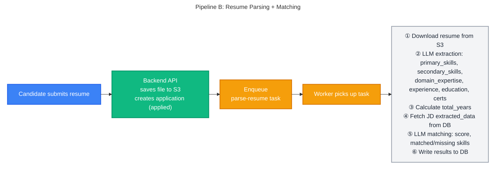
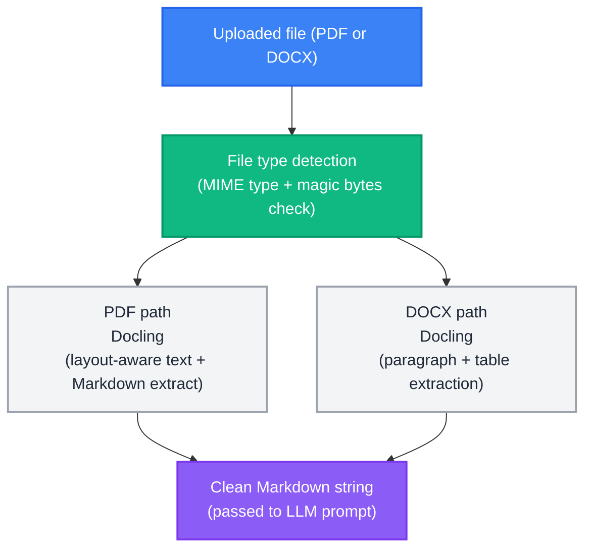
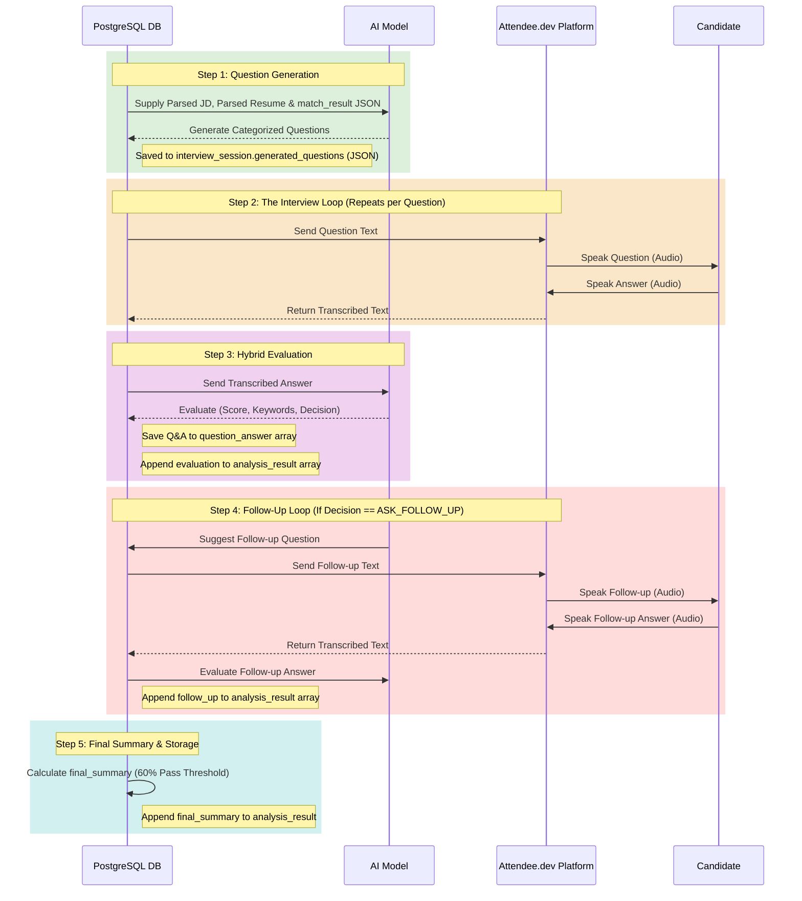

# AI Processing Pipeline - AI-Powered Recruitment Platform

> **Source of Truth**: This document is the authoritative reference for AI pipeline architecture, prompt engineering, extraction schemas, matching/scoring logic, and document parsing.
>
> For the overall system architecture and workflow diagrams, see [SYSTEM_DESIGN.md](../architecture/SYSTEM_DESIGN.md) §7 Workflows.
> For JSONB schema definitions stored in the database, see [DB_DESIGN.md](../architecture/DB_DESIGN.md) §5.

---

## Table of Contents

1. [Pipeline Overview](#1-pipeline-overview)
2. [AI Prompt Engineering](#2-ai-prompt-engineering)
3. [Matching Score Formula](#3-matching-score-formula)
4. [Document Parsing](#4-document-parsing)
5. [AI Interview Screening Pipeline](#5-ai-interview-screening-pipeline)

> **Related**: For full prompt evaluation results, JD/Resume test profiles, and all 8 parsed JSON match outputs, see [PROMPT_EVALUATION_REPORT.md](../PROMPT_EVALUATION_REPORT.md).

---

## 1. Pipeline Overview

There are two AI pipelines for Phase 1. Both follow the same pattern: **API enqueues task → broker delivers → worker processes → worker writes results to DB**.





---

## 2. AI Prompt Engineering

The system uses three sequential LLM prompts. Each prompt is designed to return **strict JSON only**, stored directly as JSONB in the database. No markdown, code fences, or explanatory text is permitted in the response.

---

### A. Resume Parsing Prompt

**Input**: Raw resume text extracted from PDF/DOCX via Docling.

```text
You are an expert resume parser specializing in tech and business resumes.
Your task is to meticulously extract specific information and return it as a valid JSON object.

Rules:
- STRICTLY adhere to the JSON schema.
- If information is not explicitly present, set the value to null or an empty list (e.g., []).
  Do NOT guess.
- Primary skills are core, hard skills (e.g., programming languages, specific frameworks).
  Secondary skills are softer skills or less central technologies.
- Domain expertise should be a list of industries or business areas
  (e.g., 'Finance', 'E-commerce', 'Logistics').
- Skills should be concise keywords/tokens, not full sentences.
  Deduplicate and normalize them.
- CRITICAL: For each work experience role, you MUST find and provide the "start_date" and
  "end_date". If the end date is ongoing, use "present".
- Output ONLY the JSON object. Do NOT include any markdown, code fences, or explanatory
  text before or after the JSON.

Schema:
{
  "primary_skills": ["string"],
  "secondary_skills": ["string"],
  "domain_expertise": ["string"],
  "relevant_experience": {
    "total_years": "number or null",
    "roles": [
      {
        "title": "string or null",
        "company": "string or null",
        "start_date": "string or null",
        "end_date": "string or null",
        "years": "number or null",
        "highlights": ["string"]
      }
    ]
  },
  "education_certificates": [
    {
      "name": "string",
      "issuer": "string or null",
      "year": "string or null",
      "type": "degree or certification"
    }
  ]
}
```

**Key constraints**:
- `total_years` must be calculated from role dates — do not copy a self-reported figure from the resume.
- Current roles use `"end_date": "present"` and tenure is computed up to today's date.

---

### B. Job Description Parsing Prompt

**Input**: Raw JD text (extracted from uploaded document or fetched from URL).

```text
You are an expert job description parser. Parse this JD systematically.
Return ONLY a JSON object in this format:
{
  "title": null,
  "company": null,
  "company_description": null,
  "experience_required": {
    "min_years": null,
    "max_years": null
  },
  "skills": {
    "must_have": ["skill1", "skill2"],
    "good_to_have": ["skill1", "skill2"]
  },
  "qualifications": ["degree1", "degree2"],
  "responsibilities": ["resp1", "resp2"],
  "location": null,
  "employment_type": "Full-time"
}
```

**Key constraints**: Return `null` for any field not explicitly mentioned. Do not infer or hallucinate values.

---

### C. Candidate–JD Matching Prompt

**Input**: Both parsed JSONs (resume + JD) already stored in DB, injected into the prompt.

```text
You are an expert technical recruiter and data analyst.
Compare the given candidate resume with the job description and calculate a match score
based strictly on the predefined evaluation criteria below.
Return STRICT JSON only, no commentary.

### Candidate Resume (parsed JSON):
{resume_json}

### Job Description (parsed JSON):
{jd_json}

### Predefined Evaluation Criteria (Total: 100 Points)
1. Must-Have Skills (40 Points):
   - Calculate the percentage of JD must-have skills found in the resume.
     Multiply that percentage by 40.
2. Relevant Experience (30 Points):
   - If candidate's total_years is null or 0, award 0 points.
   - Award 30 points if the candidate meets or exceeds the minimum required years
     (or if the JD specifies no minimum).
   - If they have less experience, pro-rate the score
     (e.g., 2 years out of 4 required = 15 points).
3. Good-to-Have Skills (20 Points):
   - Calculate the percentage of JD good-to-have skills found.
     Multiply that percentage by 20.
4. Qualifications & Domain (Maximum 10 Points):
   - Award 10 points if they have at least one exact degree/qualification match.
   - Award 5 points if their best match is a somewhat related field.
   - Award 5 points if they have a relevant certificate that comes under qualifications.
   - Award 0 points if completely unrelated and lacking relevant certificates.

### Instructions:
1. Compare candidate's skills with JD must-have and good-to-have skills.
2. Systematically calculate the score for each of the 4 criteria.
3. Sum the scores to get a total out of 100.
4. Convert the total to a 0.0–10.0 scale (e.g., 85 points = 8.5 final match_score).
5. Output reasoning in 2–4 short bullet points.

### Output Format (STRICT JSON):
{
  "score_breakdown": {
    "must_have_skills_score": 32.0,
    "experience_score": 30.0,
    "good_to_have_skills_score": 15.0,
    "qualifications_score": 10.0
  },
  "match_score": 8.7,
  "reasoning": ["point 1", "point 2", "point 3"],
  "matched_skills": {
    "must_have": ["..."],
    "good_to_have": ["..."]
  },
  "missing_skills": {
    "must_have": ["..."],
    "good_to_have": ["..."]
  },
  "qualification_match": true,
  "experience_match": true
}
```

> **Human-in-the-loop**: The AI matching score is an advisory signal, not an automated decision. No candidate is automatically rejected based on matching score alone. HR must explicitly review and confirm every status transition.

---

## 3. Matching Score Formula

The final `match_score` (0.0–10.0) is derived from a **100-point rubric** evaluated by the LLM matching prompt. The four criteria and their point allocations are:

```
  total_points (max 100) =
      must_have_skills_score     (max 40)
    + experience_score           (max 30)
    + good_to_have_skills_score  (max 20)
    + qualifications_score       (max 10)

  match_score = total_points / 10
```

| Max Points | Criterion | Scoring Logic |
|:-----------:|-----------|---------------|
| **40** | Must-Have Skills | `(matched / total must-haves) × 40` |
| **30** | Relevant Experience | Full 30 if meets/exceeds min years; pro-rated otherwise; 0 if `total_years` is null or 0 |
| **20** | Good-to-Have Skills | `(matched / total good-to-haves) × 20` |
| **10** | Qualifications & Domain | 10 = exact match · 5 = related field or relevant cert · 0 = unrelated |

The `match_score` is stored as a denormalised `float` column on the `applications` table to allow fast `ORDER BY match_score DESC` queries without recomputation.

> **Edge cases**:
> - If the JD specifies no minimum experience, the candidate receives the full 30 points provided `total_years` is not null/0.
> - If the JD has no `good_to_have` skills, that component scores 0 (not redistributed).
> - If `qualifications` list is empty in the JD, the prompt falls back to evaluating domain relevance.

> **Evaluation data**: The formula was validated against 8 test combinations (4 candidate profiles × 2 JDs). See [PROMPT_EVALUATION_REPORT.md](./PROMPT_EVALUATION_REPORT.md) for full results.

---

## 4. Document Parsing

Before the LLM can extract structured data, the raw file must be converted to clean plain text / Markdown. **Docling** is the selected parsing library for this step.

### Selected Library: Docling

Docling was chosen after evaluating 5 libraries across 6 document styles (graphical CVs, table-heavy CVs, two-column layouts, simple CVs, dense CVs, and standard JDs).

| Capability | Docling |
|---|---|
| Multi-column / sidebar reading order | ✅ Correct |
| Markdown table reconstruction | ✅ Flawless |
| Bullet point preservation | ✅ Clean `-` bullets |
| Graphical / image-heavy layout | ✅ Excellent |
| Execution | Local (no cloud API, no cost) |
| Known limitation | On dense-header PDFs, name/contact can be displaced to the bottom (PDF artifact — handled by LLM prompt) |

> **Full evaluation**: See [PDF_PARSING_LIBRARIES.md](../tools_research/PDF_PARSING_LIBRARIES.md) for the complete comparison table across all 5 libraries and 6 document types.

### Parsing Flow



Supported input formats: **PDF, DOCX**. Files are validated by MIME type and magic byte signature — not just file extension — before processing begins.

---

## 5. AI Interview Screening Pipeline

This section outlines the flow, prompts, and scoring formulas used for the automated video screening interviews.

### 5.1 End-to-End Pipeline Sequence Diagram
This diagram visualizes the flow of data through the AI models and the Attendee.dev voice platform.



### 5.2 Question Generation Logic & Prompts

**Question Category Distribution:**
The pipeline currently generates a baseline of **15 questions** per candidate, though this total number may vary based on system configuration. For a standard 15-question session, the distribution is strictly allocated as follows:

| Category | Description | Question Count |
| :--- | :--- | :--- |
| `must_have_matched` | Verifies depth on skills the candidate claims to possess. | 7 - 8 |
| `lacking_skill` | Basic awareness checks for required skills missing from the resume. | 3 - 4 |
| `good_to_have` | Checks for bonus skills requested by the JD. | 2 - 3 |
| `experience_domain` | Practical, scenario-based questions based on responsibilities. | ~ 2 |

**Question Generation Prompt:**
*(Note: The prompt below assumes a 15-question limit. The total number and category distribution are dynamically injected based on the interview time limit).*
```text
You are an expert technical AI preparing questions for an AUTOMATED VIDEO SCREENING interview. The candidate will be recording 1-2 minute video answers. The goal of this round is only to verify whether the candidate genuinely knows the required skills — not to run a full-depth technical L1/L2 interview.

═══ JOB CONTEXT ═══
Role: {title} at {company}
JD Required Experience: {experience_required}
JD Must-Have Skills: {must_have_skills}
JD Good-to-Have Skills: {good_to_have_skills}
JD Responsibilities: {responsibilities}

═══ CANDIDATE CONTEXT ═══
Years of Experience: {years}
Candidate Domain Expertise: {domain}

═══ FULL MATCH ANALYSIS JSON — use this to decide question focus ═══
{match_json}

How to use the match analysis above:
- matched_skills.must_have      → candidate HAS these → generate depth-verification questions
- missing_skills.must_have      → candidate MISSING these → generate basic awareness questions
- score_breakdown.must_have_skills_score  → if low (< 20/40), add more "lacking_skill" questions
- score_breakdown.good_to_have_skills_score → if 0, ask only basic "what is X" awareness
- reasoning                     → use the gap analysis directly to frame targeted questions
- experience_match: false       → frame experience_domain questions as awareness checks
- qualification_match: false    → do not expect academic-level depth in answers

═══ SCREENING DIFFICULTY RULES ═══
Apply the following difficulty guidance based on the JD requiring {min_y} years of experience:
- If 0-2 years (EASY): Ask basic knowledge-verification questions only.
- If 3-5 years (MEDIUM): Ask single-concept questions that verify genuine hands-on knowledge.
- If 5+ years (HARD): Ask high-level "when to use what" questions. 

Generate EXACTLY 15 questions in total across the following categories:
1. CATEGORY "must_have_matched" — from matched_skills.must_have (7–8 questions)
2. CATEGORY "lacking_skill" — from missing_skills.must_have (3–4 questions)
3. CATEGORY "good_to_have" — from JD good-to-have skills (2–3 questions)
4. CATEGORY "experience_domain" — from JD responsibilities (~2 purely technical questions)

═══ OUTPUT FORMAT ═══
Return a JSON array only. No markdown, no commentary.
[
  {
    "id": 1,
    "category": "must_have_matched | lacking_skill | good_to_have | experience_domain",
    "skill_focus": "the specific skill or topic",
    "question": "the interview question",
    "expected_keywords": ["3 to 5 keywords a correct answer must touch"],
    "answer_depth": "one sentence describing what a passing answer should cover at this screening level"
  }
]
```

### 5.3 Answer Evaluation Prompts

**Standard Answer Evaluation Prompt:**
```text
You are evaluating a candidate's answer in a FIRST SCREENING interview.

QUESTION: {question}
CANDIDATE ANSWER: {answer}
EXPECTED KEYWORDS (answer should address most of these): {keywords}
EXPECTED DEPTH FOR PASSING: {depth}

SCORING RULES:
- Score 0–10. Coverage 0–100%.
- Score 7–10: correct and clear, even if brief.
- Score 5–6: partially correct, key concept there but something important missing.
- Score 0–4: wrong, confused, or vague with no real understanding shown.
- Do NOT penalize for informal phrasing or brevity if the concept is correct.
- DO penalize for factually wrong statements or restating the question without substance.

DECISION:
- "NEXT_QUESTION" if score >= 6 AND coverage_percent >= 50 (candidate understood it well enough for screening).
- "ASK_FOLLOW_UP" if score < 6 OR coverage_percent < 50 (answer was too shallow or missed key concepts).

Return STRICT JSON only. No markdown:
{
  "score": <0-10>,
  "coverage_percent": <0-100>,
  "keywords_found": ["..."],
  "keywords_missing": ["..."],
  "is_sufficient": <true|false>,
  "decision": "NEXT_QUESTION | ASK_FOLLOW_UP",
  "feedback": "2-3 sentences: what was good, what was missing, pass/fail on this topic for screening",
  "suggested_follow_up": "If decision is ASK_FOLLOW_UP and this is NOT a follow-up evaluation itself, write a specific, conversational follow-up question here to probe what they missed based on the missing keywords. Otherwise null."
}
```

> **Note on Evaluation Output Calculation:** 
> * The **`score` (0-10)** is determined subjectively by the LLM based on conceptual understanding and the phrasing of the candidate's answer.
> * The **`coverage_percent`** is strictly and mathematically calculated by the Python backend using the array output: `( len(keywords_found) / len(expected_keywords) ) * 100`. The LLM's generated `coverage_percent` acts merely as a fallback.

**Follow-up Answer Evaluation Prompt:**
The prompt is **identical** to the standard Answer Evaluation Prompt above, except this exact string is injected at the very top of the context:
```text
NOTE: This is a FOLLOW-UP evaluation. The candidate had an insufficient primary answer.
```
*(The LLM uses this to understand that the candidate is attempting to recover from a previously missed keyword).*

### 5.4 Final Summary Calculation Engine

Once all generated questions (and any necessary follow-up loops) are complete, the pipeline's Python layer calculates the final summary.

**Topic Score Resolution:**
If a question resulted in a follow-up loop, the final score for that topic is the **average** of the primary score and the follow-up score:
```python
if "follow_up_score" in eval_obj:
    topic_score = (primary_score + follow_up_score) / 2
else:
    topic_score = primary_score
```

**Aggregate Scoring:**
*   **Total Score:** The sum of all resolved `topic_score` values.
*   **Max Possible Score:** `{total_questions} * 10` points (e.g., 150 for a 15-question set).
*   **Final Percentage:** `(total_score / max_possible_score) * 100`

**Recommendation Threshold:**
The system enforces a strict, deterministic pass/fail threshold at **60%**:
```python
if final_percentage >= 60.0:
    final_recommendation = "shortlist_for_l1"
else:
    final_recommendation = "reject"
```
