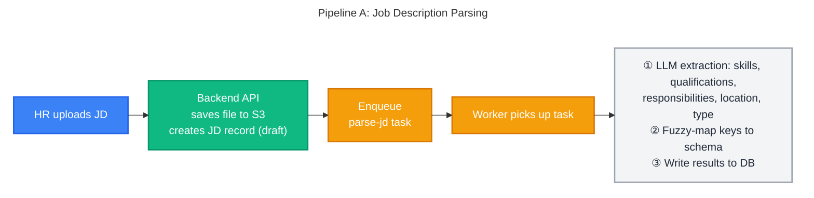
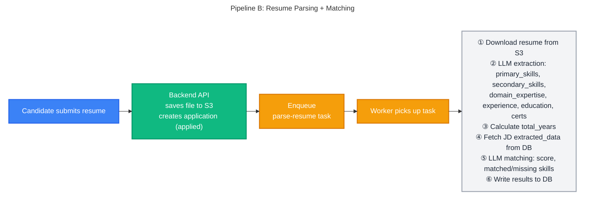
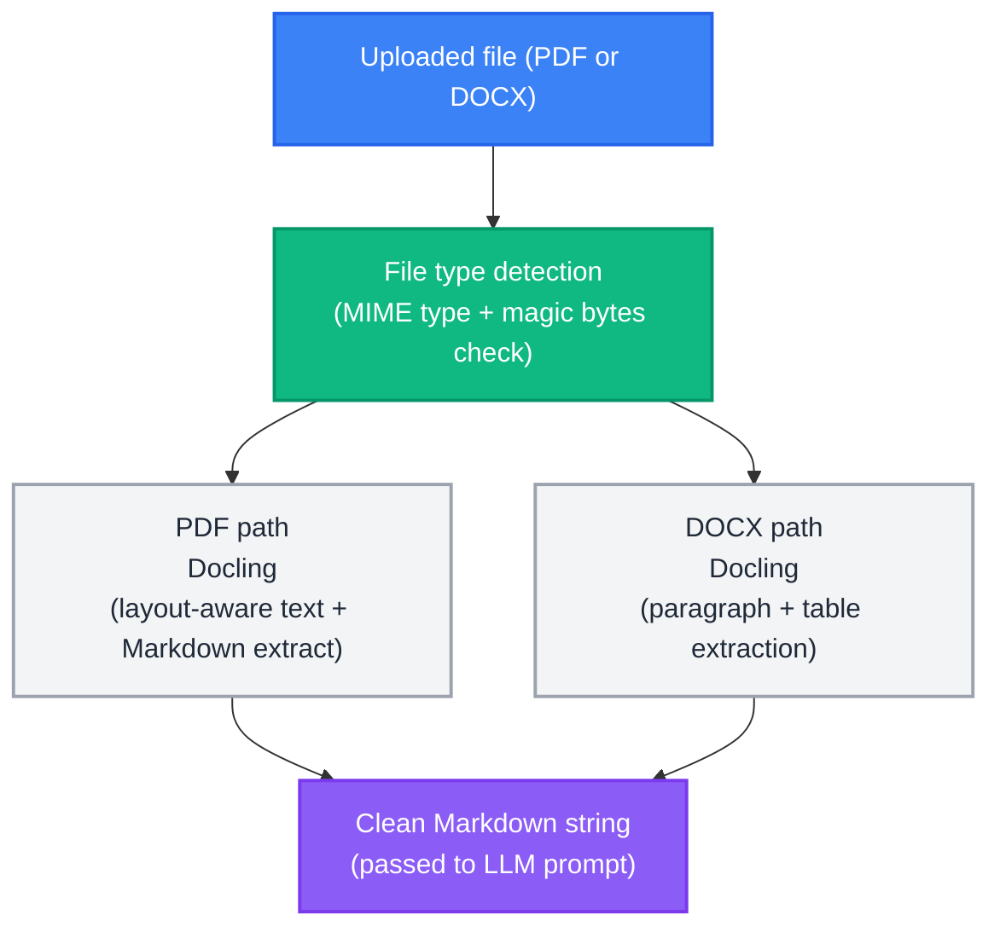
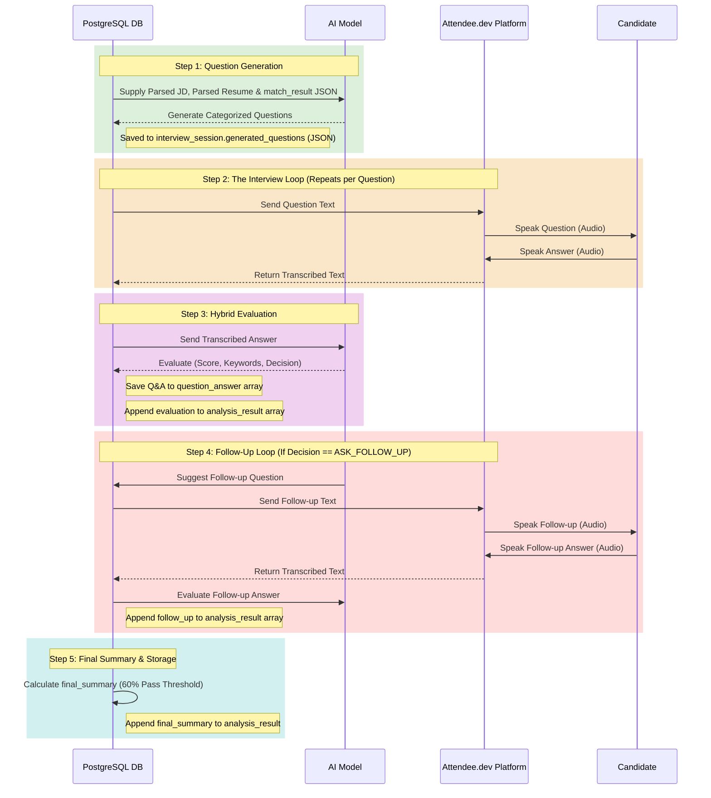

# AI Processing Pipeline - AI-Powered Recruitment Platform

> **Source of Truth**: This document is the authoritative reference for AI pipeline architecture, prompt engineering, extraction schemas, matching/scoring logic, and document parsing.
>
> For the overall system architecture and workflow diagrams, see [SYSTEM_DESIGN.md](../architecture/SYSTEM_DESIGN.md) §7 Workflows.
> For JSONB schema definitions stored in the database, see [DB_DESIGN.md](../architecture/DB_DESIGN.md) §5.

---

## Table of Contents

1. [Pipeline Overview](#1-pipeline-overview)
2. [AI Prompt Engineering](#2-ai-prompt-engineering)
3. [Matching Score Formula](#3-matching-score-formula)
4. [Document Parsing](#4-document-parsing)
5. [AI Interview Screening Pipeline](#5-ai-interview-screening-pipeline)

> **Related**: For full prompt evaluation results, JD/Resume test profiles, and all 8 parsed JSON match outputs, see [PROMPT_EVALUATION_REPORT.md](../PROMPT_EVALUATION_REPORT.md).

---

## 1. Pipeline Overview

There are two AI pipelines for Phase 1. Both follow the same pattern: **API enqueues task → broker delivers → worker processes → worker writes results to DB**.





---

## 2. AI Prompt Engineering

The system uses three sequential LLM prompts. Each prompt is designed to return **strict JSON only**, stored directly as JSONB in the database. No markdown, code fences, or explanatory text is permitted in the response.

---

### A. Resume Parsing Prompt

**Input**: Raw resume text extracted from PDF/DOCX via Docling.

```text
You are an expert resume parser specializing in technology and business resumes. Extract ONLY information explicitly stated in the provided resume and return exactly one valid JSON object matching the schema below.

CURRENT DATE: {current_date}
Use this date as the reference date for all duration calculations involving "present". Do not use any other assumed current date.

GENERAL RULES:

* Output ONLY valid JSON. No markdown, explanations, comments, or extra text.
* Never guess, infer, fabricate, or fill missing information using common knowledge.
* If information is not explicitly available, use null for scalar fields and [] for arrays.
* Extract information from the entire resume, including the header, summary, skills, experience, projects, education, and certifications.
* Normalize and deduplicate equivalent skills while preserving their meaning.
* Do not infer a skill, technology, responsibility, industry, or achievement from a job title alone.

OUTPUT FORMAT:

* primary_skills MUST always be an array of strings, even if there is only one skill.
* secondary_skills MUST always be an array of strings, even if there is only one skill.
* domain_expertise MUST always be an array of strings, even if there is only one domain.
* roles MUST always be an array of objects, with one object per distinct work experience role.
* highlights MUST always be an array of strings for every role, even if there is only one highlight.
* education_certificates MUST always be an array of objects, even if there is only one degree or certification.
* Never return an array field as a single string, object, or null.
* If no information is available for an array field, return [].
* Do not omit any field defined in the schema.

SKILLS:

* primary_skills: Core technical/hard skills explicitly mentioned, including programming languages, frameworks, libraries, databases, cloud platforms, DevOps, infrastructure, APIs, testing, data technologies, and other technical tools.
* secondary_skills: Supporting technologies, tools, methodologies, soft skills, leadership skills, and less-central technical skills explicitly mentioned.
* domain_expertise: Explicitly stated industries or business domains, such as Finance, Banking, Healthcare, E-commerce, Logistics, Retail, SaaS, or Telecom.
* Do not place the same normalized skill in both primary_skills and secondary_skills.
* Do not infer skills from projects or job titles unless the skill is explicitly stated.
* Normalize obvious naming variations, e.g. "React.js"/"ReactJS" → "React", "Postgres"/"PostgreSQL" → "PostgreSQL".

SKILL-SPECIFIC EXPERIENCE (skill_experience):

* For EVERY skill identified in primary_skills and secondary_skills, determine the candidate's total years of experience with that specific skill.
* STEP 1 - Check for DIRECT per-skill year statements ONLY:
  - A valid explicit statement is when the candidate directly associates a specific number of years with ONE specific skill, such as: "Java (5 years)", "7+ years of Python", "Spring Boot - 3 years".
  - CRITICAL: Do NOT treat professional summary or objective statements as per-skill declarations. For example, "10+ years of experience in enterprise development using Java, J2EE, Hibernate, JDBC" means the candidate has 10+ years of TOTAL career experience, NOT 10+ years in each of Java, J2EE, Hibernate, and JDBC individually. Ignore such summary statements when calculating per-skill experience.
  - If a valid direct per-skill statement is found, use that exact number.
* STEP 2 - If no direct per-skill statement exists, calculate from ROLE HIGHLIGHTS ONLY:
  - Look at each role in the "Professional Experience" / "Work Experience" section.
  - A skill is considered "used in a role" ONLY if it is explicitly mentioned in that role's bullet points/highlights. Do NOT assume a skill was used in a role just because the role title sounds related.
  - Sum the durations (years) of all roles where the skill is explicitly mentioned in the highlights.
  - Subtract overlapping role durations to prevent double-counting.
* STEP 3 - Apply safety checks:
  - The calculated years for any skill MUST NEVER exceed the candidate's `total_years` of professional experience. Cap it if it does.
  - Round the final skill experience to 1 decimal place.
* If a skill appears ONLY in a "Technical Skills" section or summary but is NOT mentioned in any role highlight or project, assign it 0.0 years.

WORK EXPERIENCE:

* Extract every distinct professional role separately.
* For every role, extract title, company, start_date, end_date, years, and highlights.
* Extract dates only from information explicitly associated with that role.
* If a date is unavailable, use null. Never infer a missing date from another role.
* If the role is explicitly ongoing/current, end_date must be "present".
* Date format:
  * YYYY-MM-DD when exact date is explicitly available.
  * YYYY-MM when month and year are explicitly available.
  * YYYY when only the year is explicitly available.
* Calculate years from the extracted start_date and end_date.
* If both month and year are available, calculate the exact elapsed duration using those months.
* If only years are available, calculate duration using the difference between the years. For example, 2022–2024 = 2.00 years.
* If only a start year is available and the role is ongoing, calculate from January 1 of that year through CURRENT DATE.
* If start month/year is available and the role is ongoing, calculate from the first day of that month through CURRENT DATE.
* If an end month/year is available, calculate through the end of that month.
* If an exact day is available, use the exact day.
* Calculate years as elapsed days / 365.25 when exact or month-level dates are available, and round to 1 decimal place.
* For year-only ranges, use the year difference directly and round to 1 decimal place.
* Do not return years as null merely because only a year or month/year is available.
* Return years as null only when the available dates are genuinely insufficient to calculate a reliable duration.
* total_years must represent unique professional experience across all extracted roles. Overlapping employment periods must not be double-counted.
* CRITICAL: First calculate the individual role `years`. Then, calculate `total_years` as the exact mathematical sum of all individual role `years`, subtracting any overlapping durations so time is not double-counted. Always double-check your addition.
* `total_years` and individual role `years` should be formatted to only 1 decimal place (e.g., 3.45 becomes 3.4).

ROLE HIGHLIGHTS:

* highlights must contain concise, factual information specifically associated with that role.
* Include role-specific technologies explicitly mentioned in that role, including programming languages, frameworks, libraries, databases, cloud, DevOps, CI/CD, APIs, monitoring, infrastructure, testing, and data tools.
* Include important responsibilities, projects, architectures, systems, and measurable achievements explicitly stated for that role.
* Preserve technology + context. For example: "Developed microservices using Java and Spring Boot" rather than only "Java".
* A technology may appear in both global skills and the relevant role's highlights.
* Associate a technology with a role ONLY when the resume explicitly connects it to that role's work, project, responsibility, or description.
* Do not copy technologies from another role into the current role.
* Do not copy the entire global skills section into every role.
* Do not infer technologies from the job title. For example, "DevOps Engineer" does not automatically mean AWS, Docker, Kubernetes, or Jenkins.
* Keep highlights concise and information-dense.
* If no role-specific details are available, return [].

PERSONAL INFORMATION:

* Extract first_name, last_name, phone_number, email, linkedin_url, github_url, and leetcode_url only when explicitly present.
* Do not expand initials into full names.
* Do not infer missing contact information.
* Preserve explicitly provided contact information accurately.

NAME PARSING:

* Extract first_name and last_name based on the person's actual given name and family/surname, not simply by word position.
* Do not assume the first word is the first name or that the last word is the last name.
* If the resume does not provide enough reliable information to determine the first name and last name, use null rather than guessing.

EDUCATION AND CERTIFICATIONS:

* Extract every explicitly stated degree and certification.

Schema:
{
  "primary_skills": ["string"],
  "secondary_skills": ["string"],
  "domain_expertise": ["string"],
  "relevant_experience": {
    "total_years": "number or null",
    "roles": [
      {
        "title": "string or null",
        "company": "string or null",
        "start_date": "string or null",
        "end_date": "string or null",
        "years": "number or null",
        "highlights": ["string"]
      }
    ]
  },
  "education_certificates": [
    {
      "name": "string",
      "issuer": "string or null",
      "year": "string or null",
      "type": "degree or certification"
    }
  ]
}
```

**Key constraints**:
- `total_years` must be calculated from role dates — do not copy a self-reported figure from the resume.
- Current roles use `"end_date": "present"` and tenure is computed up to today's date.

---

### B. Job Description Parsing Prompt

**Input**: Raw JD JSON payload (or text) sent from the user.

```text
You are an expert job description parser. Parse this JD systematically.
Return ONLY a JSON object in this format:
{
  "title": null,
  "company": null,
  "company_description": null,
  "experience_required": {
    "min_years": null,
    "max_years": null
  },
  "skills": {
    "must_have": [
      {"skill": "skill1", "required_years": null},
      {"skill": "skill2", "required_years": 3.0}
    ],
    "good_to_have": [
      {"skill": "skill1", "required_years": null}
    ]
  },
  "qualifications": ["degree1", "degree2"],
  "responsibilities": ["resp1", "resp2"],
  "location": null,
  "employment_type": "Full-time"
}
### Extraction Rules:
- For `must_have` and `good_to_have` skills, if the JD explicitly states a number of years of experience required for that specific skill (e.g., "3 years of Java"), set `required_years` to that number.
- If no specific years are mentioned for that individual skill, set `required_years` to `null`. Do not automatically assume the global `min_years` applies unless explicitly stated.

### Job Description Text:
__JD_TEXT__
```

**Key constraints**: Return `null` for any field not explicitly mentioned. Do not infer or hallucinate values.

---

### C. Candidate–JD Matching Prompt

**Input**: Both parsed JSONs (resume + JD) already stored in DB, injected into the prompt.

```text
You are an expert technical recruiter and data analyst.
Compare the given candidate resume with the job description and calculate a match score based strictly on the predefined evaluation criteria below.
Return STRICT JSON only, no commentary.

### Candidate Resume (parsed JSON):
__RESUME_JSON__

### Job Description (parsed JSON):
__JD_JSON__

### Predefined Evaluation Criteria (Total: 100 Points)

1. Must-Have Skills (40 Points):
   - Calculate the percentage of JD must-have skills found in the resume.
   - Multiply that percentage by 40.
   - A skill is considered found (and MUST be placed in `matched_skills`) if it is present anywhere in the candidate's `primary_skills` or `secondary_skills` arrays, REGARDLESS of whether they have 0.0 years of experience with it. If they listed it, they possess the baseline skill.
   - Normalize equivalent technology names before matching.
   - Do not infer a skill from a job title.

2. Relevant Experience (30 Points Total: 20 for Must-Have, 10 for Good-To-Have):
   - Calculate Relevant Experience by comparing the candidate's `skill_experience` array with the JD's must-have and good-to-have skill requirements.
   - For each JD skill, identify the candidate's candidate_years from the parsed_resume's `skill_experience` array. If the skill is not in the array, candidate_years = 0.0.
   - Calculate the skill_experience_ratio for each JD skill using these rules:
     * If the required experience is NOT mentioned in the JD for a particular skill and the candidate HAS experience (> 0.0): give ratio as 1.0
     * If the required experience is NOT mentioned in the JD for a particular skill and the candidate has NO experience: give ratio as 0.0
     * If the required experience IS mentioned in the JD for a particular skill and the candidate has LESS experience than required: give ratio as candidate_years / required_years
     * If the required experience IS mentioned in the JD for a particular skill and the candidate has MORE or EQUAL experience than required: give ratio as 1.0
   - Calculate must-have experience strictly using this exact formula:
     must_have_experience_score = (Sum of all skill_experience_ratios for must-have skills / total number of must-have skills) * 20
   - Calculate good-to-have experience strictly using this exact formula:
     good_to_have_experience_score = (Sum of all skill_experience_ratios for good-to-have skills / total number of good-to-have skills) * 10
     (If there are no good-to-have skills in the JD, good_to_have_experience_score = 10)
   - experience_score = must_have_experience_score + good_to_have_experience_score
   - Round experience_score to 2 decimal places.
   - For each skill in `must_have_experience` and `good_to_have_experience`, set `meets_requirement` to `true` ONLY IF `skill_experience_ratio` >= 1.0, otherwise `false`.
   - Set `experience_match` to `true` if at least 75% of the must-have skills have `meets_requirement` set to `true`. Otherwise, set it to `false`.

3. Good-to-Have Skills (20 Points):
   - Calculate the percentage of JD good-to-have skills found.
   - Multiply that percentage by 20.
   - A skill is considered found (and MUST be placed in `matched_skills`) if it is present anywhere in the candidate's `primary_skills` or `secondary_skills` arrays, REGARDLESS of whether they have 0.0 years of experience with it.
   - Normalize equivalent technology names before matching.
   - Do not infer a skill from a job title.

4. Qualifications & Domain (Maximum 10 Points):
   - Award 10 points if they have at least one exact degree/qualification match.
   - Award 5 points if their best match is a somewhat related field.
   - Award 5 points if they have a relevant certificate that comes under qualifications.
   - Award 0 points if completely unrelated and lacking relevant certificates.
   - Consider domain expertise if relevant to the JD.
   - If the JD has no qualification requirements, qualifications_score = 10 and qualification_match = true.

### Instructions:

1. Compare candidate's skills with JD must-have and good-to-have skills.
2. Calculate Relevant Experience specifically using the candidate's `skill_experience` array against the JD's must-have and good-to-have skills and their required years.
3. Systematically calculate the score for each of the 4 criteria.
4. Sum the scores to get a total out of 100.
5. Convert the total to a 0.0–10.0 scale:
   match_score = total_score / 10
6. Output highly detailed reasoning in 4-6 bullet points. You MUST explicitly name the specific skills that are missing. You MUST explicitly name the specific skills where the candidate lacks the required years of experience, including the concrete numbers (e.g., 'Lacks required experience in Java: has 2.0 years, but 3.0 years are required').
7. Do not change the predefined weighting: 40 + 30 + 20 + 10 = 100.

### Output Format (STRICT JSON):

{
  "score_breakdown": {
    "must_have_skills_score": 32.0,
    "experience_score": 24.5,
    "good_to_have_skills_score": 15.0,
    "qualifications_score": 10.0
  },
  "match_score": 8.15,
  "reasoning": [
    "Strong coverage of core must-have skills, explicitly matching Java, Python, and SQL.",
    "Missing critical must-have skill: AWS.",
    "Experience gap in Spring Boot: candidate has 2.0 years of experience, but 3.0 years are required.",
    "Good alignment on good-to-have skills, possessing Docker and Kubernetes.",
    "Qualifications match the requirement of a Bachelor's degree in Computer Science."
  ],
  "matched_skills": {
    "must_have": ["..."],
    "good_to_have": ["..."]
  },
  "missing_skills": {
    "must_have": ["..."],
    "good_to_have": ["..."]
  },
  "must_have_experience": [
    {
      "skill": "Java",
      "required_years": 3.0,
      "candidate_years": 4.0,
      "skill_experience_ratio": 1.0,
      "meets_requirement": true
    },
    {
      "skill": "Spring Boot",
      "required_years": 3.0,
      "candidate_years": 2.0,
      "skill_experience_ratio": 0.67,
      "meets_requirement": false
    }
  ],
  "qualification_match": true,
  "experience_match": false
}
```

> **Human-in-the-loop**: The AI matching score is an advisory signal, not an automated decision. No candidate is automatically rejected based on matching score alone. HR must explicitly review and confirm every status transition.

---

## 3. Matching Score Formula

The final `match_score` (0.0–10.0) is derived from a **100-point rubric** evaluated by the LLM matching prompt. The four criteria and their point allocations are:

```
  total_points (max 100) =
      must_have_skills_score     (max 40)
    + experience_score           (max 30)
    + good_to_have_skills_score  (max 20)
    + qualifications_score       (max 10)

  match_score = total_points / 10
```

| Max Points | Criterion | Scoring Logic |
|:-----------:|-----------|---------------|
| **40** | Must-Have Skills | `(matched / total must-haves) × 40` |
| **30** | Relevant Experience | Full 30 if meets/exceeds min years; pro-rated otherwise; 0 if `total_years` is null or 0 |
| **20** | Good-to-Have Skills | `(matched / total good-to-haves) × 20` |
| **10** | Qualifications & Domain | 10 = exact match · 5 = related field or relevant cert · 0 = unrelated |

The `match_score` is stored as a denormalised `float` column on the `applications` table to allow fast `ORDER BY match_score DESC` queries without recomputation.

> **Edge cases**:
> - If the JD specifies no minimum experience, the candidate receives the full 30 points provided `total_years` is not null/0.
> - If the JD has no `good_to_have` skills, that component scores 0 (not redistributed).
> - If `qualifications` list is empty in the JD, the prompt falls back to evaluating domain relevance.

> **Evaluation data**: The formula was validated against 8 test combinations (4 candidate profiles × 2 JDs). See [PROMPT_EVALUATION_REPORT.md](./PROMPT_EVALUATION_REPORT.md) for full results.

---

## 4. Document Parsing

Before the LLM can extract structured data, the raw file must be converted to clean plain text / Markdown. **Docling** is the selected parsing library for this step.

### Selected Library: Docling

Docling was chosen after evaluating 5 libraries across 6 document styles (graphical CVs, table-heavy CVs, two-column layouts, simple CVs, dense CVs, and standard JDs).

| Capability | Docling |
|---|---|
| Multi-column / sidebar reading order | ✅ Correct |
| Markdown table reconstruction | ✅ Flawless |
| Bullet point preservation | ✅ Clean `-` bullets |
| Graphical / image-heavy layout | ✅ Excellent |
| Execution | Local (no cloud API, no cost) |
| Known limitation | On dense-header PDFs, name/contact can be displaced to the bottom (PDF artifact — handled by LLM prompt) |

> **Full evaluation**: See [PDF_PARSING_LIBRARIES.md](../tools_research/PDF_PARSING_LIBRARIES.md) for the complete comparison table across all 5 libraries and 6 document types.

### Parsing Flow



Supported input formats: **PDF, DOCX**. Files are validated by MIME type and magic byte signature — not just file extension — before processing begins.

---

## 5. AI Interview Screening Pipeline

This section outlines the flow, prompts, and scoring formulas used for the automated video screening interviews.

### 5.1 End-to-End Pipeline Sequence Diagram
This diagram visualizes the flow of data through the AI models and the Attendee.dev voice platform.



### 5.2 Question Generation Logic & Prompts

**Question Category Distribution:**
The pipeline currently generates a baseline of **15 questions** per candidate, though this total number may vary based on system configuration. For a standard 15-question session, the distribution is strictly allocated as follows:

| Category | Description | Question Count |
| :--- | :--- | :--- |
| `must_have_matched` | Verifies depth on skills the candidate claims to possess. | 7 - 8 |
| `lacking_skill` | Basic awareness checks for required skills missing from the resume. | 3 - 4 |
| `good_to_have` | Checks for bonus skills requested by the JD. | 2 - 3 |
| `experience_domain` | Practical, scenario-based questions based on responsibilities. | ~ 2 |

**Question Generation Prompt:**
*(Note: The prompt below assumes a 15-question limit. The total number and category distribution are dynamically injected based on the interview time limit).*
```text
You are an expert technical AI preparing questions for an AUTOMATED VIDEO SCREENING interview. The candidate will be recording 1-2 minute video answers. The goal of this round is only to verify whether the candidate genuinely knows the required skills — not to run a full-depth technical L1/L2 interview.

═══ JOB CONTEXT ═══
Role: {title} at {company}
JD Required Experience: {experience_required}
JD Must-Have Skills: {must_have_skills}
JD Good-to-Have Skills: {good_to_have_skills}
JD Responsibilities: {responsibilities}

═══ CANDIDATE CONTEXT ═══
Years of Experience: {years}
Candidate Domain Expertise: {domain}

═══ FULL MATCH ANALYSIS JSON — use this to decide question focus ═══
{match_json}

How to use the match analysis above:
- matched_skills.must_have      → candidate HAS these → generate depth-verification questions
- missing_skills.must_have      → candidate MISSING these → generate basic awareness questions
- score_breakdown.must_have_skills_score  → if low (< 20/40), add more "lacking_skill" questions
- score_breakdown.good_to_have_skills_score → if 0, ask only basic "what is X" awareness
- reasoning                     → use the gap analysis directly to frame targeted questions
- experience_match: false       → frame experience_domain questions as awareness checks
- qualification_match: false    → do not expect academic-level depth in answers

═══ SCREENING DIFFICULTY RULES ═══
Apply the following difficulty guidance based on the JD requiring {min_y} years of experience:
- If 0-2 years (EASY): Ask basic knowledge-verification questions only.
- If 3-5 years (MEDIUM): Ask single-concept questions that verify genuine hands-on knowledge.
- If 5+ years (HARD): Ask high-level "when to use what" questions. 

Generate EXACTLY 15 questions in total across the following categories:
1. CATEGORY "must_have_matched" — from matched_skills.must_have (7–8 questions)
2. CATEGORY "lacking_skill" — from missing_skills.must_have (3–4 questions)
3. CATEGORY "good_to_have" — from JD good-to-have skills (2–3 questions)
4. CATEGORY "experience_domain" — from JD responsibilities (~2 purely technical questions)

═══ ANSWER DEPTH LEVELS ═══
Each question must include an `answer_depth` level ("aware", "partial_depth", or "full_depth") based on how strictly the answer should be evaluated:
- "aware" → awareness only: any reasonable attempt at a response is acceptable.
- "partial_depth" → partial coverage: the answer must touch some of the expected keywords with a basic explanation.
- "full_depth" → full depth: the answer must cover most expected keywords with a clear, accurate explanation.

Assign depth dynamically based on the candidate's {years} years of experience AND the question category:
- Use "aware" for "lacking_skill" and "good_to_have" categories, OR if the candidate has < 2 years experience (awareness check only).
- Use "partial_depth" for "must_have_matched" questions when the candidate has 2-4 years experience, OR if experience_match is false.
- Use "full_depth" for "must_have_matched" and "experience_domain" questions only when the candidate has 5+ years experience and clearly possesses the skill.

═══ OUTPUT FORMAT ═══
Return a JSON array only. No markdown, no commentary.
[
  {
    "id": 1,
    "category": "must_have_matched | lacking_skill | good_to_have | experience_domain",
    "skill_focus": "the specific skill or topic",
    "question": "the interview question",
    "expected_keywords": ["3 to 5 keywords a correct answer must touch"],
    "answer_depth": "aware | partial_depth | full_depth"
  }
]
```

### 5.3 Answer Evaluation Prompts

**Standard Answer Evaluation Prompt:**
```text
You are evaluating a candidate's answer in a FIRST SCREENING interview.

QUESTION: {question}
CANDIDATE ANSWER: {answer}
EXPECTED KEYWORDS (answer should address most of these): {keywords}
EVALUATION STRICTNESS LEVEL: {depth}

STRICTNESS DEFINITIONS:
- "aware": Accept the answer as-is. Any reasonable attempt at a response is sufficient. Do not penalize for missing keywords.
- "partial_depth": Accept if the answer covers some of the expected keywords with a basic explanation. Partial understanding is acceptable.
- "full_depth": Accept only if the answer covers most of the expected keywords with a clear and accurate explanation. Vague or incomplete answers are not sufficient.

SCORING RULES:
- Score 0–10. Your score MUST reflect BOTH keyword coverage AND the EVALUATION STRICTNESS LEVEL above.
- If STRICTNESS LEVEL is "aware": Score generously (7-10) if they show basic understanding, even if missing keywords.
- If STRICTNESS LEVEL is "partial_depth": Score 7-10 only if they hit some keywords and explain the basic concept.
- If STRICTNESS LEVEL is "full_depth": Score strictly. Score 7-10 ONLY if they hit most keywords with a clear, accurate explanation.
- Score 5–6: Candidate fell short of the required strictness level or missed key concepts.
- Score 0–4: Wrong, confused, or vague with no real understanding shown.
- Do NOT penalize for informal phrasing if the technical concept is correct.

DECISION:
- "NEXT_QUESTION" if score >= 6 AND coverage_percent >= 50 (candidate understood it well enough for screening).
- "ASK_FOLLOW_UP" if score < 6 OR coverage_percent < 50 (answer was too shallow or missed key concepts).

Return STRICT JSON only. No markdown:
{
  "score": <0-10>,
  "coverage_percent": <0-100>,
  "keywords_found": ["..."],
  "keywords_missing": ["..."],
  "is_sufficient": <true|false>,
  "decision": "NEXT_QUESTION | ASK_FOLLOW_UP",
  "feedback": "2-3 sentences: what was good, what was missing, pass/fail on this topic for screening",
  "suggested_follow_up": "If decision is ASK_FOLLOW_UP and this is NOT a follow-up evaluation itself, write a specific, conversational follow-up question here to probe what they missed based on the missing keywords. Otherwise omit this field entirely."
}
```

> **Note on Evaluation Output Calculation:** 
> * The **`score` (0-10)** is determined subjectively by the LLM based on conceptual understanding and the phrasing of the candidate's answer.
> * The **`coverage_percent`** is strictly and mathematically calculated by the Python backend using the array output: `( len(keywords_found) / len(expected_keywords) ) * 100`. The LLM's generated `coverage_percent` acts merely as a fallback.

**Follow-up Answer Evaluation Prompt:**
The prompt is **identical** to the standard Answer Evaluation Prompt above, except this exact string is injected at the very top of the context:
```text
NOTE: This is a FOLLOW-UP evaluation. The candidate had an insufficient primary answer.
```
*(The LLM uses this to understand that the candidate is attempting to recover from a previously missed keyword).*

### 5.4 Final Summary Calculation Engine

Once all generated questions (and any necessary follow-up loops) are complete, the pipeline's Python layer calculates the final summary.

**Topic Score Resolution:**
If a question resulted in a follow-up loop, the final score for that topic is the **average** of the primary score and the follow-up score:
```python
if "follow_up_score" in eval_obj:
    topic_score = (primary_score + follow_up_score) / 2
else:
    topic_score = primary_score
```

**Aggregate Scoring:**
*   **Total Score:** The sum of all resolved `topic_score` values.
*   **Max Possible Score:** `{total_questions} * 10` points (e.g., 150 for a 15-question set).
*   **Overall Score:** `(total_score / max_possible_score) * 10`

**Recommendation Threshold:**
The system enforces a strict, deterministic pass/fail threshold at **6.0 / 10**:
```python
if overall_score >= 6.0:
    final_recommendation = "shortlist_for_l1"
else:
    final_recommendation = "reject"
```
