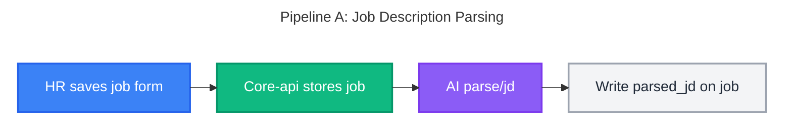
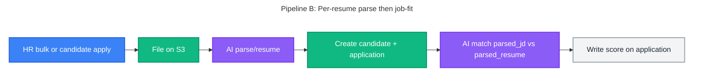
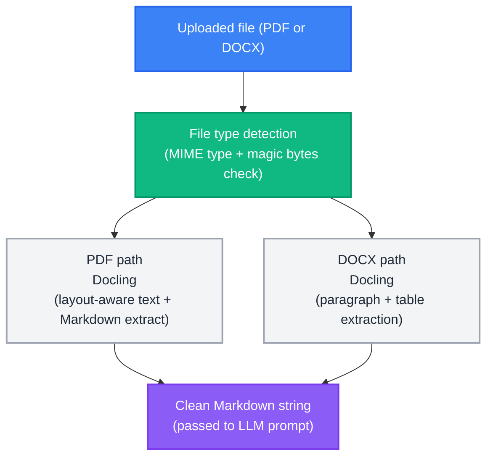
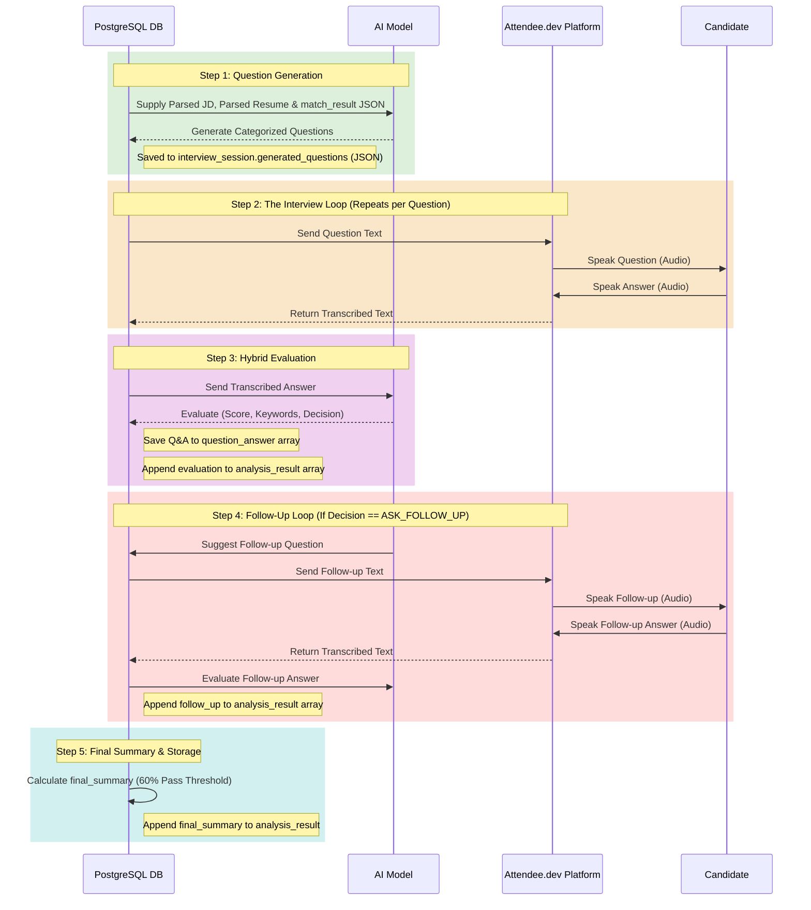

# AI Processing Pipeline - AI-Powered Recruitment Platform

> **Source of Truth**: This document is the authoritative reference for AI pipeline architecture, prompt engineering, extraction schemas, matching/scoring logic, and document parsing.
>
> For the overall system architecture and workflow diagrams, see [SYSTEM_DESIGN.md](../architecture/SYSTEM_DESIGN.md) §7 Workflows.
> For JSONB schema definitions stored in the database, see [DB_DESIGN.md](../architecture/DB_DESIGN.md) §5.

---

## Table of Contents

1. [Pipeline Overview](#1-pipeline-overview)
2. [AI Prompt Engineering](#2-ai-prompt-engineering)
3. [Matching Score Formula](#3-matching-score-formula)
4. [Document Parsing](#4-document-parsing)
5. [AI Interview Screening Pipeline](#5-ai-interview-screening-pipeline)

> **Related**: For full prompt evaluation results, JD/Resume test profiles, and all 8 parsed JSON match outputs, see [PROMPT_EVALUATION_REPORT.md](../PROMPT_EVALUATION_REPORT.md).

---

## 1. Pipeline Overview

There are two AI pipelines for Phase 1.

**Pipeline A (JD)** runs once per job (create/publish): form text → `parsed_jd` on `job_descriptions`.

**Pipeline B (resume)** runs once per file, independently (HR bulk or public apply). Core-api returns 202 on bulk; each resume is parse → candidate + application → job-fit (`parsed_jd` vs `parsed_resume`). Matching does not wait for other files.





---

## 2. AI Prompt Engineering

The system uses three sequential LLM prompts. Each prompt is designed to return **strict JSON only**, stored directly as JSONB in the database. No markdown, code fences, or explanatory text is permitted in the response.

---

### A. Resume Parsing Prompt

**Input**: Raw resume text extracted from PDF/DOCX via Docling.

```text
You are an expert resume parser specializing in technology and business resumes. Extract ONLY information explicitly stated in the provided resume and return exactly one valid JSON object matching the schema below.

CURRENT DATE: {current_date}
Use this date as the reference date for all duration calculations involving "present". Do not use any other assumed current date.

GENERAL RULES:

* Output ONLY valid JSON. No markdown, explanations, comments, or extra text.
* Never guess, infer, fabricate, or fill missing information using common knowledge.
* If information is not explicitly available, use null for scalar fields and [] for arrays.
* Extract information from the entire resume, including the header, summary, skills, experience, projects, education, and certifications.
* Normalize and deduplicate equivalent skills while preserving their meaning.
* Do not infer a skill, technology, responsibility, industry, or achievement from a job title alone.

OUTPUT FORMAT:

* primary_skills MUST always be an array of strings, even if there is only one skill.
* secondary_skills MUST always be an array of strings, even if there is only one skill.
* domain_expertise MUST always be an array of strings, even if there is only one domain.
* roles MUST always be an array of objects, with one object per distinct work experience role.
* highlights MUST always be an array of strings for every role, even if there is only one highlight.
* education_certificates MUST always be an array of objects, even if there is only one degree or certification.
* Never return an array field as a single string, object, or null.
* If no information is available for an array field, return [].
* Do not omit any field defined in the schema.

SKILLS:

* primary_skills: Core technical/hard skills explicitly mentioned, including programming languages, frameworks, libraries, databases, cloud platforms, DevOps, infrastructure, APIs, testing, data technologies, and other technical tools.
* secondary_skills: Supporting technologies, tools, methodologies, soft skills, leadership skills, and less-central technical skills explicitly mentioned.
* domain_expertise: Explicitly stated industries or business domains, such as Finance, Banking, Healthcare, E-commerce, Logistics, Retail, SaaS, or Telecom.
* Do not place the same normalized skill in both primary_skills and secondary_skills.
* Do not infer skills from projects or job titles unless the skill is explicitly stated.
* Normalize obvious naming variations, e.g. "React.js"/"ReactJS" → "React", "Postgres"/"PostgreSQL" → "PostgreSQL".
* CRITICAL RULE: Completely ignore Internship roles. Do not extract any skills from internship descriptions into primary_skills or secondary_skills.

SKILL-SPECIFIC EXPERIENCE (skill_experience):

* For EVERY skill identified in primary_skills and secondary_skills, determine the candidate's total years of experience with that specific skill.
* STEP 1 - Calculate from ROLE HIGHLIGHTS for ALL skills:
  - Look at each role in the "Professional Experience" / "Work Experience" section.
  - A skill is considered "used in a role" ONLY if it is explicitly mentioned in that role's bullet points/highlights.
  - Sum the durations (years) of all roles where the skill is explicitly mentioned.
  - Subtract overlapping role durations to prevent double-counting.
  - This provides the `calculated_role_years`.
* STEP 2 - Check for DIRECT per-skill year statements:
  - A valid explicit statement is when the candidate directly associates a specific number of years with one or more specific skills, such as: "Java (5 years)", "7+ years of Python", or "10 years of experience in Java, Spring".
  - If a candidate includes a broad professional summary statement like "3+ years of experience in enterprise development using Java, Spring Boot", apply that exact number of years (e.g., 3.0) to EACH of the skills listed.
  - CRITICAL: If a candidate states a number of years in a professional summary paragraph (e.g., "7 years of success in DevOps..."), and then lists skills within that SAME summary paragraph (e.g., "... Skilled in Jenkins, Docker"), you MUST apply that exact number of years (e.g., 7.0) to ALL skills mentioned anywhere within that summary block, even if they are in separate sentences.
  - This provides the `stated_years`.
* STEP 3 - Determine Final Skill Experience:
  - If a skill has an explicitly `stated_years`, you MUST use that exact value. You CANNOT use the `calculated_role_years` for that skill, even if the calculated years are higher.
  - If a skill does NOT have an explicitly stated number of years, only then should you fall back to using the `calculated_role_years`.
* Round the final skill experience to 1 decimal place.
* If a skill appears ONLY in a "Technical Skills" section or summary but is NOT mentioned in any role highlight or project, and has no explicit years stated, assign it 0.0 years.

WORK EXPERIENCE:

* Extract every distinct professional role separately.
* CRITICAL RULE - INTERNSHIPS: If a role title or description contains the word "Intern" or "Internship", you MUST skip it entirely. DO NOT extract it. DO NOT add its duration to `total_years`. DO NOT add its duration to any skill. Treat the internship as if it does not exist.
* For every role, extract title, company, start_date, end_date, years, and highlights.
* Extract dates only from information explicitly associated with that role.
* If a date is unavailable, use null. Never infer a missing date from another role.
* If the role is explicitly ongoing/current, end_date must be "present".
* Date format:
  * YYYY-MM-DD when exact date is explicitly available.
  * YYYY-MM when month and year are explicitly available.
  * YYYY when only the year is explicitly available.
* Calculate years from the extracted start_date and end_date.
* If both month and year are available, calculate the exact elapsed duration using those months.
* If only years are available, calculate duration using the difference between the years. For example, 2022–2024 = 2.00 years.
* If only a start year is available and the role is ongoing, calculate from January 1 of that year through CURRENT DATE.
* If start month/year is available and the role is ongoing, calculate from the first day of that month through CURRENT DATE.
* If an end month/year is available, calculate through the end of that month.
* If an exact day is available, use the exact day.
* Calculate years as elapsed days / 365.25 when exact or month-level dates are available, and round to 1 decimal place.
* For year-only ranges, use the year difference directly and round to 1 decimal place.
* Do not return years as null merely because only a year or month/year is available.
* Return years as null only when the available dates are genuinely insufficient to calculate a reliable duration.
* total_years must represent unique professional experience across all extracted roles. Overlapping employment periods must not be double-counted.
* CRITICAL RULE FOR MATH: Inside the `experience` object, you MUST first provide a string field called `total_years_calculation`. In this field, you must write out the exact mathematical addition of the individual role `years` (e.g., "7.5 + 0.6 = 8.1"). Subtract any overlapping durations.
* After `total_years_calculation`, provide `total_years` as the final calculated float exactly matching your calculation. Do not guess.
* `total_years` and individual role `years` should be rounded and formatted to only 1 decimal place (e.g., 3.45 becomes 3.4).

ROLE HIGHLIGHTS:

* highlights must contain concise, factual information specifically associated with that role.
* Include role-specific technologies explicitly mentioned in that role, including programming languages, frameworks, libraries, databases, cloud, DevOps, CI/CD, APIs, monitoring, infrastructure, testing, and data tools.
* Include important responsibilities, projects, architectures, systems, and measurable achievements explicitly stated for that role.
* Preserve technology + context. For example: "Developed microservices using Java and Spring Boot" rather than only "Java".
* A technology may appear in both global skills and the relevant role's highlights.
* Associate a technology with a role ONLY when the resume explicitly connects it to that role's work, project, responsibility, or description.
* Do not copy technologies from another role into the current role.
* Do not copy the entire global skills section into every role.
* Do not infer technologies from the job title. For example, "DevOps Engineer" does not automatically mean AWS, Docker, Kubernetes, or Jenkins.
* Keep highlights concise and information-dense.
* If no role-specific details are available, return [].

PERSONAL INFORMATION:

* Extract first_name, last_name, phone_number, email, linkedin_url, github_url, and leetcode_url only when explicitly present.
* Do not expand initials into full names.
* Do not infer missing contact information.
* Preserve explicitly provided contact information accurately.

NAME PARSING:

* Extract first_name and last_name based on the person's actual given name and family/surname, not simply by word position.
* Do not assume the first word is the first name or that the last word is the last name.
* If the resume does not provide enough reliable information to determine the first name and last name, use null rather than guessing.

EDUCATION AND CERTIFICATIONS:

* Extract every explicitly stated degree and certification.
* type must be exactly "degree" or "certification".
* name must contain the explicitly stated degree or certification name.
* issuer must contain the explicitly stated university, institution, or certification issuer when available.
* year must contain the explicitly stated graduation, completion, or certification year when available.
* Never infer an issuer or year.

FINAL VALIDATION:

Before returning the JSON, verify that:

* Every schema field is present, even when its value is null or [].
* Every extracted role has a title, company, start_date, end_date, years, and highlights field.
* Ongoing roles use "present" as end_date.
* Calculated years are numeric or null, never strings.
* primary_skills, secondary_skills, domain_expertise, roles, highlights, and education_certificates are always arrays as defined in the schema.
* Empty array fields contain [] rather than null.
* Skills are deduplicated and normalized.
* Role highlights contain only information associated with that role.
* No technology was inferred solely from a job title.
* No missing information was guessed.
* The output exactly matches the provided schema.
* The output is valid JSON.

SCHEMA:
{
  "parsed_resume": {
    "personal_info": {
      "first_name": "string or null",
      "last_name": "string or null",
      "phone_number": "string or null",
      "email": "string or null",
      "linkedin_url": "string or null",
      "github_url": "string or null",
      "leetcode_url": "string or null"
    },
    "primary_skills": ["string"],
    "secondary_skills": ["string"],
    "domain_expertise": ["string"],
    "experience": {
      "total_years_calculation": "string",
      "total_years": "number or null",
      "roles": [
        {
          "title": "string or null",
          "company": "string or null",
          "start_date": "string or null",
          "end_date": "string or null",
          "years": "number or null",
          "highlights": ["string"]
        }
      ]
    },
    "skill_experience": [
      {
        "skill": "string",
        "years": "number or null"
      }
    ],
    "education_certificates": [
      {
        "name": "string",
        "issuer": "string or null",
        "year": "string or null",
        "type": "degree or certification"
      }
    ]
  }
}
```

**Key constraints**:
- `total_years` must be calculated from role dates — do not copy a self-reported figure from the resume.
- Current roles use `"end_date": "present"` and tenure is computed up to today's date.

---

### B. Job Description Parsing Prompt

**Input**: Raw JD JSON payload (or text) sent from the user.

```text
You are an expert job description parser. Parse this JD systematically.
Return ONLY a JSON object in this format:
{
  "title": null,
  "company": null,
  "company_description": null,
  "experience_required": {
    "min_years": null,
    "max_years": null
  },
  "skills": {
    "must_have": [
      {"skill": "skill1", "required_years": null},
      {"skill": "skill2", "required_years": 3.0}
    ],
    "good_to_have": [
      {"skill": "skill1", "required_years": null}
    ]
  },
  "qualifications": ["degree1", "degree2"],
  "responsibilities": ["resp1", "resp2"],
  "location": null,
  "employment_type": "Full-time"
}
### Extraction Rules:
- For `must_have` and `good_to_have` skills, if the JD explicitly states a number of years of experience required for that specific skill (e.g., "3 years of Java"), set `required_years` to that number.
- If no specific years are mentioned for that individual skill, set `required_years` to `null`. Do not automatically assume the global `min_years` applies unless explicitly stated.
- CRITICAL RULE FOR QUALIFICATIONS: Each qualification entry must be one complete, meaningful requirement as written in the JD. Do NOT split a single sentence at commas. For example, "Bachelor's degree in Computer Science, Information Technology, or related field" is ONE qualification entry, not two or three. Only create separate entries when the JD lists genuinely distinct qualifications (e.g., a degree AND a separate certification).
- must_have_skills: if description has dedicated must have/required skills block then use that for extraction otherwise use this - Core technical/hard skills explicitly mentioned, including programming languages, frameworks, libraries, databases, cloud platforms, DevOps, infrastructure, APIs, testing, data technologies, and other technical tools.
- good_to_have_skills: if description has dedicated good to have or nice to have skills blocks then use that for extraction otherwise use this - Supporting technologies, tools, methodologies, soft skills, leadership skills, and less-central technical skills explicitly mentioned.

### Job Description Text:
__JD_TEXT__
```

**Key constraints**: Return `null` for any field not explicitly mentioned. Do not infer or hallucinate values.

---

### C. Candidate–JD Matching Prompt

**Input**: Both parsed JSONs (resume + JD) already stored in DB, injected into the prompt.

```text
You are an expert technical recruiter and data analyst.
Compare the given candidate resume with the job description and calculate a match score based strictly on the predefined evaluation criteria below.
Return STRICT JSON only, no commentary.

### Candidate Resume (parsed JSON):
__RESUME_JSON__

### Job Description (parsed JSON):
__JD_JSON__

### Predefined Evaluation Criteria (Total: 100 Points)

1. Must-Have Skills (40 Points):
   - Calculate the percentage of JD must-have skills found in the resume.
   - Multiply that percentage by 40.
   - A skill is considered found (and MUST be placed in `matched_skills`) if it is present anywhere in the candidate's `primary_skills` or `secondary_skills` arrays, REGARDLESS of whether they have 0.0 years of experience with it. If they listed it, they possess the baseline skill.
   - Normalize equivalent technology names before matching.
   - Do not infer a skill from a job title.

2. Relevant Experience (30 Points Total: 20 for Must-Have, 10 for Good-To-Have):
   - Calculate Relevant Experience by comparing the candidate's `skill_experience` array with the JD's must-have and good-to-have skill requirements.
   - For each JD skill, identify the candidate's candidate_years from the parsed_resume's `skill_experience` array. If the skill is not in the array, candidate_years = 0.0.
   - Calculate the skill_experience_ratio for each JD skill using these rules:
     * If the required experience is NOT mentioned in the JD for a particular skill AND the candidate possesses the skill (i.e., it is in matched_skills): give ratio as 1.0 (even if candidate_years is 0.0)
     * If the candidate does NOT possess the skill (i.e., it is in missing_skills): give ratio as 0.0
     * If the required experience IS mentioned in the JD for a particular skill and the candidate has LESS experience than required: give ratio as candidate_years / required_years
     * If the required experience IS mentioned in the JD for a particular skill and the candidate has MORE or EQUAL experience than required: give ratio as 1.0
   - Calculate must-have experience strictly using this exact formula:
     must_have_experience_score = (Sum of all skill_experience_ratios for must-have skills / total number of must-have skills) * 20
   - Calculate good-to-have experience strictly using this exact formula:
     good_to_have_experience_score = (Sum of all skill_experience_ratios for good-to-have skills / total number of good-to-have skills) * 10
     (If there are no good-to-have skills in the JD, good_to_have_experience_score = 10)
   - raw_experience = must_have_experience_score + good_to_have_experience_score
   - Round raw_experience to 2 decimal places.
   - For each skill in `must_have_experience` and `good_to_have_experience`, set `meets_requirement` to `true` ONLY IF `skill_experience_ratio` >= 1.0, otherwise `false`.
   - Set `experience_match` to `true` ONLY IF `raw_experience` is >= 20.0. Otherwise, set it to `false`.

3. Good-to-Have Skills (20 Points):
   - Calculate the percentage of JD good-to-have skills found.
   - Multiply that percentage by 20.
   - A skill is considered found (and MUST be placed in `matched_skills`) if it is present anywhere in the candidate's `primary_skills` or `secondary_skills` arrays, REGARDLESS of whether they have 0.0 years of experience with it.
   - Normalize equivalent technology names before matching.
   - Do not infer a skill from a job title.

4. Qualifications & Domain (Maximum 10 Points):
   - Award 10 points if they have at least one exact degree/qualification match.
   - Award 5 points if their best match is a somewhat related field.
   - Award 5 points if they have a relevant certificate that comes under qualifications.
   - Award 0 points if completely unrelated and lacking relevant certificates.
   - Consider domain expertise if relevant to the JD.
   - If the JD has no qualification requirements, qualifications_score = 10 and qualification_match = true.

### Instructions:

1. Compare candidate's skills with JD must-have and good-to-have skills.
2. Calculate Relevant Experience specifically using the candidate's `skill_experience` array against the JD's must-have and good-to-have skills and their required years.
3. Systematically calculate the raw score for each of the 4 criteria based on their respective weights (40, 30, 20, 10).
4. CRITICAL: Output the raw scores first, then convert them into a consolidated, out-of-10.0 scale for the `score_breakdown`:
   - `raw_must_have_skills`: max 40.0
   - `raw_good_to_have_skills`: max 20.0
   - `raw_experience`: max 30.0
   - `raw_qualifications`: max 10.0
   - `skills_score` = (raw_must_have_skills + raw_good_to_have_skills) / 6
   - `experience_score` = raw_experience / 3
   - `qualifications_score` = raw_qualifications / 1
   (e.g., if raw_must_have_skills is 32.0 and raw_good_to_have_skills is 15.0, skills_score is 7.83)
5. Calculate the final `match_score` out of 10.0 based on the total raw points: match_score = (raw_must_have_skills + raw_experience + raw_good_to_have_skills + raw_qualifications) / 10.
6. Output highly detailed analysis in plain, human-readable language suitable for a non-technical recruiter. DO NOT use technical terms like "ratio", "score", "formula", "0.0", or "1.0". Instead, write naturally. Provide the analysis in three parts:
   - `reasoning`: 3-4 bullet points summarizing the overall fit (e.g. "The candidate matches all core must-have skills...", "Qualification requirements fully met..."). CRITICAL: If the candidate is slightly under the required experience for a particular skill (e.g., 2-3 months under the requirement), you MUST explicitly mention this slight gap here in the reasoning.
   - `strengths`: 4-5 bullet points highlighting the candidate's strongest alignments with the JD. CRITICAL: If the candidate is "overqualified" (e.g., having 14 years of experience for a 3-6 year role), this MUST be listed as a massive STRENGTH (e.g., "Brings a veteran level of expertise..."), NEVER as a concern.
   - `concerns`: 4-5 bullet points highlighting gaps, missing skills, or shortfalls in experience. CRITICAL: If the JD requires a balanced skill set but experience is heavily skewed, point this out. NEVER list being "overqualified" as a concern. If no concerns, provide 1 bullet saying "No major concerns identified."
7. CRITICAL RULE: Never put a skill in `missing_skills` if it exists in `primary_skills` or `secondary_skills`, even if the candidate has 0.0 years of experience with it. If it is in their skills array, it MUST go into `matched_skills`.


### Output Format (STRICT JSON):

{
  "score_breakdown": {
    "raw_must_have_skills": 32.0,
    "raw_good_to_have_skills": 15.0,
    "raw_experience": 24.5,
    "raw_qualifications": 10.0,
    "skills_score": 7.83,
    "experience_score": 8.16,
    "qualifications_score": 10.0
  },
  "match_score": 8.15,
  "reasoning": [
    "Overall strong fit with technical alignment across most core skills.",
    "Qualification requirements fully met with a Bachelor's degree in Computer Science.",
    "Slight gaps in cloud infrastructure experience, but solid foundation in backend development."
  ],
  "strengths": [
    "The candidate matches core must-have skills including Java, Python, and SQL.",
    "Strong hands-on experience in Java (14 years), well exceeding the job requirements.",
    "Good coverage of nice-to-have skills, with practical experience in Docker and Kubernetes.",
    "Extensive domain expertise in E-commerce architecture."
  ],
  "concerns": [
    "Missing critical must-have skill: AWS — not found anywhere in the candidate's resume.",
    "Experience gap in Spring Boot: the candidate has 2 years of hands-on experience, but the role requires at least 3 years.",
    "Imbalanced experience for a Full Stack role: candidate has 4 years of frontend (React) experience, but only 3 months of backend (Node.js) experience.",
    "The candidate lists PostgreSQL as a skill but has no professional work experience using it in any of their roles."
  ],
  "matched_skills": {
    "must_have": ["..."],
    "good_to_have": ["..."]
  },
  "missing_skills": {
    "must_have": ["..."],
    "good_to_have": ["..."]
  },
  "must_have_experience": [
    {
      "skill": "Java",
      "required_years": 3.0,
      "candidate_years": 4.0,
      "skill_experience_ratio": 1.0,
      "meets_requirement": true
    },
    {
      "skill": "Spring Boot",
      "required_years": 3.0,
      "candidate_years": 2.0,
      "skill_experience_ratio": 0.67,
      "meets_requirement": false
    }
  ],
  "good_to_have_experience": [
    {
      "skill": "Docker",
      "required_years": null,
      "candidate_years": 2.0,
      "skill_experience_ratio": 1.0,
      "meets_requirement": true
    }
  ],
  "qualification_match": true,
  "experience_match": false
}
```

> **Human-in-the-loop**: The AI matching score is an advisory signal, not an automated decision. No candidate is automatically rejected based on matching score alone. HR must explicitly review and confirm every status transition.

---

## 3. Matching Score Formula

The final `match_score` (0.0–10.0) is derived from the sub-scores which are calculated based on raw point allocations and then normalized to a 10.0 scale.

```
  raw_must_have_skills     (max 40)
  raw_experience           (max 30)
  raw_good_to_have_skills  (max 20)
  raw_qualifications       (max 10)

  skills_score = (raw_must_have_skills + raw_good_to_have_skills) / 6
  experience_score = raw_experience / 3
  qualifications_score = raw_qualifications / 1

  match_score = (raw_must_have_skills + raw_experience + raw_good_to_have_skills + raw_qualifications) / 10
```

| Max Points | Criterion | Scoring Logic |
|:-----------:|-----------|---------------|
| **40** | Must-Have Skills | `(matched / total must-haves) × 40` |
| **30** | Relevant Experience | Full 30 if meets/exceeds min years; pro-rated otherwise; 0 if `total_years` is null or 0 |
| **20** | Good-to-Have Skills | `(matched / total good-to-haves) × 20` |
| **10** | Qualifications & Domain | 10 = exact match · 5 = related field or relevant cert · 0 = unrelated |

The `resume_score` is stored as a denormalised `Numeric(5, 2)` column on the `applications` table to allow fast `ORDER BY resume_score DESC` queries without recomputation. The full match JSON is stored in the `job_fit_analysis` column.

> **Edge cases**:
> - If the JD specifies no minimum experience, the candidate receives the full 30 points provided `total_years` is not null/0.
> - If the JD has no `good_to_have` skills, that component scores 0 (not redistributed).
> - If `qualifications` list is empty in the JD, the prompt falls back to evaluating domain relevance.

> **Evaluation data**: The formula was validated against 8 test combinations (4 candidate profiles × 2 JDs). See [PROMPT_EVALUATION_REPORT.md](./PROMPT_EVALUATION_REPORT.md) for full results.

---

## 4. Document Parsing

Before the LLM can extract structured data, the raw file must be converted to clean plain text / Markdown. **Docling** is the selected parsing library for this step.

### Selected Library: Docling

Docling was chosen after evaluating 5 libraries across 6 document styles (graphical CVs, table-heavy CVs, two-column layouts, simple CVs, dense CVs, and standard JDs).

| Capability | Docling |
|---|---|
| Multi-column / sidebar reading order | ✅ Correct |
| Markdown table reconstruction | ✅ Flawless |
| Bullet point preservation | ✅ Clean `-` bullets |
| Graphical / image-heavy layout | ✅ Excellent |
| Execution | Local (no cloud API, no cost) |
| Known limitation | On dense-header PDFs, name/contact can be displaced to the bottom (PDF artifact — handled by LLM prompt) |

> **Full evaluation**: See [PDF_PARSING_LIBRARIES.md](../tools_research/PDF_PARSING_LIBRARIES.md) for the complete comparison table across all 5 libraries and 6 document types.

### Parsing Flow



Supported input formats: **PDF, DOCX**. Files are validated by MIME type and magic byte signature — not just file extension — before processing begins.

---

## 5. AI Interview Screening Pipeline

This section outlines the flow, prompts, and scoring formulas used for the automated video screening interviews.

### 5.1 End-to-End Pipeline Sequence Diagram
This diagram visualizes the flow of data through the AI models and the Attendee.dev voice platform.



### 5.2 Question Generation Logic & Prompts

**Question Category Distribution:**
The pipeline currently generates a baseline of **15 questions** per candidate, though this total number may vary based on system configuration. For a standard 15-question session, the distribution is strictly allocated as follows:

| Category | Description | Question Count |
| :--- | :--- | :--- |
| `must_have_matched` | Verifies depth on skills the candidate claims to possess. | 7 - 8 |
| `lacking_skill` | Basic awareness checks for required skills missing from the resume. | 3 - 4 |
| `good_to_have` | Checks for bonus skills requested by the JD. | 2 - 3 |
| `experience_domain` | Practical, scenario-based questions based on responsibilities. | ~ 2 |

**Question Generation Prompt:**
*(Note: The prompt below assumes a 15-question limit. The total number and category distribution are dynamically injected based on the interview time limit).*
```text
You are an expert technical AI preparing tailored interview questions for a candidate.

═══ JOB CONTEXT ═══
Role: {title} at {company}
JD Required Experience: {experience_required}
JD Must-Have Skills: {must_have_skills}
JD Good-to-Have Skills: {good_to_have_skills}
JD Responsibilities: {responsibilities}

═══ FULL MATCH ANALYSIS JSON — use this to decide question focus ═══
{match_json}

How to use the match analysis above:
- matched_skills.must_have      → candidate HAS these → frame questions assuming hands-on experience.
- missing_skills.must_have      → candidate MISSING these → frame questions acknowledging they haven't used it directly.
- reasoning                     → use the overall summary to frame the general tone of questions.
- strengths                     → use these verified strengths to frame harder, depth-verification questions.
- concerns                      → use these identified gaps or missing skills to frame targeted awareness or behavioral questions.

═══ SCREENING DIFFICULTY RULES ═══
CRITICAL: The difficulty of each question MUST be determined on a per-skill basis according to the Job Description's required experience, NOT the candidate's actual experience.
To determine the target experience level for a specific skill question, use the JD's required years of experience for that skill.
- Target Experience Level = jd_required_skill_years (If not explicitly stated in JD, default to the JD's overall min_years).

Example 1: Candidate has 10 years of Java, JD requires 3 years -> Ask a 3-year level question.
Example 2: Candidate has 1 year of Java, JD requires 3 years -> Ask a 3-year level question.

Apply the following difficulty guidance based on the Target Experience Level:
- If 0-2 years (EASY): Ask basic knowledge-verification questions only.
- If 3-5 years (MEDIUM): Ask single-concept questions that verify genuine hands-on knowledge.
- If 5+ years (HARD): Ask high-level "when to use what" or architecture questions.

Generate EXACTLY 15 questions in total across the following categories:
1. CATEGORY "must_have_matched" — from matched_skills.must_have (7–8 questions)
2. CATEGORY "lacking_skill" — from missing_skills.must_have (3–4 questions)
3. CATEGORY "good_to_have" — from JD good-to-have skills (2–3 questions)
4. CATEGORY "experience_domain" — from JD responsibilities (~2 purely technical questions)

═══ ANSWER DEPTH LEVELS ═══
Each question must include an `answer_depth` level ("aware", "partial_depth", or "full_depth") based on how strictly the answer should be evaluated:
- "aware" → awareness only: any reasonable attempt at a response is acceptable.
- "partial_depth" → partial coverage: the answer must touch some of the expected keywords with a basic explanation.
- "full_depth" → full depth: the answer must cover most expected keywords with a clear, accurate explanation.

Assign depth dynamically based ONLY on the JD's REQUIRED EXPERIENCE for that specific skill (Target Experience Level), regardless of whether the candidate possesses the skill or not:
- Use "aware" if the Target Experience Level is < 2 years.
- Use "partial_depth" if the Target Experience Level is 2-4 years.
- Use "full_depth" if the Target Experience Level is 5+ years.

═══ OUTPUT FORMAT ═══
Return a JSON array only. No markdown, no commentary.
[
  {
    "id": 1,
    "category": "must_have_matched | lacking_skill | good_to_have | experience_domain",
    "skill_focus": "the specific skill or topic",
    "question": "the interview question",
    "expected_keywords": ["3 to 5 keywords a correct answer must touch"],
    "answer_depth": "aware | partial_depth | full_depth"
  }
]
```

### 5.3 Answer Evaluation Prompts

**Standard Answer Evaluation Prompt:**
```text
You are evaluating a candidate's answer in a FIRST SCREENING interview.

QUESTION: {question}
CANDIDATE ANSWER: {answer}
EXPECTED KEYWORDS (answer should address most of these): {keywords}
EVALUATION STRICTNESS LEVEL: {depth}

STRICTNESS DEFINITIONS:
- "aware": Accept the answer as-is. Any reasonable attempt at a response is sufficient. Do not penalize for missing keywords.
- "partial_depth": Accept if the answer covers some of the expected keywords with a basic explanation. Partial understanding is acceptable.
- "full_depth": Accept only if the answer covers most of the expected keywords with a clear and accurate explanation. Vague or incomplete answers are not sufficient.

SCORING RULES:
- Score 0–10. Your score MUST reflect BOTH keyword coverage AND the EVALUATION STRICTNESS LEVEL above.
- If STRICTNESS LEVEL is "aware": Score generously (7-10) if they show basic understanding, even if missing keywords.
- If STRICTNESS LEVEL is "partial_depth": Score 7-10 only if they hit some keywords and explain the basic concept.
- If STRICTNESS LEVEL is "full_depth": Score strictly. Score 7-10 ONLY if they hit most keywords with a clear, accurate explanation.
- Score 5–6: Candidate fell short of the required strictness level or missed key concepts.
- Score 0–4: Wrong, confused, or vague with no real understanding shown.
- Do NOT penalize for informal phrasing if the technical concept is correct.

DECISION:
- "NEXT_QUESTION" if score >= 6 AND coverage_percent >= 50 (candidate understood it well enough for screening).
- "ASK_FOLLOW_UP" if score < 6 OR coverage_percent < 50 (answer was too shallow or missed key concepts).
- "REPEAT_QUESTION" if the candidate asked you to repeat the question, or if their response was completely unrelated to the interview (e.g. "I can't hear you", "Hold on a second").

Return STRICT JSON only. No markdown:
{
  "score": <0-10>,
  "coverage_percent": <0-100>,
  "keywords_found": ["..."],
  "keywords_missing": ["..."],
  "is_sufficient": <true|false>,
  "decision": "NEXT_QUESTION | ASK_FOLLOW_UP | REPEAT_QUESTION",
  "feedback": "2-3 sentences: what was good, what was missing, pass/fail on this topic for screening",
  "suggested_follow_up": "If decision is ASK_FOLLOW_UP and this is NOT a follow-up evaluation itself, write a specific, conversational follow-up question here to probe what they missed based on the missing keywords. If REPEAT_QUESTION, omit this field."
}
```

> **Note on Evaluation Output Calculation:** 
> * The **`score` (0-10)** is determined subjectively by the LLM based on conceptual understanding and the phrasing of the candidate's answer.
> * The **`coverage_percent`** is strictly and mathematically calculated by the Python backend using the array output: `( len(keywords_found) / len(expected_keywords) ) * 100`. The LLM's generated `coverage_percent` acts merely as a fallback.

**Follow-up Answer Evaluation Prompt:**
The prompt is **identical** to the standard Answer Evaluation Prompt above, except this exact string is injected at the very top of the context:
```text
NOTE: This is a FOLLOW-UP evaluation. The candidate had an insufficient primary answer.
```
*(The LLM uses this to understand that the candidate is attempting to recover from a previously missed keyword).*

### 5.4 Final Summary Calculation Engine

Once all generated questions (and any necessary follow-up loops) are complete, the pipeline's Python layer calculates the final summary.

**Topic Score Resolution:**
If a question resulted in a follow-up loop, the final score for that topic is the **average** of the primary score and the follow-up score:
```python
if "follow_up_score" in eval_obj:
    topic_score = (primary_score + follow_up_score) / 2
else:
    topic_score = primary_score
```

**Aggregate Scoring:**
*   **Total Score:** The sum of all resolved `topic_score` values.
*   **Max Possible Score:** `{total_questions} * 10` points (e.g., 150 for a 15-question set).
*   **Overall Score:** `(total_score / max_possible_score) * 10`

**Recommendation Threshold:**
The system enforces a strict, deterministic pass/fail threshold at **6.0 / 10**:
```python
if overall_score >= 6.0:
    final_recommendation = "shortlist_for_l1"
else:
    final_recommendation = "reject"
```
