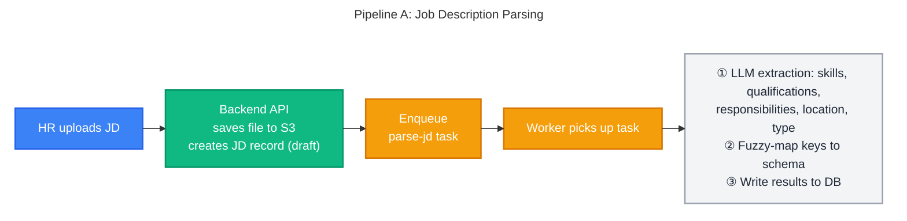
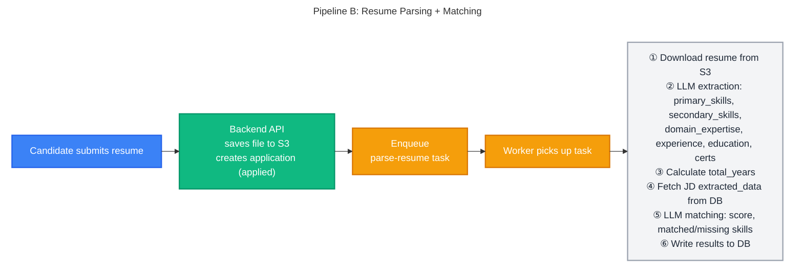
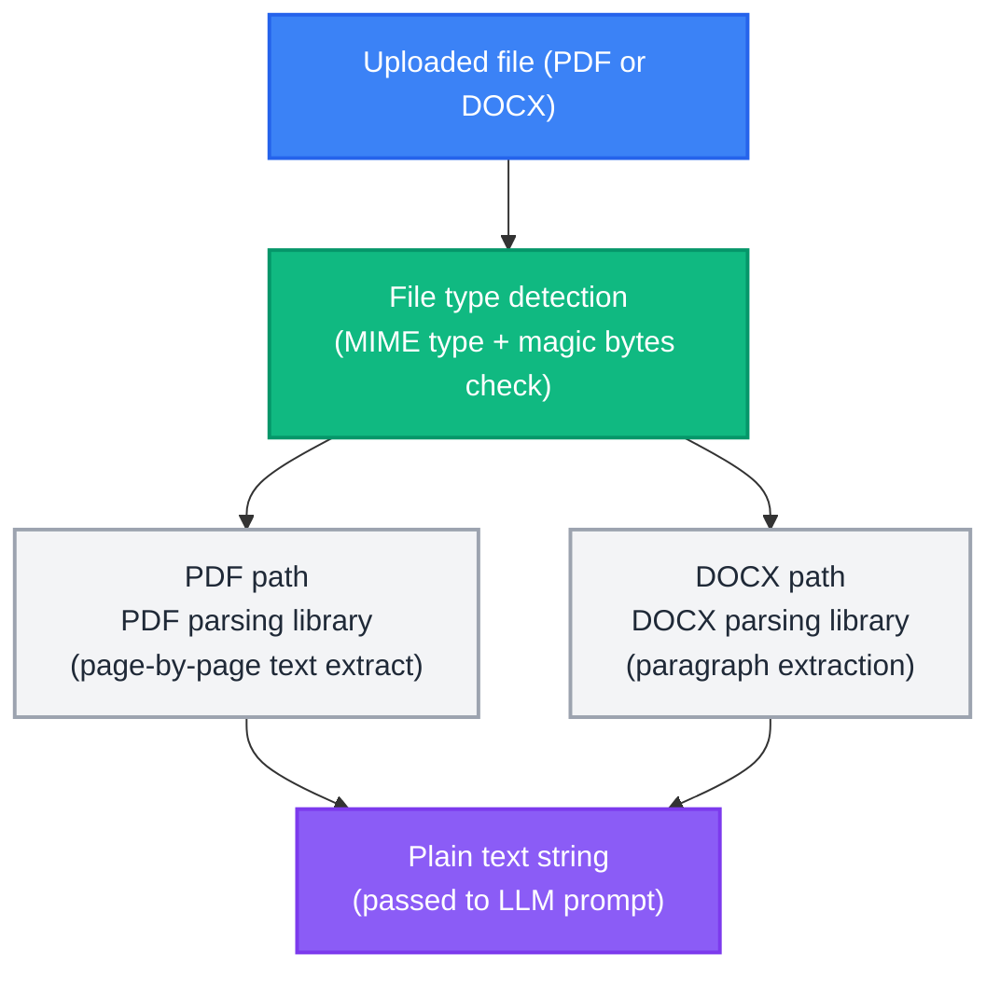

# AI Processing Pipeline - AI-Powered Recruitment Platform

> **Source of Truth**: This document is the authoritative reference for AI pipeline architecture, prompt engineering, extraction schemas, matching/scoring logic, and document parsing.
>
> For the overall system architecture and workflow diagrams, see [SYSTEM_DESIGN.md](../architecture/SYSTEM_DESIGN.md) §7 Workflows.
> For JSONB schema definitions stored in the database, see [DB_DESIGN.md](../architecture/DB_DESIGN.md) §5.

---

## Table of Contents

1. [Pipeline Overview](#1-pipeline-overview)
2. [AI Prompt Engineering](#2-ai-prompt-engineering)
3. [Matching Score Formula](#3-matching-score-formula)
4. [Document Parsing](#4-document-parsing)

> **Related**: For full prompt evaluation results, JD/Resume test profiles, and all 8 parsed JSON match outputs, see [PROMPT_EVALUATION_REPORT.md](../PROMPT_EVALUATION_REPORT.md).

---

## 1. Pipeline Overview

There are two AI pipelines for Phase 1. Both follow the same pattern: **API enqueues task → broker delivers → worker processes → worker writes results to DB**.





---

## 2. AI Prompt Engineering

The system uses three sequential LLM prompts. Each prompt is designed to return **strict JSON only**, stored directly as JSONB in the database. No markdown, code fences, or explanatory text is permitted in the response.

---

### A. Resume Parsing Prompt

**Input**: Raw resume text extracted from PDF/DOCX via Docling.

```text
You are an expert resume parser specializing in tech and business resumes.
Your task is to meticulously extract specific information and return it as a valid JSON object.

Rules:
- STRICTLY adhere to the JSON schema.
- If information is not explicitly present, set the value to null or an empty list (e.g., []).
  Do NOT guess.
- Primary skills are core, hard skills (e.g., programming languages, specific frameworks).
  Secondary skills are softer skills or less central technologies.
- Domain expertise should be a list of industries or business areas
  (e.g., 'Finance', 'E-commerce', 'Logistics').
- Skills should be concise keywords/tokens, not full sentences.
  Deduplicate and normalize them.
- CRITICAL: For each work experience role, you MUST find and provide the "start_date" and
  "end_date". If the end date is ongoing, use "present".
- Output ONLY the JSON object. Do NOT include any markdown, code fences, or explanatory
  text before or after the JSON.

Schema:
{
  "primary_skills": ["string"],
  "secondary_skills": ["string"],
  "domain_expertise": ["string"],
  "relevant_experience": {
    "total_years": "number or null",
    "roles": [
      {
        "title": "string or null",
        "company": "string or null",
        "start_date": "string or null",
        "end_date": "string or null",
        "years": "number or null",
        "highlights": ["string"]
      }
    ]
  },
  "education_certificates": [
    {
      "name": "string",
      "issuer": "string or null",
      "year": "string or null",
      "type": "degree or certification"
    }
  ]
}
```

**Key constraints**:
- `total_years` must be calculated from role dates — do not copy a self-reported figure from the resume.
- Current roles use `"end_date": "present"` and tenure is computed up to today's date.

---

### B. Job Description Parsing Prompt

**Input**: Raw JD text (extracted from uploaded document or fetched from URL).

```text
You are an expert job description parser. Parse this JD systematically.
Return ONLY a JSON object in this format:
{
  "title": null,
  "company": null,
  "company_description": null,
  "experience_required": {
    "min_years": null,
    "max_years": null
  },
  "skills": {
    "must_have": ["skill1", "skill2"],
    "good_to_have": ["skill1", "skill2"]
  },
  "qualifications": ["degree1", "degree2"],
  "responsibilities": ["resp1", "resp2"],
  "location": null,
  "employment_type": "Full-time"
}
```

**Key constraints**: Return `null` for any field not explicitly mentioned. Do not infer or hallucinate values.

---

### C. Candidate–JD Matching Prompt

**Input**: Both parsed JSONs (resume + JD) already stored in DB, injected into the prompt.

```text
You are an expert technical recruiter and data analyst.
Compare the given candidate resume with the job description and calculate a match score
based strictly on the predefined evaluation criteria below.
Return STRICT JSON only, no commentary.

### Candidate Resume (parsed JSON):
{resume_json}

### Job Description (parsed JSON):
{jd_json}

### Predefined Evaluation Criteria (Total: 100 Points)
1. Must-Have Skills (40 Points):
   - Calculate the percentage of JD must-have skills found in the resume.
     Multiply that percentage by 40.
2. Relevant Experience (30 Points):
   - If candidate's total_years is null or 0, award 0 points.
   - Award 30 points if the candidate meets or exceeds the minimum required years
     (or if the JD specifies no minimum).
   - If they have less experience, pro-rate the score
     (e.g., 2 years out of 4 required = 15 points).
3. Good-to-Have Skills (20 Points):
   - Calculate the percentage of JD good-to-have skills found.
     Multiply that percentage by 20.
4. Qualifications & Domain (Maximum 10 Points):
   - Award 10 points if they have at least one exact degree/qualification match.
   - Award 5 points if their best match is a somewhat related field.
   - Award 5 points if they have a relevant certificate that comes under qualifications.
   - Award 0 points if completely unrelated and lacking relevant certificates.

### Instructions:
1. Compare candidate's skills with JD must-have and good-to-have skills.
2. Systematically calculate the score for each of the 4 criteria.
3. Sum the scores to get a total out of 100.
4. Convert the total to a 0.0–10.0 scale (e.g., 85 points = 8.5 final match_score).
5. Output reasoning in 2–4 short bullet points.

### Output Format (STRICT JSON):
{
  "score_breakdown": {
    "must_have_skills_score": 32.0,
    "experience_score": 30.0,
    "good_to_have_skills_score": 15.0,
    "qualifications_score": 10.0
  },
  "match_score": 8.7,
  "reasoning": ["point 1", "point 2", "point 3"],
  "matched_skills": {
    "must_have": ["..."],
    "good_to_have": ["..."]
  },
  "missing_skills": {
    "must_have": ["..."],
    "good_to_have": ["..."]
  },
  "qualification_match": true,
  "experience_match": true
}
```

> **Human-in-the-loop**: The AI matching score is an advisory signal, not an automated decision. No candidate is automatically rejected based on matching score alone. HR must explicitly review and confirm every status transition.

---

## 3. Matching Score Formula

The final `match_score` (0.0–10.0) is derived from a **100-point rubric** evaluated by the LLM matching prompt. The four criteria and their point allocations are:

```
  total_points (max 100) =
      must_have_skills_score     (max 40)
    + experience_score           (max 30)
    + good_to_have_skills_score  (max 20)
    + qualifications_score       (max 10)

  match_score = total_points / 10
```

| Max Points | Criterion | Scoring Logic |
|:-----------:|-----------|---------------|
| **40** | Must-Have Skills | `(matched / total must-haves) × 40` |
| **30** | Relevant Experience | Full 30 if meets/exceeds min years; pro-rated otherwise; 0 if `total_years` is null or 0 |
| **20** | Good-to-Have Skills | `(matched / total good-to-haves) × 20` |
| **10** | Qualifications & Domain | 10 = exact match · 5 = related field or relevant cert · 0 = unrelated |

The `match_score` is stored as a denormalised `float` column on the `applications` table to allow fast `ORDER BY match_score DESC` queries without recomputation.

> **Edge cases**:
> - If the JD specifies no minimum experience, the candidate receives the full 30 points provided `total_years` is not null/0.
> - If the JD has no `good_to_have` skills, that component scores 0 (not redistributed).
> - If `qualifications` list is empty in the JD, the prompt falls back to evaluating domain relevance.

> **Evaluation data**: The formula was validated against 8 test combinations (4 candidate profiles × 2 JDs). See [PROMPT_EVALUATION_REPORT.md](./PROMPT_EVALUATION_REPORT.md) for full results.

---

## 4. Document Parsing

Before the LLM can extract structured data, the raw file must be converted to plain text. The document parser handles this step:



Supported input formats: PDF, DOCX. Files are validated by MIME type and magic byte signature - not just file extension - before processing begins.

---

