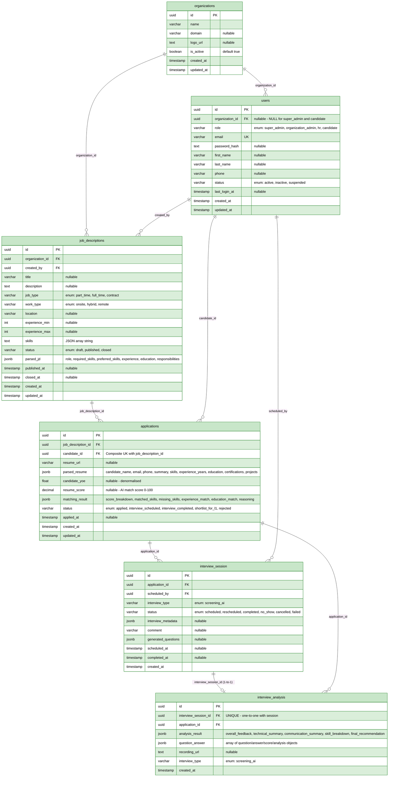

# Database Design - AI-Powered Recruitment Platform

> **Source of Truth**: This document is the authoritative reference for database schema, entities, relationships, constraints, indexes, JSONB schemas, and data lifecycle.
>
> For architectural decisions explaining *why* the schema is designed this way, see [SYSTEM_DESIGN.md](SYSTEM_DESIGN.md) §4 Key Design Decisions.

---

## Table of Contents

1. [Design Principles](#1-design-principles)
2. [Entity Reference](#2-entity-reference)
3. [Entity Relationship Diagram](#3-entity-relationship-diagram)
4. [Enum & Status Definitions](#4-enum--status-definitions)
5. [JSONB Schema Definitions](#5-jsonb-schema-definitions)
6. [Indexing Strategy](#6-indexing-strategy)
7. [Data Retention & Deletion](#7-data-retention--deletion)

---

## 1. Design Principles

1. **JSONB for AI-Extracted Data**: `parsed_jd` (job_descriptions), `parsed_resume` (applications), `matching_result` (applications), `analysis_result` & `question_answer` (interview_analysis) use PostgreSQL JSONB — allows schema evolution without migrations and efficient querying.

2. **Status-Driven Workflows**: State machines for JD lifecycle (`draft → published → closed`) and application lifecycle (`applied → interview_scheduled → shortlist_for_l1 / rejected`). All status transitions are validated at the application layer.

3. **Role-Based Access**: User roles (`super_admin`, `organization_admin`, `hr`, `candidate`) are stored directly on the `users` table. Organization scoping is enforced via `organization_id` (null for `super_admin` and `candidate`).

4. **Multi-Tenancy**: Organization-scoped data isolation. All queries for HR/admin users are automatically scoped to `organization_id`.

5. **Denormalised Read Columns**: `resume_score` (decimal) and `candidate_yoe` (float) are stored as typed columns on `applications` for fast `ORDER BY` and `WHERE` without JSONB parsing.

6. **One Interview Analysis per Session**: `interview_analysis.interview_session_id` carries a `UNIQUE` constraint enforcing a strict one-to-one relationship.

---

## 2. Entity Reference

### Summary

| Entity | Purpose |
|--------|---------|
| `organizations` | Multi-tenant organization records |
| `users` | All user accounts (admins, HR, candidates) |
| `job_descriptions` | Job postings with AI-parsed JD data |
| `applications` | Candidate applications with AI scoring |
| `interview_session` | Scheduled AI screening sessions |
| `interview_analysis` | AI analysis results for a completed session |

---

### organizations

| Column | Type | Constraints | Description |
|--------|------|-------------|-------------|
| `id` | uuid | PK | |
| `name` | varchar | NOT NULL | Organization display name |
| `domain` | varchar | nullable | Organization domain |
| `logo_url` | text | nullable | Organization logo URL |
| `is_active` | boolean | default true | Soft-delete / suspension flag |
| `created_at` | timestamp | | |
| `updated_at` | timestamp | | |

---

### users

| Column | Type | Constraints | Description |
|--------|------|-------------|-------------|
| `id` | uuid | PK | |
| `organization_id` | uuid | FK → organizations, nullable | NULL for `super_admin` & `candidate` |
| `role` | user_role | | See [User Role Enum](#user-role) |
| `email` | varchar | UNIQUE, NOT NULL | |
| `password_hash` | text | nullable | |
| `first_name` | varchar | nullable | |
| `last_name` | varchar | nullable | |
| `phone` | varchar | nullable | |
| `status` | user_status | | See [User Status Enum](#user-status) |
| `last_login_at` | timestamp | nullable | |
| `created_at` | timestamp | | |
| `updated_at` | timestamp | | |

---

### job_descriptions

| Column | Type | Constraints | Description |
|--------|------|-------------|-------------|
| `id` | uuid | PK | |
| `organization_id` | uuid | FK → organizations, NOT NULL | |
| `created_by` | uuid | FK → users, NOT NULL | HR/admin who created the JD |
| `title` | varchar | nullable | Job title |
| `description` | text | nullable | Raw JD text entered from UI |
| `job_type` | Job_type | | `part_time`, `full_time`, `contract` |
| `work_type` | work_type | | `onsite`, `hybrid`, `remote` |
| `location` | varchar | nullable | |
| `experience_min` | int | nullable | Minimum years of experience |
| `experience_max` | int | nullable | Maximum years of experience |
| `skills` | text | nullable | JSON array string of required skills |
| `status` | job_status | | See [Job Status Enum](#job-status) |
| `parsed_jd` | jsonb | nullable | See [parsed_jd Schema](#jd-parsed_jd) |
| `published_at` | timestamp | nullable | When status changed to `published` |
| `closed_at` | timestamp | nullable | When status changed to `closed` |
| `created_at` | timestamp | | |
| `updated_at` | timestamp | | |

---

### applications

| Column | Type | Constraints | Description |
|--------|------|-------------|-------------|
| `id` | uuid | PK | |
| `job_description_id` | uuid | FK → job_descriptions, NOT NULL | |
| `candidate_id` | uuid | FK → users, NOT NULL | Composite UK with `job_description_id` |
| `resume_url` | varchar | nullable | URL / S3 path for uploaded resume |
| `parsed_resume` | jsonb | nullable | See [parsed_resume Schema](#application-parsed_resume) |
| `candidate_yoe` | float | nullable | Denormalised years of experience |
| `resume_score` | decimal | nullable | AI match score (0–100) |
| `matching_result` | jsonb | nullable | See [matching_result Schema](#application-matching_result) |
| `status` | application_status | | See [Application Status Enum](#application-status) |
| `applied_at` | timestamp | nullable | |
| `created_at` | timestamp | | |
| `updated_at` | timestamp | | |

**Unique Constraint**: `(job_description_id, candidate_id)` — one application per candidate per JD.

---

### interview_session

| Column | Type | Constraints | Description |
|--------|------|-------------|-------------|
| `id` | uuid | PK | |
| `application_id` | uuid | FK → applications, NOT NULL | |
| `scheduled_by` | uuid | FK → users, NOT NULL | HR/admin who scheduled the session |
| `interview_type` | interview_type | | e.g. `screening_ai` |
| `status` | interview_status | | See [Interview Status Enum](#interview-status) |
| `interview_metadata` | jsonb | nullable | Flexible metadata (links, tokens, etc.) |
| `comment` | varchar | nullable | Internal notes |
| `generated_questions` | jsonb | nullable | See [generated_questions Schema](#interview-session-generated_questions) |
| `scheduled_at` | timestamp | nullable | Confirmed session time |
| `completed_at` | timestamp | nullable | |
| `created_at` | timestamp | | |

---

### interview_analysis

| Column | Type | Constraints | Description |
|--------|------|-------------|-------------|
| `id` | uuid | PK | |
| `interview_session_id` | uuid | FK → interview_session, NOT NULL, UNIQUE | One-to-one with session |
| `application_id` | uuid | FK → applications, NOT NULL | |
| `analysis_result` | jsonb | nullable | See [analysis_result Schema](#interview-analysis-analysis_result) |
| `question_answer` | jsonb | nullable | See [question_answer Schema](#interview-analysis-question_answer) |
| `recording_url` | text | nullable | URL / S3 path for session recording |
| `interview_type` | interview_type | | |
| `created_at` | timestamp | | |

---

## 3. Entity Relationship Diagram



---

## 4. Enum & Status Definitions

### User Status

| Value | Description |
|-------|-------------|
| `active` | Account is active and can log in |
| `inactive` | Account deactivated (not suspended) |
| `suspended` | Account suspended by admin |

### User Role

| Role | Scope | Description |
|------|-------|-------------|
| `super_admin` | All organizations | Full system access; `organization_id` is NULL |
| `organization_admin` | Own organization | Manage users and all org data |
| `hr` | Own organization | Create/publish jobs, review applicants, schedule interviews |
| `candidate` | Own data | Browse jobs, submit applications; `organization_id` is NULL |

### Job Status

| Status | Description | Transitions To |
|--------|-------------|---------------|
| `draft` | Created, not yet visible to candidates | `published` |
| `published` | Visible; accepting applications | `closed` |
| `closed` | No longer accepting applications | Terminal |

### Work Type

| Value | Description |
|-------|-------------|
| `onsite` | In-office only |
| `hybrid` | Mix of office and remote |
| `remote` | Fully remote |

### Job Type

| Value | Description |
|-------|-------------|
| `part_time` | Part-time engagement |
| `full_time` | Full-time employment |
| `contract` | Contract / freelance |

### Application Status

| Status | Description | Transitions To |
|--------|-------------|---------------|
| `applied` | Application submitted | `interview_scheduled` |
| `interview_scheduled` | AI screening session scheduled | `interview_completed` |
| `interview_completed` | Session completed, awaiting HR review | `shortlist_for_l1`, `rejected` |
| `shortlist_for_l1` | Shortlisted for L1 human interview | Terminal (next pipeline step) |
| `rejected` | Candidate rejected | Terminal |

### Interview Type

| Value | Description |
|-------|-------------|
| `screening_ai` | AI-conducted screening interview |

### Interview Status

| Status | Description |
|--------|-------------|
| `scheduled` | Interview confirmed and upcoming |
| `rescheduled` | Interview rescheduled |
| `completed` | Interview completed |
| `no_show` | Candidate did not join |
| `cancelled` | Interview cancelled |
| `failed` | Interview failed due to a technical error |

---

## 5. JSONB Schema Definitions

### JD `parsed_jd`

```json
{
  "title": null,
  "company": null,
  "company_description": null,
  "experience_required": {
    "min_years": null,
    "max_years": null
  },
  "skills": {
    "must_have": ["skill1", "skill2"],
    "good_to_have": ["skill1", "skill2"]
  },
  "qualifications": ["degree1", "degree2"],
  "responsibilities": ["resp1", "resp2"],
  "location": null,
  "employment_type": "Full-time"
}

```

All fields return `null` if not explicitly found in the JD. The LLM prompt constrains: "Do not infer or hallucinate values."

---

### Application `parsed_resume`

```json
{
  "primary_skills": ["string"],
  "secondary_skills": ["string"],
  "domain_expertise": ["string"],
  "relevant_experience": {
    "total_years": "number or null",
    "roles": [
      {
        "title": "string or null",
        "company": "string or null",
        "start_date": "string or null",
        "end_date": "string or null",
        "years": "number or null",
        "highlights": ["string"]
      }
    ]
  },
  "education_certificates": [
    {
      "name": "string",
      "issuer": "string or null",
      "year": "string or null",
      "type": "degree or certification"
    }
  ]
}
```

---

### Application `matching_result`

```json
{
  "score_breakdown": {
    "must_have_skills_score": 32.0,
    "experience_score": 30.0,
    "good_to_have_skills_score": 15.0,
    "qualifications_score": 10.0
  },
  "match_score": 8.7,
  "reasoning": [
    "point 1",
    "point 2",
    "point 3"
  ],
  "matched_skills": {
    "must_have": ["..."],
    "good_to_have": ["..."]
  },
  "missing_skills": {
    "must_have": ["..."],
    "good_to_have": ["..."]
  },
  "qualification_match": true,
  "experience_match": true
}
```
---

### Interview Session `generated_questions`

```json
[
  {
    "id": 1,
    "category": "must_have_matched",
    "skill_focus": "Core Java",
    "question": "Can you explain the difference between checked and unchecked exceptions?",
    "expected_keywords": ["RuntimeException", "compile-time", "try-catch", "throws"],
    "answer_depth": "The candidate should clearly state that checked exceptions are verified at compile-time while unchecked exceptions happen at runtime."
  }
]
```
This dynamic list of questions is tailored to the candidate and generated by the LLM based on the interview time limit.

---

### Interview Analysis `question_answer`

```json
[
  {
    "question_id": 1,
    "question": "Can you explain the difference between a HashMap and a ConcurrentHashMap?",
    "candidate_answer": "So, a HashMap isn't thread-safe, while a ConcurrentHashMap is designed for multi-threaded environments.",
    "follow_up_question": "You mentioned that ConcurrentHashMap handles synchronization for you; can you explain how it does that differently?",
    "follow_up_answer": "Right, so instead of locking the entire map, ConcurrentHashMap uses a technique called lock stripping."
  },
  {
    "question_id": 2,
    "question": "When would you use a JOIN versus a Subquery to retrieve data?",
    "candidate_answer": "I generally use joins when I need to combine columns from multiple tables, while subqueries are better for filtering."
  }
]
```
This stores the raw Q&A combinations generated during the session BEFORE the final LLM evaluation.

---

### Interview Analysis `analysis_result`

```json
{
  "evaluations": [
    {
      "question_id": 1,
      "question": "Can you explain the difference between checked and unchecked exceptions?",
      "candidate_answer": "Checked exceptions are checked at compile time, and you have to use a try catch block. Unchecked exceptions extend RuntimeException.",
      "score": 8,
      "coverage_percent": 75.0,
      "keywords_found": ["compile-time", "try-catch", "RuntimeException"],
      "keywords_missing": ["throws"],
      "is_sufficient": true,
      "decision": "NEXT_QUESTION",
      "feedback": "The candidate provided a solid and accurate definition of the exceptions.",
      "follow_ups": []
    },
    {
      "question_id": 2,
      "question": "Can you explain the difference between a HashMap and a ConcurrentHashMap?",
      "candidate_answer": "A HashMap isn't thread-safe, while a ConcurrentHashMap is designed for multi-threaded environments.",
      "score": 5,
      "coverage_percent": 66.6,
      "keywords_found": ["thread-safety", "multi-threading"],
      "keywords_missing": ["segment locking"],
      "is_sufficient": false,
      "decision": "ASK_FOLLOW_UP",
      "feedback": "The candidate correctly identified the basic difference regarding thread-safety, but failed to explain *how* it achieves this.",
      "follow_ups": [
        {
          "follow_up_question": "You mentioned it handles synchronization; can you explain how it does that differently than a global lock to maintain performance?",
          "follow_up_answer": "It uses a technique called lock stripping or bucket-level locking to allow multiple threads.",
          "score": 9,
          "coverage_percent": 100.0,
          "keywords_found": ["segment locking", "thread-safety", "multi-threading"],
          "keywords_missing": [],
          "is_sufficient": true,
          "decision": "NEXT_QUESTION",
          "feedback": "The candidate correctly identified lock stripping/bucket-level locking as the mechanism to reduce contention."
        },
      ]
    }
  ],
  "final_summary": {
    "total_score": 114.0,
    "max_possible_score": 150,
    "final_percentage": 76.0,
    "final_recommendation": "shortlist_for_l1"
  }
}
```
*(Note: The `max_possible_score` and `final_percentage` are mathematically calculated based on the dynamic number of questions. The `follow_ups` array is empty `[]` when `decision` is `NEXT_QUESTION`, and contains one or more objects when `decision` is `ASK_FOLLOW_UP`.)*

---

### Denormalised Columns on `applications`

| Column | Type | Source | Purpose |
|--------|------|--------|---------|
| `resume_score` | decimal (0–100) | `matching_result.score_breakdown.overall_score` | Fast `ORDER BY` sorting |
| `candidate_yoe` | float | `parsed_resume.experience_years` | Fast filter/sort by experience |

---

## 6. Indexing Strategy

| Table | Index | Columns | Type | Access Pattern |
|-------|-------|---------|------|----------------|
| `organizations` | Active lookup | `is_active` | B-tree | Filter active orgs |
| `users` | Org isolation | `organization_id` | B-tree | All user queries scoped to org |
| `users` | Role filter | `role` | B-tree | Filter by role |
| `users` | Status filter | `status` | B-tree | Filter active/suspended users |
| `job_descriptions` | Org isolation | `organization_id` | B-tree | Multi-tenant JD queries |
| `job_descriptions` | Status filter | `status` | B-tree | Filter published/draft/closed |
| `job_descriptions` | AI data search | `parsed_jd` | GIN | Query inside JSONB |
| `applications` | Applications by JD | `job_description_id` | B-tree | All applicants for a job |
| `applications` | Score ranking | `resume_score DESC` | B-tree | Sort candidates by AI score |
| `applications` | Status filter | `status` | B-tree | Filter by pipeline stage |
| `applications` | Combined HR query | `(job_description_id, status, resume_score DESC)` | Composite B-tree | Single-query dashboard |
| `applications` | Duplicate check | `(job_description_id, candidate_id)` | Composite UK | Enforce one application per user per JD |
| `applications` | Experience filter | `candidate_yoe` | B-tree | Filter by experience range |
| `applications` | Resume data search | `parsed_resume` | GIN | Query inside JSONB |
| `interview_session` | Session by application | `application_id` | B-tree | All sessions for an application |
| `interview_session` | Session status | `status` | B-tree | Filter by session state |
| `interview_analysis` | Unique session link | `interview_session_id` | UK | Enforce 1-to-1 with session |
| `interview_analysis` | Analysis by application | `application_id` | B-tree | All analyses for an application |

### Query Patterns to Avoid

- **N+1 queries** — always eager-load associated records in a single query
- **Full table scans on large tables** — all `WHERE` clauses on `applications` and `job_descriptions` must use indexed columns
- **Sorting unindexed JSONB fields** — sort on the denormalised `resume_score` decimal column, not on `matching_result->>'overall_score'`
- **Unbounded queries** — all list endpoints must enforce a `LIMIT` and use cursor or offset pagination

---

## 7. Data Retention & Deletion

### Retention Policy

| Record Type | Retention Period |
|-------------|-----------------|
| Rejected applications | 180 days |
| Shortlisted / hired candidate records | 7 years |
| Closed job descriptions | 5 years |
| Interview session recordings | 2 years (or until deletion requested) |


---

