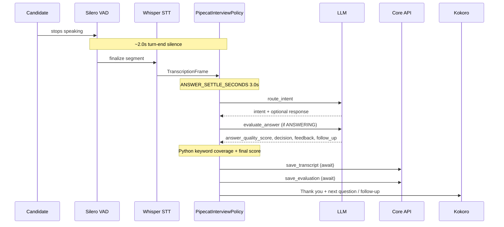

> **Update:** the Python keyword matcher (`keyword_matcher.py`, `calculate_keyword_coverage`) described below has since been removed. The LLM now returns `keyword_match_score` and the found/missing lists; Python only bounds and blends them. See `AI_PROCESSING.md` §5.3.

# Screening Bot Latency Optimization Plan

> **Status**: Phases 1–4 implemented and validated (see §4.8, §5.5, §6.6, §7.5).
> **Scope**: `services/ai-core-services/src/screening_pipeline/` (Pipecat interview bot).  
> **Goal**: Reduce perceived turn latency without changing screening outcomes, persistence shape, or HR-facing data.
> **Rollout approach**: Direct replacement per phase, no env-var feature flags — each phase lands as a single change on this branch, validated by the existing pytest suite plus a manual dry-run before merge. Rollback is `git revert`, not a runtime toggle. (Chosen over flags to avoid maintaining dual code paths — see §3.)

---

## 1. Objectives and constraints

### 1.1 Goals

| Priority | Goal | Primary lever |
| --- | --- | --- |
| P0 | Remove one LLM round-trip per candidate utterance (except greeting/closing paths) | Phase 1 |
| P1 | Shorten silence after the candidate stops speaking before evaluation starts | Phase 2 |
| P1 | Stop blocking the next bot utterance on Core API HTTP | Phase 3 |
| P2 | Start audio sooner for fixed and predictable bot text | Phase 4 |

### 1.2 Non-goals (this initiative)

- Changing question generation, routing engine, or final weighted score math (`routing_engine`, `summary_calculator`).
- Replacing Whisper STT, Kokoro TTS, or Attendee transport.
- Removing deterministic keyword coverage in Python (remains authoritative per `AI_PROCESSING.md` §5.3).
- Batching multiple questions into one LLM call.

### 1.3 Invariants (must hold after every phase)

These are enforced by existing tests and product behavior; any phase that breaks them is rolled back.

1. **Intent taxonomy**: `ANSWERING`, `CLARIFICATION`, `SMALL_TALK`, `SKIP` — same semantics as `INTENT_ROUTER_SYSTEM` in `prompts.py`.
2. **Scoring**: `keyword_match_score`, `answer_quality_score`, `score`, `decision` (`NEXT_QUESTION` / `ASK_FOLLOW_UP` / `REPEAT_QUESTION`) computed as today: Python keyword matcher + LLM quality score + 50/50 blend (`evaluator.py`).
3. **Persistence payloads**: `build_qa_entry`, `build_evaluation_block`, `build_skip_evaluation` output shape unchanged (`evaluation_builders.py`).
4. **State machine**: Greeting → questions → optional follow-up (max 1) → closing → optional closing reply; inactivity prompts; VAD resets settle buffer (`pipecat_policy.py`).
5. **Finalize**: `persist_interview_close` still runs once with in-memory `analysis_evaluations` + `transcript_log` (`test_behavior_contracts.py`).

---

## 2. Current latency budget (baseline)

Approximate critical path **after the candidate finishes an answer** (happy path, `ANSWERING` → sufficient score → next question):

```text
[Pipecat VAD stop_secs]     SCREENING_TURN_END_SILENCE_SECONDS = 2.0s   (pipecat_runtime.py)
[Policy answer settle]      ANSWER_SETTLE_SECONDS = 3.0s                 (prompts.py)
[LLM intent router]         1 × openai_chat_generate                     (evaluator.route_intent)
[LLM answer evaluation]     1 × openai_chat_generate                     (evaluator.evaluate_answer)
[Python keyword merge]      synchronous                                  (keyword_matcher)
[Core API]                  save_transcript + save_evaluation (sequential, awaited)
[TTS]                       Kokoro full-utterance synth + chunked send   (pipecat_tts.py)
[Fixed phrase TTS]          "Thank you for answering the question."      (pipecat_policy._handle_answer)
```

**Dominant removable costs today**

1. Second LLM call on every non-conversational utterance (~largest win).
2. Up to **5.0s** of post-speech waiting (2.0 VAD + 3.0 settle) before any LLM work begins.
3. Core API latency on the path to `_ask_next_question` (two HTTP calls, 5s timeout each).
4. TTS cold synthesis for text known at session start (questions, greeting, closing, silence prompt).



---

## 3. Phased rollout strategy

| Phase | Deliverable | Risk | Status |
| --- | --- | --- | --- |
| 1 | Unified LLM router + evaluator | Medium (prompt/schema) | **Implemented** |
| 2 | Tunable VAD + settle | Medium (UX / cut-off) | **Implemented** |
| 3 | Async Core API writes | Low–medium (durability) | **Implemented** |
| 4 | TTS warm cache + overlap | Low | **Implemented** |

**Rollout rule**: Direct replacement, no feature flags (see status banner above) — old and new
code paths do not coexist. Run the full pytest screening suite + one manual dry-run checklist
(§9) before merging each phase.

**Rollback**: `git revert` the phase's commit(s); no DB migration required for any phase.

---

## 4. Phase 1 — Single LLM call (intent + evaluation)

### 4.1 Problem

`_process_speech` always calls `route_intent`, then `evaluate_answer` for `ANSWERING` (`pipecat_policy.py` lines 362–436). That is **two sequential network calls** to the model with overlapping context.

### 4.2 Design

Introduce **one** user-facing LLM method, e.g. `AnswerEvaluator.classify_and_evaluate(...)`, backed by:

- **System prompt**: Merge `INTENT_ROUTER_SYSTEM` + `ANSWER_EVALUATION_SYSTEM` into `UNIFIED_SCREENING_SYSTEM` in `prompts.py`.
- **User prompt**: Extend `ScreeningPromptBuilder` with `build_unified_prompt(...)` that includes:
  - Current question, candidate transcript (same as intent).
  - For evaluation context: `expected_keywords`, `answer_depth`, optional follow-up block (same as `build_evaluation_prompt`).
  - Explicit instruction: **If intent is not `ANSWERING`, omit evaluation fields and do not score.**

**Structured JSON response** (strict JSON, no markdown):

```json
{
  "intent": "ANSWERING | CLARIFICATION | SMALL_TALK | SKIP",
  "response": "<required for CLARIFICATION and SMALL_TALK; empty string otherwise>",

  "answer_quality_score": "<0-10; required only when intent is ANSWERING>",
  "decision": "NEXT_QUESTION | ASK_FOLLOW_UP | REPEAT_QUESTION | omitted when not ANSWERING>",
  "feedback": "<2-3 sentences; ANSWERING only>",
  "suggested_follow_up": "<ASK_FOLLOW_UP only; omit for REPEAT_QUESTION>"
}
```

**Fields intentionally NOT returned by LLM** (unchanged authority):

- `keywords_found`, `keywords_missing`, `coverage_percent`, `keyword_match_score`, `score`, `is_sufficient` — still computed in Python via `calculate_keyword_coverage` + existing merge logic in `evaluate_answer` (extract shared post-processing function `_apply_deterministic_scores(eval_data, transcript, expected_keywords)`).

### 4.3 Control flow (after Phase 1)

```text
_process_speech(transcript)
  → unified = classify_and_evaluate(...)
  → switch unified.intent:
       CLARIFICATION | SMALL_TALK → _handle_conversational (unchanged)
       SKIP                       → _handle_skip (unchanged)
       ANSWERING                  → use unified eval payload → _handle_answer logic (no second LLM)
```

**Greeting / closing paths**: No LLM today — unchanged.

### 4.4 Prompt authoring notes

1. **Order of instructions**: Classify intent first in the system prompt; then state that evaluation fields apply **only** when intent is `ANSWERING`.
2. **CLARIFICATION vs REPEAT_QUESTION**: Keep intent router rule — repeat/clarify the *question* is `CLARIFICATION` with `response`; unrelated audio (`REPEAT_QUESTION` in eval) remains an evaluation-time `decision` when intent is `ANSWERING` (same as today).
3. **SKIP**: Intent `SKIP` must not populate scores; policy continues to use `build_skip_evaluation`.
4. **Follow-up answers**: Pass `follow_up_context` and the follow-up note in the user prompt (same as current evaluation prompt).
5. **Primary eval follow-up path**: When `primary_eval` exists in transcript log, keep using missing keywords + `partial_depth` (`pipecat_policy._handle_answer` lines 411–418) — only the LLM call site changes.

### 4.5 Compatibility and deprecation

- `route_intent` and `evaluate_answer` were removed outright (no flag, no legacy path) —
  decided against dual code paths to avoid the extra branching/cleanup cost of a flag for
  a same-branch change. `classify_and_evaluate` + `AnswerEvaluator._apply_deterministic_scores`
  fully replace them in `evaluator.py`.
- `prompts.py`: `INTENT_ROUTER_SYSTEM` + `ANSWER_EVALUATION_SYSTEM` replaced by
  `UNIFIED_SCREENING_SYSTEM`. `prompt_builder.py`: `build_intent_prompt` +
  `build_evaluation_prompt` replaced by `build_unified_prompt`.
- `docs/architecture/AI_PROCESSING.md` §5.3 updated with the **Unified Turn Prompt**
  subsection mirroring the JSON schema above.

### 4.6 Tests (Phase 1) — implemented

| Test | Purpose |
| --- | --- |
| `test_evaluator_scoring.py::test_evaluator_combines_python_keyword_coverage_with_llm_quality` | Unified response → same numeric outcomes as the old split calls |
| `test_evaluator_scoring.py::test_classify_and_evaluate_skips_scoring_for_non_answering_intent` | CLARIFICATION/SMALL_TALK/SKIP omit eval fields, exactly one `openai_chat_generate` call |
| `test_evaluator_scoring.py::test_classify_and_evaluate_falls_back_to_answering_on_malformed_json` | Malformed JSON → ANSWERING + eval-failure fallback, same as the old combined-failure case |
| `test_evaluator_helpers.py::test_unified_system_*` | Unified system prompt keeps the 50/50 scoring language and gates evaluation on ANSWERING |
| `test_behavior_contracts.py::test_question_is_repeated_at_most_once` | Updated to call `_handle_answer` with a precomputed `eval_data` (no more internal evaluator call) |
| Full `tests/screening_pipeline/` + `tests/` suite | 150/150 passing after the refactor |

### 4.7 Phase 1 dry-run (validated against the implemented code)

1. Candidate: "Can you repeat the question?" → `classify_and_evaluate` returns
   `{"intent": "CLARIFICATION", "response": ...}` with no eval fields and no keyword
   computation → `_handle_conversational` speaks the response and resumes listening —
   **no** evaluation persisted, **no** second LLM call.
2. Candidate: technical answer → one LLM call → `intent=ANSWERING`, score 6+,
   `decision=NEXT_QUESTION` → "Thank you for answering the question." + next question.
3. Candidate: shallow answer → `ASK_FOLLOW_UP` + `suggested_follow_up` spoken on this
   turn; the follow-up reply is itself one new `classify_and_evaluate` call on the next
   turn — never two calls within the same turn.
4. LLM returns malformed JSON → `classify_and_evaluate` catches the exception, defaults
   to `{"intent": "ANSWERING", "response": "", **eval-failure fallback}`, and
   `_apply_deterministic_scores` still runs keyword coverage against it — same net
   behavior as the old two-call failure case (both calls failing independently).

Confirmed by code inspection of `pipecat_policy._process_speech` / `_handle_answer` and
`AnswerEvaluator.classify_and_evaluate` — see git history for the exact diff.

### 4.8 What changed vs. the original draft of this document

- No feature flags (§3): direct replacement per the rollout decision, not staged env-var flags.
- The unified JSON schema **drops** `coverage_percent`, `keyword_match_score`,
  `keywords_found`, `keywords_missing`, `is_sufficient` from the fields the LLM is asked
  to return (§10 originally still listed some of these as LLM-returned). Python already
  overwrote every one of these unconditionally, so asking the LLM to generate them was
  pure wasted output-token latency with zero effect on behavior — removing them is a
  small additional latency win with no functional risk.

---

## 5. Phase 2 — VAD and answer settle tuning

### 5.1 Problem

Turn end is gated twice:

1. **Pipecat** `VADParams(stop_secs=SCREENING_TURN_END_SILENCE_SECONDS)` — default **2.0s** (`pipecat_runtime.py`).
2. **Policy** `ANSWER_SETTLE_SECONDS` — **3.0s** after each STT segment (`pipecat_policy.py`).

While the candidate is still talking, `handle_candidate_activity` cancels settle (`VADUserStartedSpeakingFrame` → `handle_candidate_activity`), so lowering settle mainly affects **final pause** before evaluation, not mid-sentence pauses.

### 5.2 Approach (conservative) — implemented

| Parameter | Old default | New default (implemented) | Hard floor (do not go below without UX sign-off) |
| --- | --- | --- | --- |
| `SCREENING_TURN_END_SILENCE_SECONDS` | 2.0 | **1.5** | 1.0 |
| `ANSWER_SETTLE_SECONDS` | 3.0 | **2.0** | 1.5 |

**Combined worst-case wait**: 5.0s → **3.5s**, saving up to **1.5s** before LLM work starts.
Picked the staging-trial values, not the hard floor — the hard floor still needs a live UX
sign-off this session couldn't produce (see §5.5).

Implementation:

- Both moved to `core/config.py` as `Settings.screening_turn_end_silence_seconds` /
  `Settings.screening_answer_settle_seconds` (pydantic-settings, same pattern as every
  other tunable in that file), env-overridable via `SCREENING_TURN_END_SILENCE_SECONDS`
  / `SCREENING_ANSWER_SETTLE_SECONDS`, documented in `.env.example`.
- `pipecat_runtime.SCREENING_TURN_END_SILENCE_SECONDS` and
  `prompts.ANSWER_SETTLE_SECONDS` now read from `settings` at import time instead of
  being hardcoded — every other call site (`VADParams(stop_secs=...)`,
  `asyncio.sleep(ANSWER_SETTLE_SECONDS)`) is unchanged, so this is a value-source change
  only, not a behavior/flow change.
- This is configurability of a single tunable, not a feature flag / dual code path —
  consistent with the "no flags" rollout decision in §3.

### 5.3 UX safeguards (no functional regression)

1. **Do not reduce** `SILENCE_PROMPT_SECONDS` (30) or inactivity logic — unrelated to answer latency.
2. **Monitor**: Rate of `REPEAT_QUESTION` and follow-ups caused by truncated STT (proxy: short transcripts + low scores).
3. **VAD activity path**: Keep cancel-on-`VADUserStartedSpeakingFrame`; if settle is shortened, rely on buffer concat (`test_answer_segments_are_combined_before_evaluation`).
4. **Whisper segment timing**: If STT finalizes late, VAD dominates; tune VAD first, then settle.

### 5.4 Validation

- Replay recorded PCM (if available) or manual calls with deliberate mid-answer pauses (2–3s) — answer must still merge segments.
- Compare p50/p95 "user stop → bot speak" from logs before/after.

### 5.5 Implementation & validation notes

- Full `tests/` suite passes (150/150) after the change, including
  `test_answer_segments_are_combined_before_evaluation` (buffer-concat still works with
  the shorter settle window — that test forces `ANSWER_SETTLE_SECONDS=0` via monkeypatch,
  so it exercises the concat logic independent of the actual timing value) and
  `test_pipecat_runtime_waits_for_the_configured_turn_end_silence_before_finalizing_an_answer`
  (VAD now constructed with 1.5s).
- Traced logically: `handle_candidate_activity` still cancels the settle task on every
  `VADUserStartedSpeakingFrame` regardless of the configured durations, so mid-sentence
  pauses shorter than the new 1.5s VAD window still don't finalize a segment early, and
  multi-segment answers still concatenate via `_answer_buffer` — the shortened values
  change *how long* the system waits, not *whether* segments get merged.
- **Not done — still needed before this is production-safe**: §5.4's live/staging
  validation (real candidate audio against the new 1.5s/2.0s values, p50/p95 comparison,
  deliberate mid-answer pause testing). This session verified the change is functionally
  correct (same merge/cancel logic, tests green) but could not verify perceived UX with
  real speech — that requires an actual Attendee/Pipecat session. If early real usage
  shows cut-off answers or a rise in `REPEAT_QUESTION`/short-answer follow-ups, dial the
  two env vars back up first before touching code — no redeploy needed.

---

## 6. Phase 3 — Async Core API persistence — implemented

### 6.1 Problem

Blocking calls on the hot path:

- `persist_completed_question`: `save_transcript` then `save_evaluation` (both awaited) before `_ask_next_question`.
- `_handle_skip`: same pattern.
- `finalize` / `persist_interview_close`: must remain reliable (summary + metadata).

### 6.2 Design (minimal) — as implemented

`persistence.py` split the old `persist_completed_question` into:
- `build_completed_question_payload(...)` — pure, builds `(qa_entry, evaluation)`, no I/O.
- `persist_qa_and_evaluation(api_client, qa_entry, evaluation)` — I/O only, `save_transcript` then `save_evaluation`, sequential (preserves Core API ordering per question).

`pipecat_policy.py` added two helpers on `PipecatInterviewPolicy`:
- `_schedule_persist(coro)` — wraps `coro` in `_run_persist` (catches + logs any exception so nothing raises into an untracked task) and `asyncio.create_task`s it, tracked in `self._pending_persist_tasks`; a `done_callback` removes it from the list on completion.
- `_flush_pending_persist(timeout=10.0)` — awaits every still-pending task via `asyncio.gather`, bounded by a 10s timeout so a dead Core API can't hang teardown indefinitely.

**Hot path change** (`_complete_question`, `_handle_skip`):

1. Build `qa_entry` / evaluation synchronously (pure functions — unchanged).
2. **Append to `analysis_evaluations` immediately** — see §6.2.1, this turned out to be load-bearing, not just a nice-to-have.
3. `self._schedule_persist(persist_qa_and_evaluation(...))` — fire and track, don't await.
4. `await self._ask_next_question()` runs immediately, not gated on the Core API call.

`finalize()` calls `await self._flush_pending_persist()` **before** `persist_interview_close`, so every per-question save gets a bounded chance to land before the summary/metadata calls and before teardown.

#### 6.2.1 A dependency the original draft of this section missed

`_ask_next_question` → `routing_engine.get_next_question(question_queues, self.analysis_evaluations)` reads `analysis_evaluations` **synchronously, immediately after** `_complete_question`/`_handle_skip` returns — it uses the just-completed question's score to decide the next category, detect a downgrade, or trigger `fatal_failure`. That is a hard functional dependency, not a bookkeeping nicety: if the append were also deferred to the background task, routing would make its decision blind to the answer that was just given.

Consequence: `analysis_evaluations` now gets the evaluation **as soon as it's built**, not gated on `save_evaluation` returning `True` as it was before. This is a genuine behavior change (call it out, don't bury it):
- **Before**: an evaluation only counted toward routing/final-score if Core API confirmed the save. A rejected/failed save silently excluded that question from scoring.
- **After**: an evaluation always counts toward routing/final-score once the LLM has scored it; the Core API save happens independently in the background and is logged (not scored) on failure.
- This is arguably more correct in practice (the candidate's answer to the fatal_failure/routing math shouldn't depend on Core API being up at that instant), but it is a behavior change the original doc draft didn't anticipate, so flagging it explicitly per the "no silent regressions" invariant in §1.3.

### 6.3 Failure handling (avoid silent data loss) — as implemented

| Event | Behavior |
| --- | --- |
| Background POST fails | Logged inside `SessionApiClient` (existing behavior) and again by `_run_persist` if the coroutine itself raises; **no retry** — see below |
| Interview ends | `_flush_pending_persist` blocks up to 10s; still-pending/failed items are logged, not retried |
| Process crash mid-interview | Same risk as before mid-await; unchanged — acceptable, same as today, bounded by the normal hang-up path calling `finalize` |

**Deliberately not implemented**: retry-with-backoff for failed background saves (the original draft's §6.3 proposed it). Skipped because (a) it requires knowing whether Core API's `qa-transcript`/`evaluation` POST endpoints are safe to retry (idempotent), which wasn't verified, and (b) it's added complexity beyond what this latency change needs — logging a failure for ops to see is the existing behavior for every other Core API call in this file (`update_status`, `save_final_summary`, `save_interview_metadata` all just log-and-continue on failure too). Consistent scope, not a gap specific to this phase.

**Known minor edge case, not fixed**: two background saves for consecutive questions could theoretically complete out of arrival order at Core API if their HTTP latencies differ enough (e.g., a slow POST for question 3 finishing after a fast POST for question 4). Each record carries its own `question_id`, so this is at most a display-order cosmetic issue for Core API's stored array, never a scoring or routing issue (routing/scoring only ever reads the in-memory `analysis_evaluations`, appended in true completion order). Not worth solving with a persistence queue/sequencer for a same-branch change — would be the exact overengineering this initiative was told to avoid.

### 6.4 What stays synchronous — unchanged

- `persist_interview_close` (LLM summary + `save_final_summary` + `save_interview_metadata`) — end of call, not per-turn latency.
- `update_status("completed")` — kept after the finalize await, unchanged.

### 6.5 Tests — implemented

| Test | Purpose |
| --- | --- |
| `test_persistence.py::test_build_completed_question_payload_builds_qa_entry_and_evaluation` | Pure builder unaffected by the I/O split |
| `test_persistence.py::test_persist_qa_and_evaluation_saves_transcript_then_evaluation` | Ordering preserved (transcript before evaluation) |
| `test_persistence.py::test_persist_qa_and_evaluation_does_not_raise_when_core_api_rejects` | A rejected save must not raise into an untracked background task |
| `test_behavior_contracts.py::test_complete_question_advances_without_waiting_for_core_api` | Real async timing (an `asyncio.Event`-gated mock, not a plain mock): `_ask_next_question` and `analysis_evaluations` both advance while `save_transcript` is still blocked; `save_evaluation` hasn't even been reached yet |
| `test_behavior_contracts.py::test_finalize_awaits_pending_persist_before_closing_out` | `finalize()` waits for the in-flight save to actually complete (asserted via call order) before running `persist_interview_close` |

### 6.6 Implementation & validation notes

- Full `tests/` suite passes (153/153) after the change.
- The two new timing-sensitive tests exercise real `asyncio` scheduling (event-gated
  mocks that only release once explicitly signaled) rather than instantly-resolving
  mocks, specifically so they'd fail if the hot path accidentally still awaited the
  Core API call inline.
- **Not done — still needed before this is production-safe**: a live/staging run
  against a real (or realistically slow) Core API to confirm perceived latency actually
  drops and that no background task is silently dropped under real network conditions
  (e.g. Core API restarting mid-interview). This session validated correctness of the
  async wiring, not real-world timing.

---

## 7. Phase 4 — TTS pre-generation and faster playback — implemented

### 7.1 Problem

`KokoroSynthesizer.synthesize` runs **full utterance** in a thread pool, then chunks PCM (`pipecat_tts.py`). Known-at-start strings still pay synthesis latency on first speak.

**Known text** (deterministic):

- `GREETING_TEXT`, `CLOSING_TEXT`, `SILENCE_PROMPT_TEXT`
- Every `question` string in `session.generated_questions`
- Static phrase: `ANSWER_ACKNOWLEDGEMENT_TEXT` ("Thank you for answering the question.") — pulled out of
  `pipecat_policy._handle_answer` into a named constant in `prompts.py` so the warm-up pass and the live
  `speak()` call are guaranteed to use the exact same string (a cache is keyed by exact text, so a stray
  literal mismatch would have silently defeated the cache for this phrase).

**Unknown until LLM returns** (not pre-warmed, unchanged Kokoro path):

- Follow-up questions, CLARIFICATION/SMALL_TALK `response`, repeat-question phrasing

### 7.2 Design (as implemented — minimal cache, no overlap sub-step)

`KokoroSynthesizer` (`pipecat_tts.py`) owns the cache directly rather than a separate `TtsWarmCache` class —
one `KokoroSynthesizer` instance already exists per Pipecat session (constructed fresh in
`PipecatInterviewRuntime.__init__`), so it's the natural owner and needs no extra wiring to stay
session-scoped:

- `self._cache: dict[str, list[bytes]]` keyed by the exact text passed to `synthesize()`, storing the
  already-chunked PCM (`@ 24kHz`, same 2400-byte chunking as before).
- `self._synth_lock: asyncio.Lock()` serializes the underlying `kokoro.create(...)` call — the
  onnxruntime session backing Kokoro is not documented as safe for concurrent invocation from multiple
  threads, and warm-up now runs concurrently (in a background task) with whatever `speak()` calls happen
  on the live turn path.
- `synthesize(text)`: cache hit → yield the cached chunks directly, no executor hop at all. Cache miss →
  acquire `_synth_lock`, re-check the cache (a warm-up pass may have finished while this call waited on
  the lock), synthesize via the existing thread-pool path if still missing, store the result, then yield.
- `warm(texts)`: dedupes the input, skips anything already cached, and drains `synthesize()` for each
  remaining string **sequentially** (via the same lock) so it never contends with the model call a live
  `speak()` might be making concurrently.
- `KokoroTTSService.warm_cache(texts)` is a thin pass-through to `synthesizer.warm(texts)`.

**Trigger point**: `PipecatInterviewPolicy.start()` — right after `self.questions` is loaded from the
session and before the greeting is spoken — fires `asyncio.create_task(self._warm_tts_cache())` against
`self.tts_cache_warmer` (wired to `KokoroTTSService.warm_cache` by `PipecatInterviewRuntime.__init__`).
This is fire-and-forget: it does not block the greeting, and by the time each question is actually asked
(several turns later, after the LLM has processed the candidate's replies) its audio is very likely
already cached.

**Not implemented — the optional "overlap for LLM follow-ups" sub-step from the original draft**: follow-up
questions, CLARIFICATION/SMALL_TALK responses, and repeat-question phrasing are never known ahead of time
(they come from the LLM), so there is nothing to pre-warm for them; they always take the normal
on-demand Kokoro path. Starting their synthesis early while "Thank you..." is still playing was scoped
out as unnecessary complexity for a same-branch change — `ANSWER_ACKNOWLEDGEMENT_TEXT` itself is now
warm-cached, which already removes its synthesis latency from that turn.

**Streaming**: the pipeline still streams ~50ms chunks to Attendee (`AttendeeOutputProcessor`
re-chunks every outbound frame to `chunk_size=2400` regardless of the frame size it receives, so this
was never a hard constraint on `KokoroSynthesizer`'s own chunking). Cache-miss synthesis itself is now
also incremental, not just the delivery to Attendee — see §7.6.

### 7.3 Invalidation

- Cache lives on the `KokoroSynthesizer` instance, which is constructed fresh per
  `PipecatInterviewRuntime` (one per Attendee WebSocket session/meeting) and is never reused across
  sessions — so it is discarded for free when the runtime object is torn down at the end of the meeting,
  with no explicit invalidation code needed.
- `PipecatInterviewPolicy` also cancels its own warm-up task (`_cancel_tts_warm`) as part of
  `end_interview`, alongside the other per-turn task cancellations, so a warm-up still in flight when the
  interview ends early doesn't keep running past teardown.
- Question text does not change mid-session today, so the cache key is the exact question string, not a
  question id — same as the original draft assumed.

### 7.4 Tests — implemented

| Test | Purpose |
| --- | --- |
| `test_pipecat_tts.py::test_synthesize_caches_pcm_and_skips_model_on_repeat` | Cache hit skips the model call entirely |
| `test_pipecat_tts.py::test_warm_populates_cache_for_all_known_texts_without_duplicates` | `warm()` dedupes and pre-populates so a later live `speak()` for the same text is a cache hit |
| `test_pipecat_tts.py::test_warm_skips_texts_already_cached` | `warm()` doesn't re-synthesize something already cached |
| `test_pipecat_tts.py::test_concurrent_synthesize_calls_for_same_text_only_invoke_model_once` | The synth lock collapses a race on the same uncached text into one model call |
| `test_pipecat_tts.py::test_kokoro_tts_service_warm_cache_delegates_to_synthesizer` | Service-level `warm_cache` wiring |
| `test_behavior_contracts.py::test_start_warms_tts_cache_with_greeting_closing_and_all_questions` | `start()` fires the warmer with exactly greeting + closing + silence prompt + acknowledgement + every question text |
| `test_behavior_contracts.py::test_start_does_not_warm_tts_cache_when_no_warmer_configured` | No-warmer constructor path is a no-op, not an error |
| `test_behavior_contracts.py::test_ending_interview_cancels_a_still_running_tts_warm_task` | A still-running warm-up task is cancelled on `end_interview`, not left dangling |

### 7.5 Implementation & validation notes

- Full `tests/` suite passes (161/161) after this change (163/163 after §7.6).
- Not done — same caveat as Phases 1–3: this session validated the cache/warm-up logic and its wiring
  with unit tests and code inspection, not a live/staging interview run measuring actual first-play
  latency against real Kokoro synthesis timing. The dry-run checklist in §9 should be re-run once this
  phase is included.

### 7.6 Addendum — streaming synthesis on cache miss

**Problem**: the cache-miss path (follow-up questions, CLARIFICATION/SMALL_TALK responses,
repeat-question phrasing — anything the LLM generates at runtime, never pre-warmed per §7.2) still called
`kokoro_onnx`'s `Kokoro.create(...)`, which synthesizes the **entire utterance in one blocking call**
before returning anything. The 2400-byte chunking `KokoroSynthesizer` did afterward was purely a
post-hoc slice of already-finished audio — a multi-sentence follow-up still made the candidate wait for
every sentence to synthesize before hearing the first one.

**Fix**: `kokoro_onnx` (confirmed on the locked version, 0.6.1) also exposes `Kokoro.create_stream(...)`,
which internally does the same sentence/clause batching `create()` uses (same `_prepare` /
`_create_batch`, same voice/speed/lang/pause parameters) but yields each batch's audio as soon as *that
batch* finishes synthesizing in the background, instead of waiting for the whole text.
`KokoroSynthesizer._stream_pcm` now calls `create_stream` instead of `create` for the cache-miss path
inside `synthesize()`, PCM-encoding and 2400-byte-chunking each batch as it arrives and yielding
immediately — so a multi-sentence reply starts playing after its first sentence is ready, not after the
whole reply is.

**Locking stays coarse-grained, deliberately**: `_synth_lock` is still held for the *entire* cache-miss
stream (through every yield to the caller), not released between batches. `create_stream`'s own
background task keeps prefetching one batch ahead via a bounded queue for as long as its generator is
being consumed, independent of any lock external code holds — so releasing `_synth_lock` between batches
would not actually stop a concurrent `warm()` call from racing the same underlying onnx session while
this stream's background task is still running. Holding the lock for the whole stream is the only way to
guarantee two `create_stream`/`create` calls never touch `self.kokoro` at the same time. The cost: if a
cache-miss utterance is being spoken while a background `warm()` pass is still in progress (mainly a very
early-session window — e.g. the candidate's very first reply is already a CLARIFICATION and
`self.tts_cache_warmer` hasn't finished yet), `warm()` waits for that utterance's full playback, not just
its synthesis, before continuing. Considered and rejected: re-acquiring the lock only around each
`__anext__()` call on the stream — unsafe, for the prefetch reason above, not just unnecessary complexity.

**Content parity with the old `create()` path — one caveat documented, not hidden**: wording is
identical (same phonemization, same batches). `create()`'s non-streaming path additionally ran
`insert_pauses`, a global post-process that nudges pause length to align with quiet regions the model
actually left, using duration/timing output when the model provides it. `create_stream` does not run
this (it can't — that pass needs the fully concatenated audio up front, which defeats streaming); each
batch instead carries its own flat trailing silence, already baked in by `_create_batch` before
`create_stream` ever streams it. Net effect: **possible small differences in inter-sentence pause
timing**, never in wording or content. Same tradeoff every incremental-TTS approach makes; not something
a live/staging listening pass can avoid, so call it out here instead of only finding it by ear later.

**Tests** (in `test_pipecat_tts.py`, using a fake `Kokoro.create_stream` async generator):

| Test | Purpose |
| --- | --- |
| `test_cache_miss_yields_audio_per_sentence_batch_not_the_whole_utterance` | Proves real incrementality: asserts the first batch is visible to the consumer while a second, event-gated batch is still pending — not "collect everything, then yield" |
| `test_synthesize_holds_synth_lock_for_the_full_stream_not_just_first_chunk` | Regression guard for the locking decision above: a second cache-miss call for *different* text does not start on the shared Kokoro instance until the first stream fully finishes |

Existing cache tests (`test_synthesize_caches_pcm_and_skips_model_on_repeat`, the `warm()` tests, the
same-text race test, the `KokoroTTSService.warm_cache` delegation test) were updated to fake
`create_stream` instead of `create` and continue to pass unchanged in behavior — cache hit/miss,
dedup, and same-text race-collapsing semantics from §7.2 are unaffected by this addendum. Full `tests/`
suite: 163/163. Not validated against real Kokoro timing in a live session — same standing caveat as the
rest of §7.5.

### 7.7 Addendum — pre-warming before the bot joins the meeting

**Problem**: §7.2's warm-up starts inside `PipecatInterviewPolicy.start()`, which only runs once
Attendee's WebSocket connects — i.e. **after** the bot has already joined the call. For ~15 questions
plus the fixed phrases, that's roughly 1–1.5 minutes of CPU-bound Kokoro synthesis landing in the same
narrow window as the greeting and the candidate's first turn, where it competes for CPU with real-time
VAD/STT work for *this same session*. The existing `_synth_lock` (§7.2) already prevents a cache-miss
speak() and the warm-up from literally running concurrently *within one session's Kokoro instance*, but
it does nothing about the raw amount of CPU-bound work landing in that opening window.

**Constraint carried over from §7.2**: no global/shared Kokoro instance. A single instance shared across
concurrent interviews would serialize every session's synthesis through one lock system-wide — a
scalability and isolation regression, not a fix.

**Design**: move the *timing* earlier without changing the *ownership* model — each interview still gets
its own `KokoroSynthesizer` and its own cache; only when that object is created and warmed changes.

- `src/screening_pipeline/tts_prewarm.py` (new): `TtsPrewarmRegistry`, an in-process handoff table
  (`dict[session_id, KokoroSynthesizer]`) plus the scheduling logic. `coerce_questions_list` and
  `known_bot_texts` (the "which strings does this session need" list from §7.2) moved here from
  `pipecat_policy.py` so both the live session and the pre-warm job build the same list from one place.
- `AttendeeBotClient.dispatch_bot()` (`meeting_bot/client.py`) — right after successfully scheduling the
  bot with Attendee (and only when the session and its `scheduled_at` were resolved) — calls
  `tts_prewarm_registry.schedule(session_id, questions, join_at=scheduled_at)`. This is fire-and-forget:
  it never blocks the dispatch response and never raises into it.
- `TtsPrewarmRegistry.schedule` computes a delay so synthesis *finishes* roughly
  `PREWARM_LEAD_SECONDS` (120s) before `join_at`, via `_compute_delay` (a pure, directly-testable
  function — no real sleeping needed in tests): `max(0, seconds_until_join - lead_seconds)`. Unknown
  `join_at`, or a join time already inside the lead window, means "start now" (delay 0) — this also
  covers the case where the interview is dispatched to start immediately.
- The scheduled job, once its delay elapses, acquires a small `asyncio.Semaphore` (`MAX_CONCURRENT_PREWARMS
  = 3`) before actually synthesizing — **this, not the lead time, is the actual lever against CPU
  spikes**: shifting one interview's warm-up 2 minutes earlier doesn't reduce total CPU-seconds spent
  system-wide, it only decouples *that session's own* warm-up from *that session's own* real-time audio
  window. If many interviews are scheduled close together, the semaphore is what stops all of them from
  hitting Kokoro at the same instant — live (already-joined) sessions are never throttled by it, only
  background pre-warm jobs are.
- `PipecatInterviewRuntime.__init__` (`pipecat_runtime.py`) calls `tts_prewarm_registry.claim(session_id)`
  when constructing `KokoroTTSService`. A hit reuses the already-warmed `KokoroSynthesizer` (its `_cache`
  already populated); a miss (too early, still running, expired, or nothing was scheduled — e.g. the
  process restarted between dispatch and join) falls back to `KokoroTTSService()`'s default fresh
  synthesizer, and `PipecatInterviewPolicy.start()`'s own warm-up (§7.2) covers it exactly as before this
  addendum existed — `warm()` already skips anything already cached, so the two mechanisms layer for
  free with no special-casing.
- **Abandoned entries**: a dispatched bot that never joins (candidate no-show, cancelled interview) would
  otherwise hold a loaded Kokoro model in memory forever. `PREWARM_ENTRY_TTL_SECONDS` (30 minutes) bounds
  this — `claim()` and every new `schedule()` call sweep expired entries first.
- **In-process only, by design, not by oversight**: `docker-compose.yml` runs this service as one
  container with a bare `uvicorn` command (no `--workers`, no `replicas`), so a plain in-memory dict is a
  correct handoff today. If this service is ever scaled to multiple workers or replicas, `dispatch_bot()`
  and the WebSocket connection it's pre-warming for could land on different processes and this handoff
  would silently stop working (always a cache miss, degrading to §7.2's behavior only — not a crash, but
  it would quietly lose the benefit). Noted here as the first thing to revisit if that deployment shape
  changes; a shared store (e.g. Redis) would replace the in-process dict at that point.

**Tests** — `test_tts_prewarm.py` (new): `coerce_questions_list`/`known_bot_texts` shape handling,
`_compute_delay` (before/inside the lead window, unknown `join_at`), `schedule()` → `claim()` round-trip
with a faked `KokoroSynthesizer.warm`, TTL expiry, a failed warm leaving no entry (and not raising), and
a concurrency test proving `MAX_CONCURRENT_PREWARMS` actually bounds simultaneous active warms (4
scheduled jobs, gated on a shared event, never more than 2 running at once with `max_concurrent=2`).
`test_client.py` (updated): `dispatch_bot` schedules a pre-warm with the right session id / question list
/ parsed `join_at` on the success path, and does not schedule one when the session can't be resolved.
`test_behavior_contracts.py` (updated): `PipecatInterviewRuntime` reuses a claimed synthesizer's cache
when one is available, and builds a fresh one otherwise. Full `tests/` suite: 177/177.

Not done — same standing caveat as the rest of §7: no live/staging run confirming pre-warm jobs actually
finish before real bot joins under production `scheduled_at` lead times, and no measurement of whether
2 minutes plus `MAX_CONCURRENT_PREWARMS=3` is the right tuning for real interview volume/clustering —
both are reasonable starting defaults, not measured ones.

### 7.8 Addendum — spoken fillers while the LLM turn is slow

**Problem**: even with Phase 1's single unified LLM call and Phase 4's TTS caching, the one remaining
per-turn wait is `classify_and_evaluate` itself — a live model call with no hard upper bound. Several
seconds of silence after the candidate finishes speaking reads as the bot being stuck, not thinking.

**Design**: `PipecatInterviewPolicy._await_with_fillers` (`pipecat_policy.py`) wraps that call. It runs
the LLM call as a task and polls it with `asyncio.wait(..., timeout=FILLER_INTERVAL_SECONDS)`
(3.5s, `prompts.py`); each time the poll times out without the task finishing, it speaks the next of
three short, pre-warmed phrases (`FILLER_TEXTS` — "Alright, one moment.", "Just a moment, please.",
"Okay, give me a second.") via a new `_speak_filler` method, then polls again. It stops adding new
fillers after `FILLER_MAX_COUNT` (3) but keeps waiting (silently) either way, so a genuinely hung call
doesn't repeat itself forever. The `finally` block cancels the inner LLM task if `_await_with_fillers`
itself is cancelled (e.g. candidate barge-in — see below), so a slow call never becomes an orphaned
background task.

**The one subtlety that matters — `_speak_filler` vs. `speak`**: `speak()` sets
`current_interaction_state = "speaking"`; `_speak_filler()` deliberately does **not**.
`handle_candidate_activity` (the VAD barge-in handler) only cancels the in-flight LLM task and returns
to `"collecting_answer"` when `current_interaction_state == "evaluating"` — the state
`_process_after_answer_settles` sets right before creating the task that runs `_process_speech`. If a
filler flipped that state to `"speaking"` while playing, a candidate interrupting mid-filler would be
missed by that check (the old evaluation would keep running in the background while a *second*,
unrelated answer-processing cycle also started from the interrupting transcript). Leaving
`current_interaction_state` untouched during fillers keeps that invariant intact — verified directly
in tests rather than only inferred from the code.

**Pre-warming**: `FILLER_TEXTS` was added to `tts_prewarm.known_bot_texts` (§7.7), so fillers are
pre-synthesized right alongside the greeting/questions — a filler whose own synthesis took a second
would defeat the purpose.

**Tests** (`test_behavior_contracts.py`): a fast call speaks no filler; a slow call speaks a filler from
`FILLER_TEXTS` while leaving `current_interaction_state` unchanged; fillers stop after
`FILLER_MAX_COUNT` (still waiting silently past that); cancelling the outer await cancels the inner LLM
task too. `test_tts_prewarm.py` / `test_behavior_contracts.py`'s existing warm-list assertions updated
for the new entries. Full `tests/` suite: 181/181.

Not done: no live/staging listening pass to judge whether 3.5s/3 fillers feels natural rather than
chatty — these are reasonable starting values, not tuned ones.

### 7.9 Bug fixes found during manual review of §7.8

Two issues surfaced after §7.8 landed, both in `pipecat_policy.py` / `pipecat_runtime.py`:

**1. Fillers cycled in a fixed order, not randomly.** `_await_with_fillers` originally indexed
`FILLER_TEXTS[filler_index % len(FILLER_TEXTS)]`, so every slow turn in an interview spoke the exact
same three phrases in the exact same order — noticeably scripted over a multi-question interview. Fixed
with `_pick_random_filler()`: `random.choice` over the filler pool, excluding whichever phrase was
spoken immediately before (so two turns in a row never repeat, but which of the other phrases comes up
first is randomized each time).

**2. "Are you there?" could fire mid-answer.** The 30-second inactivity deadline
(`_inactivity_cycle_started_at`) was only ever reset by `handle_candidate_activity`, called on
`VADUserStartedSpeakingFrame` — VAD's *speech-onset* event, which fires once at the start of an
utterance and does not re-fire while the candidate keeps talking. For any single answer running longer
than `SILENCE_PROMPT_SECONDS` (30s) with no pause, `_end_after_inactivity`'s loop would see the stale
deadline as expired and interrupt the candidate with "Are you there?" while they were still actively
mid-sentence.

Fix: a `_candidate_speaking` flag, set `True` on `VADUserStartedSpeakingFrame` (in
`handle_candidate_activity`) and `False` on the previously-unhandled `VADUserStoppedSpeakingFrame` (new
`handle_candidate_speech_stopped`, wired into `InterviewPolicyProcessor.process_frame` in
`pipecat_runtime.py` — this Pipecat frame existed and was already flowing through the pipeline
unhandled). `_end_after_inactivity` now checks the flag before prompting: while `True`, it polls again
every `CANDIDATE_SPEAKING_POLL_SECONDS` (1.0s, a named constant instead of the original inline literal,
so tests can shrink it) instead of firing. `handle_candidate_speech_stopped` also resets
`_inactivity_cycle_started_at`, mirroring what `handle_candidate_activity` already does on speech start —
so once the candidate actually finishes a long answer, they get a full fresh `SILENCE_PROMPT_SECONDS`
window rather than being treated as already having gone silent 30 seconds ago.

**Tests**: `test_vad_stopped_speaking_notifies_the_policy` (frame wiring),
`test_handle_candidate_activity_marks_candidate_as_speaking` /
`test_handle_candidate_speech_stopped_clears_the_speaking_flag` (flag transitions),
`test_silence_prompt_is_withheld_while_a_long_answer_is_still_in_progress` (the actual regression —
a simulated 40+ deadline-second unbroken answer never triggers the prompt) and
`test_silence_prompt_fires_after_candidate_actually_stops` (it fires normally once VAD confirms they
stopped), `test_pick_random_filler_never_repeats_consecutively`. Full `tests/` suite: 187/187.

### 7.10 Bug fix — REPEAT_QUESTION was always a cache miss

`_handle_answer`'s `REPEAT_QUESTION` path built `f"Let me repeat the question: {repeat_text}"` and spoke
it as one string. The TTS cache (§7.2) is keyed on exact text, and only the bare question text was
pre-warmed — the prefixed variant never matched, so every "please repeat the question" moment paid full
(streamed, but not cached) synthesis latency, even for the main question, which *was* sitting in the
cache under its own exact string.

Fix: `REPEAT_QUESTION_PREFIX_TEXT` ("Let me repeat the question.") and `REPEAT_QUESTION_LIMIT_TEXT`
("I have already repeated..." — previously an inline literal too) moved to named constants in
`prompts.py` and added to `tts_prewarm.known_bot_texts`. The prefix and the question are now two
separate `speak()` calls instead of one concatenated string — `repeat_text` is spoken verbatim, so when
it's the main question (the common case) it's an exact cache hit; only a repeated *follow-up* question
(LLM-generated, never pre-warmed) still misses, same as before. `test_question_is_repeated_at_most_once`
updated to assert on the two separate calls; `known_bot_texts`/warm-list tests updated for the two new
entries. Full `tests/` suite: 187/187.

### 7.11 Bug fixes — filler timing didn't match what the candidate actually experiences

Two more issues surfaced in §7.8's filler mechanism once it was tested against a live local-Kokoro
session, both in `pipecat_policy.py` / `prompts.py`:

**1. The filler clock started too late.** `_await_with_fillers` measured `FILLER_INTERVAL_SECONDS` from
when the LLM call itself started — i.e. *after* `ANSWER_SETTLE_SECONDS` (2.0s) had already elapsed, and
with no accounting at all for VAD-stop-detection or STT latency before that. The candidate's actual
experience is VAD-confirm + STT + settle-wait + the LLM call as one continuous gap, so the real wait
before the first filler was routinely 5-6s, not `FILLER_INTERVAL_SECONDS`.

Fix: `handle_candidate_speech_stopped` (VAD confirming the candidate stopped talking — the earliest
signal available, well before STT finalizes a transcript) now stamps `self._turn_started_at`.
`_process_after_answer_settles` only sets it as a fallback, for callers that push a transcript without a
preceding VAD-stop event. `_await_with_fillers` reads (and clears) `_turn_started_at` and measures its
schedule from there, so time already spent on VAD-confirm + STT + settle counts against the budget
instead of stacking on top of it.

**2. A fixed-cadence repeat isn't what a natural wait sounds like.** A single `FILLER_INTERVAL_SECONDS`
repeated forever (3.5s, then 3.5s, then 3.5s, ...) either felt slow to reassure the candidate up front, or
— once shortened for a fast first response — repetitive on a genuinely long wait. Replaced the single
interval + `FILLER_MAX_COUNT` pair with `FILLER_SCHEDULE_SECONDS = [1.0, 4.0, 8.0]` in `prompts.py`: a
list of **absolute** seconds since the candidate stopped talking (not gaps between fillers) at which each
successive filler fires. `_await_with_fillers` walks the list, computing each wait as
`(turn_started_at + offset) - now`; once the list is exhausted it just `await`s the task directly —
silently, so a genuinely hung call doesn't keep talking. Using absolute offsets (re-deriving the timeout
from wall-clock time each iteration) rather than sequential relative waits also means a filler's own
playback time doesn't push later ones later than their target.

**Tests** (`test_behavior_contracts.py`): `test_first_filler_lands_within_one_schedule_offset_of_vad_stop_not_of_settle`
simulates VAD-stop → STT delay → settle → LLM call and checks the first filler lands within one schedule
offset of VAD-stop, not of settle-start; `test_filler_schedule_uses_absolute_offsets_not_relative_gaps`
simulates a slow filler (`speech_output` takes real time) and checks the next filler still lands close to
its own absolute target instead of drifting by the previous filler's playback time;
`test_await_with_fillers_stops_adding_new_ones_after_the_schedule_ends` replaces the old
`FILLER_MAX_COUNT`-based version. Full `tests/` suite: 188 passed (1 pre-existing, unrelated failure —
`test_interview_timing_and_prompt_contract_is_explicit` asserts the old `GREETING_TEXT` wording against a
copy that was reworded outside of this change; not touched here since it's a content decision, not a
timing one).

### 7.12 Bug fix — Whisper hallucinations, and the filler schedule couldn't fire before settle ended

Two more issues surfaced from live logs (a local Kokoro/Whisper session), both traced to exact timestamps:

**1. An un-denylisted Whisper hallucination triggered a whole phantom turn.** `is_probable_hallucination`
(`speech_filter.py`) is a hand-maintained denylist of known Whisper silence-hallucinations. In the log,
Whisper hallucinated `"Okay."` from ~1.9s of background noise/silence (VAD still detected speech-shaped
audio); `"okay"` wasn't on the list (`"thank you"`, `"thanks"`, `"you"`, `"yeah"`, ... were), so it sailed
through as a real utterance — triggering settle, a full `classify_and_evaluate` round trip, two fillers,
an LLM-generated "take your time" response, and a fresh 30s listening window, entirely in response to
silence. (A different hallucination — `"Thank you."` — arrived ~25s later in the same session and *was*
correctly filtered, confirming the mechanism works when the phrase is known.) No code changed yet for this
one — see the two-layer proposal (denylist + Whisper's own `no_speech_prob` via `verbose_json`) discussed
but not yet applied, pending live verification that Groq's endpoint returns `segments` as expected.

**2. The filler schedule could never fire before `ANSWER_SETTLE_SECONDS` ended, defeating a fast LLM
response's chance to beat it.** §7.11's `_await_with_fillers` only started its clock (and thus could only
release control back to the LLM-call-in-progress) *after* the `ANSWER_SETTLE_SECONDS` sleep. When
`FILLER_SCHEDULE_SECONDS[0]` (1.0s) was smaller than `ANSWER_SETTLE_SECONDS` (2.0s), the first offset was
already in the past the instant the LLM call started, so `max(0, target - now)` floored at `0` — an
*immediate* filler, on every single turn, regardless of how fast the LLM actually responded. Logs showed
this exactly: a filler fired 16ms after the LLM call was dispatched. A stopgap fix (deriving
`FILLER_SCHEDULE_SECONDS` from `ANSWER_SETTLE_SECONDS + margin`) closed the immediate-fire bug but pushed
the earliest possible filler to `settle + 1s` (~3s), which then felt *too slow* for a fast success path.

Real fix: there was never an actual reason fillers had to wait for settle to end. A filler already goes
through the exact same `TTSSpeakFrame` → `KokoroTTSService` → output pipeline as any other bot utterance,
and `handle_candidate_activity` already pushes an unconditional `InterruptionFrame` on any
`VADUserStartedSpeakingFrame`, regardless of `current_interaction_state` — so a candidate resuming speech
mid-settle already interrupts an in-progress filler exactly like it would interrupt a real question. There
was no dead-air-vs-safety tradeoff being protected by holding fillers back until settle ended; it was an
unnecessary self-imposed constraint.

Reworked: `_await_with_fillers` (which wrapped one specific awaitable) is gone, replaced by
`_start_filler_schedule` / `_cancel_filler_schedule` / `_run_filler_schedule` — an independent background
task armed the moment `_process_after_answer_settles` begins (spanning settle *and* the LLM call) and
disarmed the instant a real response is known: immediately for the closing-reply and greeting-reply
shortcuts in `_process_speech` (which never call `classify_and_evaluate` and so never need a filler at
all), or right after `classify_and_evaluate` resolves for the main path (a `try`/`finally` around that
call). `FILLER_SCHEDULE_SECONDS` reverted to a flat list — `[1.5, 4.5, 8.0]` — since it no longer needs to
stay ahead of `ANSWER_SETTLE_SECONDS`.

**Tests** (`test_behavior_contracts.py`): the `_await_with_fillers`-based tests were replaced with
`_start_filler_schedule`/`_cancel_filler_schedule` equivalents;
`test_filler_can_fire_during_the_settle_wait_itself` is the new core regression (fires the schedule's
first offset while settle is still asleep and asserts a filler played);
`test_filler_schedule_is_cancelled_the_instant_classify_and_evaluate_resolves` proves later offsets never
sneak in after the real response is known; `test_greeting_reply_cancels_the_filler_schedule_immediately` /
`test_closing_reply_cancels_the_filler_schedule_immediately` cover the two shortcut paths. Full `tests/`
suite: 192 passed (same one pre-existing, unrelated `GREETING_TEXT` failure noted in §7.11).

---

## 8. Implementation map (files)

| Phase | Primary files |
| --- | --- |
| 1 | `prompts.py`, `prompt_builder.py`, `evaluator.py`, `pipecat_policy.py`, tests under `tests/screening_pipeline/` |
| 2 | `pipecat_runtime.py`, `prompts.py` (or `core/config.py`), `test_behavior_contracts.py` |
| 3 | `persistence.py`, `pipecat_policy.py`, `session_api.py` (optional retry helper) |
| 4 | `pipecat_tts.py`, `pipecat_policy.py` (`speak` / `start`), new `tts_prewarm.py`, `pipecat_runtime.py`, `meeting_bot/client.py` (`dispatch_bot`) |

---

## 9. End-to-end dry-run checklist (post all phases)

Use one staging interview session and verify:

- [ ] Greeting plays; first candidate reply advances to Q1 without LLM on greeting path.
- [ ] Mid-answer pause (~2s) still merges into one evaluation.
- [ ] CLARIFICATION gets conversational reply; same question remains active.
- [ ] SKIP persists 0-score eval and advances (Core API eventually consistent).
- [ ] Low score triggers one follow-up; second answer completes question.
- [ ] `REPEAT_QUESTION` does not consume follow-up slot.
- [ ] Thank-you + next question audibly acceptable (timing).
- [ ] Closing + candidate reply triggers leave bot.
- [ ] Disconnect mid-interview still finalizes once (`test_finalization_is_idempotent`).
- [ ] HR-facing evaluation JSON unchanged shape (spot-check Core API).

**Expected latency shift (order of magnitude, not a SLA guarantee)**:

- Phase 1: **−1 LLM RTT** per evaluated utterance.
- Phase 2: **−0.5 to −1.5s** before LLM starts.
- Phase 3: **−Core API RTT** on path to next question (often 0.2–2s+).
- Phase 4: **−TTS synth time** for questions/greeting (often 0.3–1s+ first play).

---

## 10. Unified system prompt outline (Phase 1 — draft for `prompts.py`)

Use this as the starting text when implementing; refine in code review, keep JSON schema stable.

```text
You are an AI screening interview turn processor. For each candidate utterance:

STEP 1 — INTENT (always)
Classify exactly one intent:
- ANSWERING: Attempting to answer the technical question (including wrong or confused attempts using technical terms).
- CLARIFICATION: Asking to repeat, clarify, or rephrase the question.
- SMALL_TALK: Brief thinking time, apology, presence check, or greeting/closing small talk — not technical rambling.
- SKIP: Explicitly does not know and wants to move on.

STEP 2 — RESPONSE (conditional)
If CLARIFICATION or SMALL_TALK: provide "response" — polite, brief, steers back to the interview.
Otherwise: "response" must be "".

STEP 3 — EVALUATION (only if intent is ANSWERING)
Apply the strictness, answer-quality calibration, and decision rules from the existing answer evaluation prompt.
Return answer_quality_score, decision, feedback, and suggested_follow_up when applicable.
Do NOT return keyword lists or final score — the application computes keyword coverage and the 50/50 final score.

Return STRICT JSON only with fields:
intent, response, and (when ANSWERING) answer_quality_score, decision, feedback, suggested_follow_up.
```

(User prompt carries question, transcript, keywords, depth, follow-up context — same factual content as today’s two prompts combined.)

---

## 11. Next step

**Phase 1 is implemented** (unified prompt + evaluator + policy wiring + tests + `AI_PROCESSING.md` update), validated per §4.6–§4.7 with the full `tests/` suite passing. It still needs a live/staging interview run — the dry-run in §4.7 is code-level, not an actual LLM call — to confirm the unified JSON schema holds up against real model output before merging.

**Phase 2 is implemented** (VAD/settle now env-tunable, defaults lowered to the staging-trial values from §5.2), validated per §5.5 with the same passing test suite plus a logical trace of the cancel/concat behavior. It has **not** been validated with real audio — see §5.5's gap — and should get a live/staging interview pass alongside Phase 1's before merging.

**Phase 3 is implemented** (per-question Core API saves moved to the background, `finalize` flushes stragglers first — §6), validated per §6.5–§6.6 with the same passing suite plus two tests that exercise real async timing rather than mocks. §6.2.1 documents a behavior change this phase required (in-memory routing state now updates before the Core API save confirms, not after) — read that before merging, since it changes what counts toward the fatal-failure/routing decision on a Core API failure. Not validated against a real/slow Core API.

**Phase 4 is implemented** (per-session Kokoro PCM cache keyed by exact text, warmed in the background
from `PipecatInterviewPolicy.start()` for greeting/closing/silence-prompt/acknowledgement/all question
text — §7), validated per §7.4–§7.5 with the same passing suite (161/161) plus tests exercising cache
hits, dedup, concurrent-request collapsing via the synth lock, and warm-task cancellation on early
interview end. Not validated against real Kokoro synthesis timing in a live/staging session — see §7.5.

All four phases in this plan are now implemented. Remaining work before calling the initiative fully
production-validated is the live/staging pass called out at the end of each phase's implementation notes
(§4.7, §5.5, §6.6, §7.5) plus the end-to-end dry-run checklist in §9.
