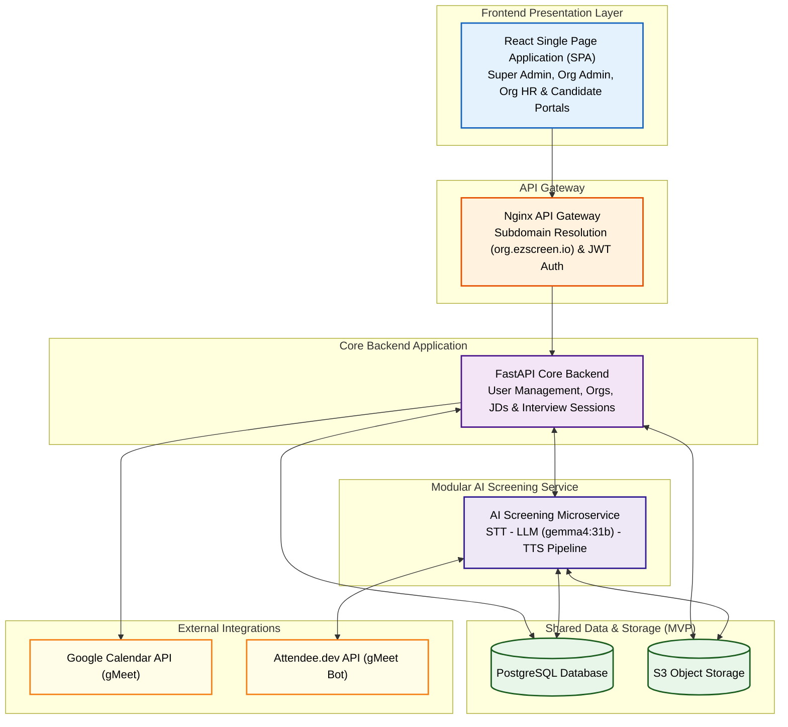
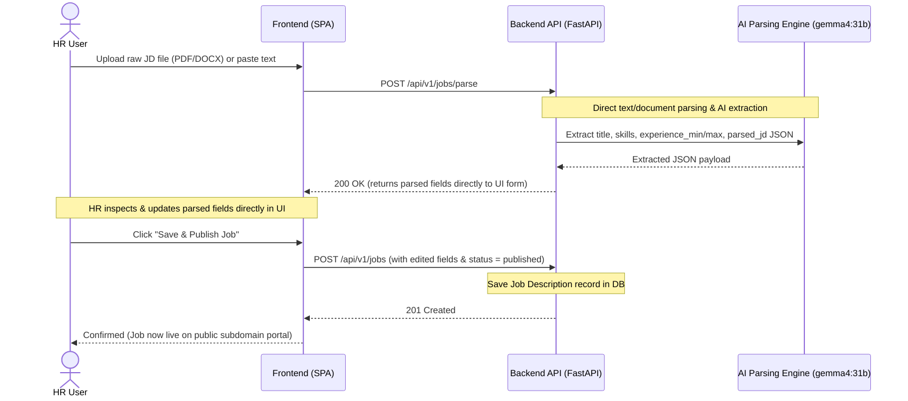
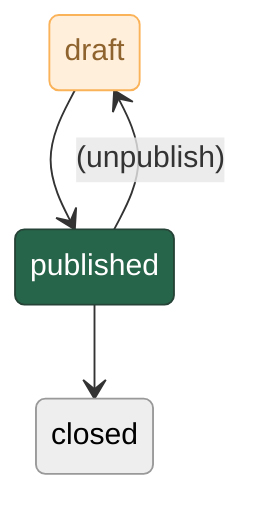
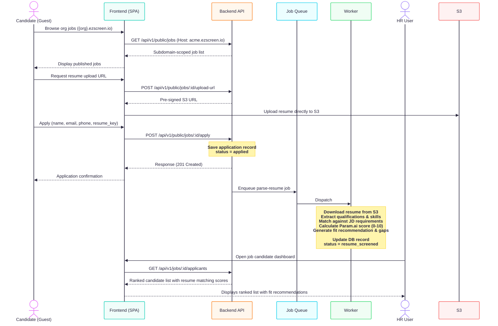
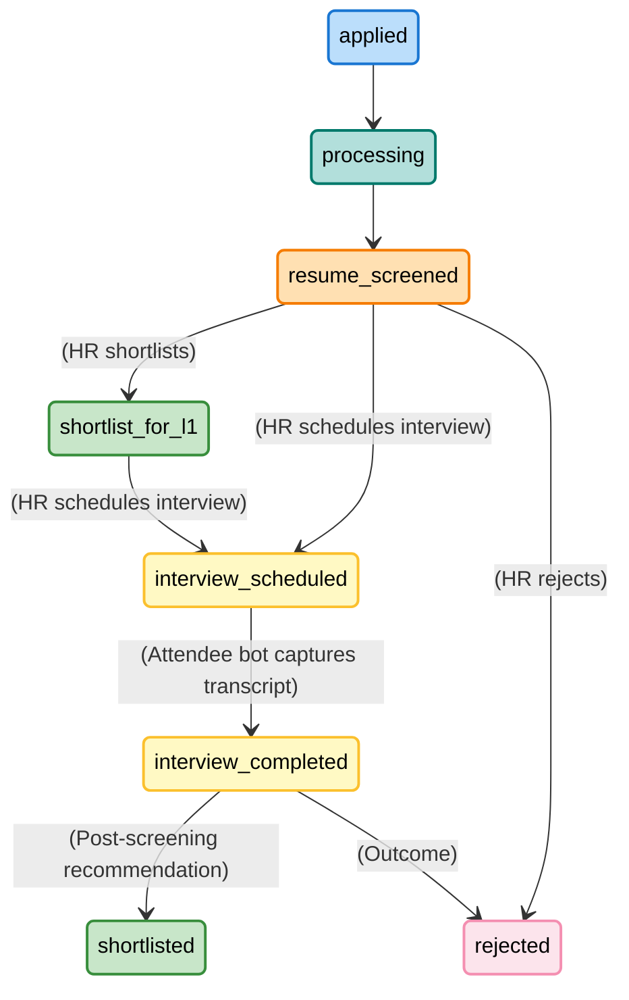
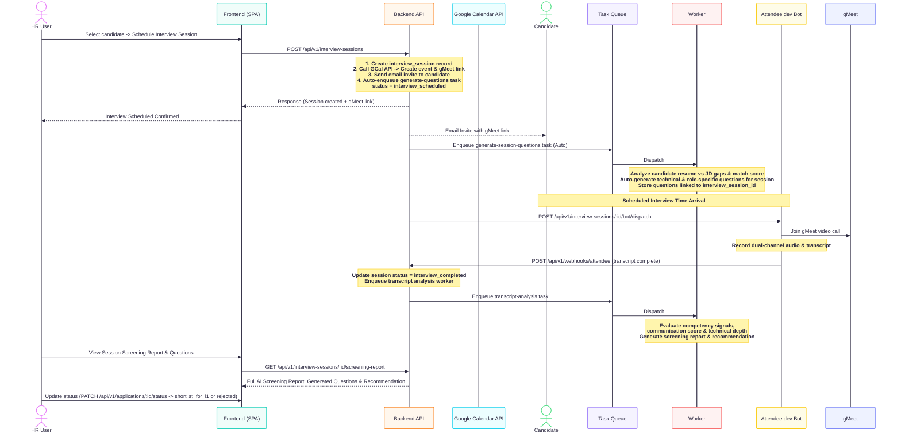

# AI-Powered Recruitment Platform - EZScreen System Design

## 1. Overview

### Purpose
An AI-powered recruitment platform that automates the candidate screening process by:
- Parsing job descriptions and extracting key requirements
- Processing candidate resumes and extracting qualifications
- Automatically filtering candidates based on JD-resume matching
- Facilitating interview scheduling for shortlisted candidates

### Key Stakeholders
- **HR/Recruiters**: Publish jobs, review candidates, schedule interviews
- **Admins**: System-wide access and management
- **Candidates**: Browse jobs, apply, schedule interviews (optional account)

### Core Value Proposition
Eliminate manual screening overhead with AI-driven candidate resume matching and screening.

---

## 2. System Architecture

### High-Level Architecture

### Architecture Patterns

| Pattern | Applied to | Rationale |
| :--- | :--- | :--- |
| **Modular Monolith** | Whole System | Code is structured into decoupled modules inside a Monorepo. Enables fast MVP deployment with a shared database while preserving clear boundaries for independent microservice extraction. |
| **Domain Isolation** | Core API, Parsing, Screening | `core-api`, `parsing-matching`, and `ai-screening` operate as isolated domain packages with strict contract boundaries. |
| **Shared Storage MVP** | PostgreSQL & S3 | Shared database across modules for single-transaction ACID consistency and high-speed relational JOINs. |

---

### Modular Monolith & Monorepo Structure

The platform is designed as a **Modular Monolith inside a Monorepo**. This guarantees clean separation of concerns without the operational complexity of distributed microservices for MVP.

#### Service Module Responsibilities

1. **Core Backend Application (`apps/core-api`)**:
   * System gatekeeper handling Authentication, Multi-tenant Organization Scoping (`organization_id`), User Provisioning, Public Job Board API, Interview Scheduling, and Webhook routing.

2. **Parsing & Matching Engine (`services/parsing-matching`)**:
   * Pure document parsing and matching engine. Extracts structured `parsed_jd` requirements, parses candidate resumes (`parsed_resume`), and computes Param.ai candidate-JD matching scores (`matching_result`).
   * *Standalone Capability*: Can be packaged and deployed independently as a "Resume & JD Parsing API".

3. **AI Screening Microservice (`services/ai-screening`)**:
   * Handles static interview question generation (`generated_questions`), STT-LLM (`gemma4:31b`)-TTS conversation pipeline, Attendee bot coordination, and transcript Q&A evaluation (`interview_analysis`).
   * *Standalone Capability*: Can be deployed independently on GPU infrastructure for AI video/voice interview execution.
---

## 3. Technology Stack

The following technologies have been selected for the platform to balance rapid MVP development with long-term scalability.

---

### Frontend

| Component | Selection | Rationale |
| :--- | :--- | :--- |
| Framework | React (JavaScript) | Team familiarity, rich ecosystem, SPA model fits this product |
| UI Library | Modern React Library + TailwindCSS | Rapid styling and responsive design |
| File Upload | Pre-signed S3 URLs via frontend | Bypasses backend server to save bandwidth |
| Other Tooling | Vite, Axios, React Router, Vitest | Standard React ecosystem defaults |

---

### Backend

The backend handles REST APIs, authentication, job orchestration, async task dispatch, and AI processing logic. Python is chosen because the AI/ML ecosystem is strongest in Python.

| Component | Selection | Rationale |
| :--- | :--- | :--- |
| Framework | FastAPI (Python) | Async-native, auto-generated OpenAPI, strong LLM SDK support |
| Schema Validation | Pydantic | Aligns perfectly with FastAPI and JSONB schemas |
| API Documentation | Auto-generated via FastAPI | Zero-maintenance Swagger UI |
| Email Service | SendGrid or Resend | Simple API, generous free tier for MVP volumes |
| Data Access | SQLAlchemy | Standard for FastAPI |
| Auth & Crypto | python-jose, passlib (bcrypt) | Proven security |

---

### AI Processing

AI processing runs as a module within the backend codebase. All AI tasks are executed by background workers to ensure long-running LLM calls never block API responses.

| Component | Selection | Rationale |
| :--- | :--- | :--- |
| LLM Provider / Model | **`gemma4:31b`** (via Ollama / Hosted API) | Selected open-weight 31B parameter model providing high-quality structured JSON output |
| Local LLM Runner | Ollama (with `gemma4:31b`) | Local runner option for development & self-hosted deployments |
| Document Parsing | docling | Python-native text extraction |
| Orchestration | Custom prompt pipeline / Piepcat | Simple is better for MVP |
| Meeting Bot | Attendee.dev API | Headless gMeet meeting bot for recording dual-channel audio & transcript |

---

### Data Layer

| Component | Selection | Rationale |
| :--- | :--- | :--- |
| Primary Database | PostgreSQL | JSONB support required for AI-extracted data, proven reliability |
| Object Storage | S3-compatible | S3 API is the standard. MinIO simplifies Docker-based local dev |
| Key-Value Data Store | - (To Be Decided) | To be evaluated based on lightweight storing requirements |

> **Storage note**: Object storage is the single source of truth for all uploaded files (JDs and resumes). A local MinIO container is used during development. In production, a managed S3-compatible service is used directly.

---

### Key Constraints That Drive Choices

The following requirements constrain the option space regardless of preference:

1. **JSONB support** - the database must support a flexible JSON column type. This rules out MySQL before version 5.7 and most NoSQL databases as a primary store.
2. **S3-compatible object storage in production** - all environments above local dev must use a cloud-managed object storage service. Local emulators are not permitted in staging or production.
3. **AI processing isolation via task queue** - all LLM-calling code runs in background worker processes, not in the API request/response cycle. Workers are separate OS processes running the same codebase with a different entrypoint. This prevents LLM latency from degrading API response times and allows workers to be scaled independently based on queue depth.
4. **Containerisation is mandatory** - every component ships as a Docker image. This applies to all environments including development, so environment parity is maintained from day one.

---

## 4. Database Design

> **Full Reference**: Entity definitions, column details, ER diagram, JSONB schemas, indexing strategy, and data lifecycle are documented in [DB_DESIGN.md](DB_DESIGN.md).

### Entity Summary

| Entity | Purpose | Phase |
| --- | --- | --- |
| `organizations` | Multi-tenant organization records (`name`, `domain`, `logo_url`) | MVP |
| `users` | All user accounts (`super_admin`, `organization_admin`, `hr`, `candidate`) | MVP |
| `job_descriptions` | JD records with `parsed_jd` JSONB for AI-extracted requirements | MVP |
| `applications` | Candidate applications with `parsed_resume` & `matching_result` JSONB | MVP |
| `interview_session` | Session-based AI interview scheduling & static question sets (`generated_questions`) | MVP |
| `interview_analysis` | AI screening report, Q&A transcript analysis (`question_answer`), and call recording URL | MVP |

### Key Design Decisions

1. **JSONB for Flexible AI Data**: `parsed_jd`, `parsed_resume`, `matching_result`, `generated_questions`, `analysis_result`, and `question_answer` use PostgreSQL's JSONB type
   - Allows AI extraction schema evolution without complex SQL migrations
   - Enables efficient querying with GIN indexes
   - Perfect for storing rich AI feedback, score breakdowns, and dual-channel transcripts

2. **Status-Driven Workflows**: Enforces state machines via PostgreSQL ENUM types:
   - `user_status`: `active`, `inactive`, `suspended`
   - `user_role`: `super_admin`, `organization_admin`, `hr`, `candidate`
   - `job_status`: `draft`, `published`, `closed`
   - `application_status`: `applied`, `interview_scheduled`, `interview_completed`, `shortlist_for_l1`, `rejected`
   - `interview_status`: `scheduled`, `rescheduled`, `completed`, `no_show`, `cancelled`, `failed`

3. **Multi-Tenancy & Role Isolation**:
   - `organization_admin` and `hr` are bound strictly to one organization (`organization_id NOT NULL`).
   - `super_admin` (global owner) and `candidate` operate across system scopes (`organization_id NULL`).

4. **Session-Based Interviewing & Analysis Separation**:
   - `interview_session` handles meeting metadata (gMeet URL, bot dispatch state, scheduled times, static questions).
   - `interview_analysis` handles post-interview screening output (Q&A transcripts, skill scores, overall recommendation, audio/video recording URLs).

---

## 5. API Design

> **Full Reference**: Endpoint contracts, request/response schemas, role access per endpoint, query parameters, error format, and phase classification are documented in [API_SPEC.md](API_SPEC.md).

### API Design Principles

- **RESTful**: All endpoints follow REST conventions with resource-based URLs
- **Versioned**: All routes prefixed with `/api/v1/`
- **RBAC-Protected**: Role-based access control on all authenticated endpoints
- **Idempotent**: Resource creation endpoints support `Idempotency-Key` header
- **No `/admin/` namespace**: Administrative operations use standard resource URLs (`/users`, `/companies`, `/roles`) with RBAC determining scope

### API Groups

| Group | Base Path | Auth | Key Endpoints | Phase |
|-------|-----------|------|---------------|-------|
| Authentication | `/api/v1/auth/` | Public | register, login, refresh, logout, forgot-password, reset-password, me | MVP |
| Job Descriptions | `/api/v1/jobs/` | JWT | CRUD, status change, applicant list | MVP |
| Public Browsing | `/api/v1/public/jobs/` | None | Browse jobs, view job, apply | MVP |
| Applications | `/api/v1/applications/` | JWT | List, detail (with signed resume URL), status change | MVP |
| Interview Scheduling | `/api/v1/interviews/` | JWT / Token | Create invite, self-scheduling via token | MVP |
| User & Company Mgmt | `/api/v1/users/`, `/companies/`, `/roles/` | JWT (RBAC) | CRUD for users, companies, roles | Post-MVP |
| System | `/api/v1/system/` | JWT (super_admin) | Health check | MVP |

### Key Query Capabilities (Applicant List)

The applicant list endpoint (`GET /jobs/{id}/applicants`) supports:
- **Sort**: by score (default), date, name, experience
- **Filter**: by status, score range, experience range
- **Pagination**: max 50 per page

---

## 6. Authentication & Authorization

### Authentication Strategy

**Two-tier Authentication**:
1. **Guest Access**: Candidates can browse and apply without accounts
2. **JWT Authentication**: For registered users (HR, Admin)

### JWT Implementation

Tokens are stateless JWTs signed with a secret key. Two token types are used:

| Token | Stored in | TTL | Purpose |
|-------|----------|-----|---------|
| Access token | Memory (not localStorage) | 15-30 minutes | Authenticates API requests |
| Refresh token | httpOnly cookie | 7 days | Issues new access tokens silently |

**Access token payload**:

| Claim | Description |
|-------|-------------|
| `sub` | User UUID |
| `email` | User email address |
| `roles` | Array of role names for this user |
| `company_id` | Company UUID - enforces tenant isolation |
| `iat` | Issued at timestamp |
| `exp` | Expiry timestamp |

**Token refresh flow**: When an API call returns 401, the client silently sends the refresh token to `POST /auth/refresh`. If valid, a new access token is returned and the original request is retried. If invalid or expired, the session is cleared and the user is sent to login.

**Token invalidation**: On logout, the refresh token is revoked server-side. The revoked token's JTI is stored in a revocation table in the database with an expiry timestamp matching the token's remaining lifetime. A background task periodically cleans up expired entries.

### Authorization - Role-Based Access Control (RBAC)

#### Roles & Permissions

| Role | Scope | Key permissions |
|------|-------|----------------|
| `super_admin` | All companies | Full system access - manage companies, users, roles, system config |
| `admin` | Own company | Manage users within company, view all company data |
| `hr_manager` | Own company | Create/publish/close jobs, view all applicants, schedule interviews |
| `candidate` | Own data | Browse published jobs, submit applications, view own application status |

Guest (unauthenticated) access is permitted only on:
- `GET /api/v1/public/jobs` - browse published jobs
- `GET /api/v1/public/jobs/:id` - view job detail
- `POST /api/v1/public/jobs/:id/apply` - submit application

All other endpoints require a valid access token.

#### Permission Enforcement

Permissions are checked at two layers:

1. **Route layer** - middleware validates the token and extracts roles before the request reaches any handler. Requests with missing or invalid tokens are rejected with 401 before any business logic runs.

2. **Resource layer** - handlers verify the authenticated user's company matches the resource's company. An HR user from Company A cannot access jobs or applicants from Company B even with a valid token. This is enforced by automatically scoping all database queries to the authenticated user's `company_id`.

For user and company management endpoints, the same RBAC middleware determines scope: `super_admin` sees all companies and users; `admin` sees only users within their own company. The URL structure reflects the resources (`/users`, `/companies`), and the authorization layer determines what the caller can see and do.

---

## 7. Core Features & Workflows

---

### Workflow 1: Job Description Parsing & Publishing

**JD status flow**:

> **Direct Parsing Workflow**: When HR uploads a JD file or pastes text, the backend parses the requirements immediately and returns the extracted fields directly to the frontend. HR can adjust any requirements directly in the UI before saving and publishing. No S3 storage is required for job descriptions.

### Workflow 2: Candidate Application & AI Resume Scoring

**Application status flow**:

### Workflow 3: Session-Based Interview Scheduling, Auto Question Generation & Bot Screening

---
