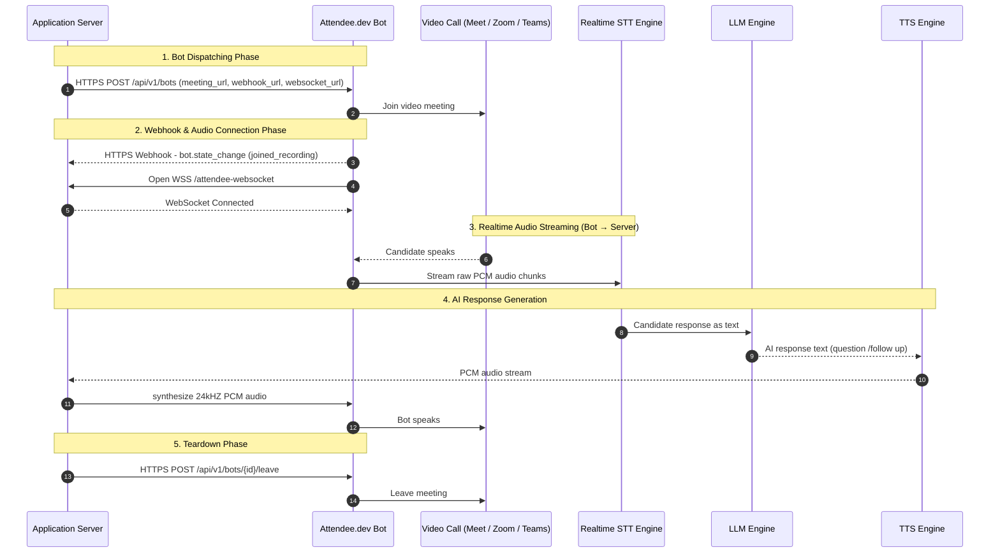
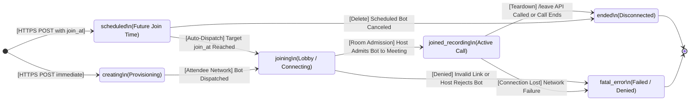

# Attendee.dev Technical Integration Guide

This document is a comprehensive technical integration reference for **Attendee.dev**. It details how to deploy AI meeting bots to video conferencing platforms (Google Meet, Zoom, Microsoft Teams), manage bot states, stream low-latency audio bidirectionally over WebSockets, and handle real-time speech events.

---

## 1. Architecture & Data Flow

[Attendee.dev](https://attendee.dev) provides a headless virtual meeting bot API. The bot joins meeting rooms, captures mixed room audio, streams raw PCM audio frames over a WebSocket connection, and receives outbound TTS PCM audio frames to speak back to call participants.


---

## 2. Attendee API key

Before deploying an integration, configure the API KEY for your bot from the [attendee dashboard](https://app.attendee.dev/projects/proj_wIZ9ZLaTZ0H2ppbl/keys)

---

## 3. Infrastructure & Public Endpoint Setup

Attendee.dev requires **publicly accessible HTTPS and WSS URLs** to send webhooks and connect audio WebSockets to the server.

* **Local Development Setup (Ngrok)**:
  Run Ngrok to expose local port 5001:
  ```bash
  ngrok http 5001
  ```
  Ngrok generates a public forwarding URL (e.g. `https://a1b2-34-56-78-90.ngrok-free.app`).
  - Webhook URL: `https://a1b2-34-56-78-90.ngrok-free.app/webhook`
  - WebSocket URL: `wss://a1b2-34-56-78-90.ngrok-free.app/attendee-websocket`

---

## 4. How to Create and Teardown Bots

### Creating a Bot (`POST /api/v1/bots`)

* **HTTP Method**: `POST`
* **URL**: `https://app.attendee.dev/api/v1/bots`
* **Headers**:
  ```http
  Authorization: Token ATTENDEE_API_KEY
  Content-Type: application/json
  ```

#### Master Request Body Schema (All Supported Parameters)
```json
{
  "meeting_url": "https://meet.google.com/abc-defg-hij",
  "bot_name": "EZScreen Screening Assistant",
  "join_at": "2026-07-29T14:30:00Z",
  "transcription_settings": {
    "meeting_closed_captions": {}
  },
  "websocket_settings": {
    "audio": {
      "url": "wss://public-domain.com/attendee-websocket",
      "sample_rate": 24000
    }
  },
  "webhooks": [
    {
      "url": "https://public-domain.com/webhook",
      "triggers": [
        "bot.state_change",
        "participant_events.speech_start_stop"
      ]
    }
  ]
}
```

#### Master Request Parameters Breakdown

| Parameter | Type | Required | Description |
| :--- | :--- | :--- | :--- |
| `meeting_url` | String | **Yes** | Full target call URL. Supports Google Meet (`https://meet.google.com/...`), Zoom (`https://zoom.us/j/...`), and Microsoft Teams (`https://teams.microsoft.com/...`). |
| `bot_name` | String | **Yes** | Display name for the bot as it appears in the meeting participant list. |
| `join_at` | String | Optional | ISO 8601 UTC timestamp string (e.g. `2026-07-29T14:30:00Z`). Enables **Scheduled Bot** mode. |
| `transcription_settings` | Object | **Yes** | Configuration for closed captions (`meeting_closed_captions`) or integrated STT (`deepgram`). |
| `websocket_settings` | Object | Optional | Enables **Realtime Audio Streaming** (bidirectional PCM audio). |
| `websocket_settings.audio.url` | String | **Yes** | Public `wss://` or `ws://` URL on the backend server handling bidirectional audio frames. |
| `websocket_settings.audio.sample_rate` | Integer | **Yes** | Audio sample rate in Hz. Recommended: `24000` (24kHz) or `16000` (16kHz). |
| `webhooks` | Array | **Yes** | List of webhook endpoints and subscribed event triggers. |
| `webhooks[].url` | String | **Yes** | Public HTTP/HTTPS URL handling POST webhook payloads. |
| `webhooks[].triggers` | Array | **Yes** | Subscribed event triggers: `"bot.state_change"`, `"participant_events.speech_start_stop"`. |

---

### Feature Focus: Scheduling a Bot to Join at a Future Time

#### How the `join_at` Parameter Controls Scheduling:
1. **Initial State (`scheduled`)**: When `join_at` is present in the creation payload, Attendee creates the bot immediately with state `"scheduled"`.
2. **Auto-Dispatch**: At the specified UTC timestamp, Attendee's scheduler automatically dispatches the bot to join the meeting room, transitions state to `"joining"`, and emits a `bot.state_change` webhook.
3. **Cancellation**: Calling `DELETE /api/v1/bots/{bot_id}` before `join_at` cancels the scheduled join.

---

#### Creation Response Payload (`200 OK` / `201 Created`)
```json
{
  "id": "bot_9876543210",
  "state": "joining",
  "meeting_url": "https://meet.google.com/abc-defg-hij",
  "created_at": "2026-07-29T11:30:00Z"
}
```

---

### Requesting Bot to Leave Call (`POST /api/v1/bots/{bot_id}/leave`)

* **HTTP Method**: `POST`
* **URL**: `https://app.attendee.dev/api/v1/bots/{bot_id}/leave`
* **Headers**: `Authorization: Token ATTENDEE_API_KEY`

#### Response (`200 OK`)
```json
{
  "success": true,
  "message": "Bot leave request queued successfully."
}
```

---

### Force Deleting a Bot (`DELETE /api/v1/bots/{bot_id}`)

* **HTTP Method**: `DELETE`
* **URL**: `https://app.attendee.dev/api/v1/bots/{bot_id}`

---

## 5. Bot States & Lifecycle Management

Attendee.dev manages bots through a defined state lifecycle. The server tracks state transitions via `bot.state_change` webhooks.

### Bot State Lifecycle Diagram



### Complete Bot State Table

| Bot State | Description | Recommended Server Action |
| :--- | :--- | :--- |
| `scheduled` | Bot creation included a future `join_at` timestamp. Held until specified time. | Store scheduled appointment in DB; wait for auto-dispatch state change webhook. |
| `creating` | Bot is being provisioned on Attendee servers. | Initialize local session record and session logs. |
| `joining` | Bot is in the meeting lobby waiting to be admitted. | Update UI to show bot is attempting entry. |
| `joined_recording` | Bot has entered the room and is actively capturing/playing audio. | Trigger opening AI greeting or start real-time audio pipeline. |
| `ended` | Bot has exited the call gracefully or meeting finished. | Trigger post-call analysis, saved transcript evaluations, and cleanup. |
| `fatal_error` | Bot failed to join (e.g. host rejected entry, invalid meeting URL). | Log error status and notify user in dashboard UI. |

---

## 6. Realtime Audio Streaming from Bot (Listening: Bot $\rightarrow$ Server)

Attendee.dev streams real-time raw room audio from the meeting call to the backend WebSocket endpoint specified in `websocket_settings.audio.url`.

### Event Trigger: `realtime_audio.mixed`

As soon as the bot enters the meeting call, Attendee streams continuous audio chunks over the WebSocket.

#### Inbound WebSocket Payload Schema
```json
{
  "trigger": "realtime_audio.mixed",
  "data": {
    "chunk": "<base64_encoded_pcm_audio_bytes>",
    "sample_rate": 24000
  }
}
```

---

## 7. Realtime Audio Input to Bot (Speaking: Server $\rightarrow$ Bot)

To play AI-generated speech (from TTS) back into the meeting call for participants to hear, the server sends JSON frames over the active WebSocket session established via `websocket_settings.audio.url`.

### Event Trigger: `realtime_audio.bot_output`

#### Outbound WebSocket Payload Schema
```json
{
  "trigger": "realtime_audio.bot_output",
  "data": {
    "chunk": "<base64_encoded_pcm_audio_bytes>",
    "sample_rate": 24000
  }
}
```

---


## 8. Step-by-Step Integration Execution Checklist

Follow this sequential checklist to integrate Attendee.dev into any project:

1. **Step 1: Obtain Credentials**:
   Get an `ATTENDEE_API_KEY` from [app.attendee.dev](https://app.attendee.dev) and configure API keys for STT, TTS, and LLM services in `.env`.
2. **Step 2: Expose Public HTTPS & WSS Endpoints**:
   Start Ngrok (`ngrok http 5001`) for local testing or configure domain SSL/TLS for production.
3. **Step 3: Implement Webhook Listener (`POST /webhook`)**:
   Handle `bot.state_change` (for room entry/exit) and `participant_events.speech_start_stop` (for instant barge-in).
4. **Step 4: Implement Audio WebSocket Listener (`/attendee-websocket`)**:
   Receive `realtime_audio.mixed` incoming PCM chunks and stream outbound `realtime_audio.bot_output` PCM chunks.
5. **Step 5: Dispatch Bot (`POST /api/v1/bots`)**:
   Send meeting URL, bot name, sample rate (`24000`), WebSocket URL, and webhook URLs. Store the returned `bot_id`.
6. **Step 6: Wire Realtime Audio STT, LLM & TTS Pipeline**:
   Stream incoming PCM bytes to real-time STT, generate LLM response text, synthesize 24kHz PCM bytes via TTS, and stream 50ms frames to the bot.
7. **Step 7: Teardown Bot (`POST /api/v1/bots/{bot_id}/leave`)**:
   Call leave endpoint upon interview conclusion and run post-call analytics.