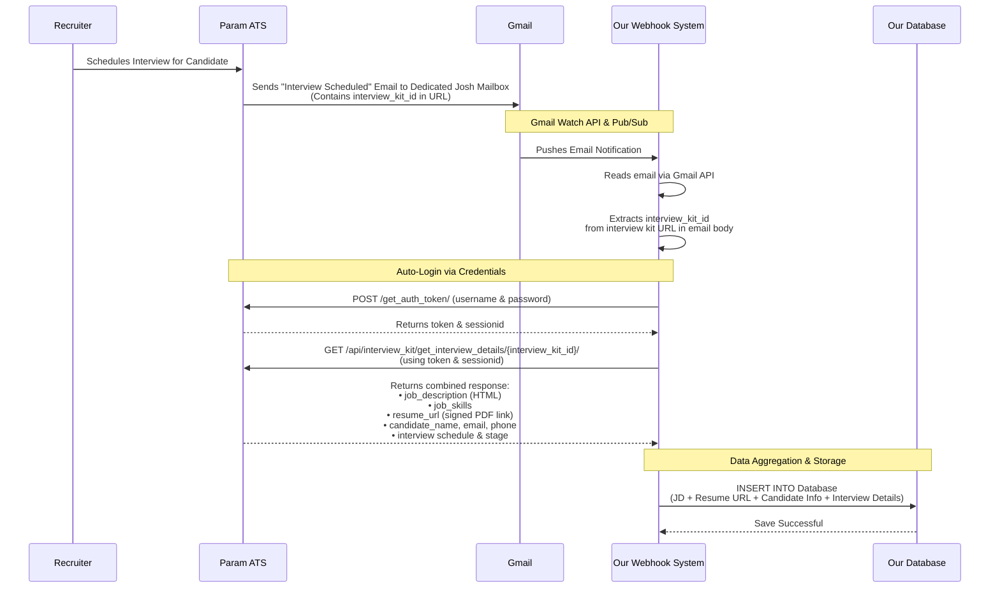

# Interview Scheduling & Data Fetching Workflow

This document illustrates the complete, end-to-end flow. It starts when a recruiter schedules an interview in Param ATS, triggers our Gmail Webhook, and ends with our system automatically calling the Param ATS API to fetch the full Job Description (JD) and Candidate Resume data to store in our database.

## 1. Sequence Diagram



## 2. Process Workflow (How It Works)

### Step 1: Triggering the Event
When a recruiter schedules an interview for a candidate in Param ATS, an automated email is sent out to a **dedicated Josh email address** (which our system monitors). This email acts as our trigger because it contains the unique `interview_kit_id` embedded inside the interview URL. Our system will receive this email and proceed to process it further.

### Step 2: Webhook Capture
Our Gmail Watch API and Pub/Sub setup actively monitors the inbox. 
* It instantly pushes an email notification to our Webhook System.
* The webhook reads the email contents using the Gmail API.
* A regex parser specifically searches the email body to extract the `interview_kit_id`.

### Step 3: Automated Authentication
Because Param ATS APIs are protected, our Webhook System must authenticate itself.
* The system securely calls the `POST /get_auth_token/` API using our service account credentials.
* It receives a `token` (JWT) and a `sessionid` which are required to access candidate data.

### Step 4: Fetch JD & Resume Data
Using the extracted `interview_kit_id` and the auth tokens, the system makes a single, highly efficient API call to `GET /api/interview_kit/get_interview_details/{interview_kit_id}/`. 
* This API returns a comprehensive JSON payload containing the HTML Job Description, the required Job Skills, the Candidate's Information, and a signed temporary URL to download the Candidate's Resume PDF.

### Step 5: Database Storage
The system extracts all the relevant information (JD, Resume URL, Candidate details, Interview Stage/Time) from the payload.
* It safely executes an `INSERT` into our Database.
* The Database returns a "Save Successful" response, fully automating the data aggregation without human intervention.

---

## 3. Required Param ATS APIs

Below are the exact API definitions and their live JSON responses required to execute the steps mentioned in the workflow above.

# API 1: Get Auth Token (Required for Step 3)

## API Overview

| Field | Details |
|-------|---------|
| **API Name** | Get Auth Token |
| **Endpoint** | `/get_auth_token/` |
| **Method** | `POST` |
| **Purpose** | Authenticates the system user and returns an authorization token and session ID required for protected API calls (like fetching interview kits). |

## Request

| Field | Description |
|-------|-------------|
| **username** | The registered email/username of the recruiter or service account. |
| **password** | The password for the account. |

## Response

```json
{
    "token": "abc123xyz456jwt789"
}
```
*(Note: The `sessionid` is NOT in the JSON response. It is returned in the HTTP Headers as a `Set-Cookie` header!)*

## Observations

- This API must be called before accessing any protected endpoints.
- The returned `token` must be passed in the `Authorization: Token <token>` header.
- The returned `sessionid` must be passed in the `Cookie: sessionid=<sessionid>` header.

---

# API 2: Interview Kit Details (Required for Step 4)

## API Overview

| Field | Details |
|-------|---------|
| **API Name** | Interview Kit Details |
| **Endpoint** | `/api/interview_kit/get_interview_details/{interview_kit_id}/` |
| **Method** | `GET` |
| **Purpose** | Retrieves combined interview details in a single call, including the full Job Description (HTML), Candidate Information, and the signed Resume Download URL. |

## Request

| Field | Description |
|-------|-------------|
| **interview_kit_id** | The UUID extracted from the interview URL in the Gmail notification. (Path Parameter) |
| **Headers** | Requires `Authorization` token and `Cookie` sessionid from API 1. |

## Response

```json
{
  "result": {
    "start_time": "2026-07-28T06:00:00Z",
    "end_time": "2026-07-28T06:30:00Z",
    "location": "",
    "competencies": [
      {
        "name": "Communication",
        "category": "Skill"
      },
      {
        "name": "Logical Thinking",
        "category": "Josh Pune Java Scorecard"
      }
    ],
    "application_form_response": null,
    "candidate_name": "Sagar Sonwane",
    "candidate_email": "sagarsonwane23@gmail.com",
    "candidate_phone": "+919425952353",
    "candidate_experience": null,
    "resume_url": "https://storage.googleapis.com/crm-param-prod/resumes/5NG3WnpiWv_RESUME_SAGAR_SONWANE_23.pdf?GoogleAccessId=gsc-signed-read%40param-dev.iam.gserviceaccount.com&Expires=...",
    "recruiter_name": "Vishakha Sainani",
    "recruiter_notes": "",
    "job_title": "Dummy Job Innovation team",
    "job_description": "<p>ABC</p>",
    "job_skills": [
      "Data Entry Accuracy",
      "Basic Software Proficiency",
      "Microsoft Office Suite",
      "Record Keeping",
      "Attention to Detail",
      "Time Management"
    ],
    "stage_name": "TAO Interview (Internal)",
    "interview_url": "https://meet.google.com/vfn-ituh-shf",
    "interviewer_feedback": null,
    "job_id": "154ab6a0-3536-4be4-85b1-3e8101697a65",
    "candidate_id": "025e9f99-e322-470c-a5ed-0e1151e73374",
    "interview_attachment": {
      "url": "",
      "file_name": ""
    },
    "show_profile_link": true,
    "candidate_timezone": "Asia/Calcutta",
    "interviewer_confirmation": {
      "reason": null,
      "remark": null,
      "received": false,
      "confirmed": false,
      "other_data": {
        "suggest_time": null
      },
      "modified_on": null
    },
    "stage": "scheduled",
    "candidate_notified": true,
    "candidate_notified_at": "2026-07-28T05:59:20.206Z",
    "is_bot_added_to_meeting": true,
    "video_url": null,
    "transcript": []
  }
}
```

## Observations

- This is the primary and most efficient API for the interview workflow as it fetches both JD and Resume in a single network request.
- The `resume_url` is a pre-signed, temporary cloud storage link used to download the PDF.
- If the `interview_kit_id` is unavailable, you must fallback to the separate Standalone APIs below.

---

# API 3: Job Details 

## API Overview

| Field | Details |
|-------|---------|
| **API Name** | Job Details |
| **Endpoint** | `/api/sourcing/jobs/{job_uuid}/` |
| **Method** | `GET` |
| **Purpose** | Retrieves complete details for a specific job, including the Job Description and required skills. |

## Request

| Field | Description |
|-------|-------------|
| **job_uuid** | The unique identifier (UUID) for the job. (Path Parameter) |

## Response

```json
{
  "job_title": "Dummy Job Innovation team",
  "job_id": "154ab6a0-3536-4be4-85b1-3e8101697a65",
  "job_description": "<p>ABC</p>",
  "job_ats_id": null,
  "job_req_id": 37250,
  "internal_job": false,
  "referrals": false,
  "ijp_description": null,
  "job_close_reason": null,
  "referral_description": null,
  "job_location": [
    "Pune"
  ],
  "job_min_experience": 12,
  "job_max_experience": 24,
  "job_min_ctc": "",
  "job_currency": "",
  "job_max_ctc": "",
  "job_status": "unpublished",
  "job_skills": [
    "Data Entry Accuracy",
    "Basic Software Proficiency",
    "Microsoft Office Suite",
    "Record Keeping",
    "Attention to Detail",
    "Time Management"
  ],
  "is_advanced": false,
  "slug": "dummy-job-innovation-team",
  "category": "Technical",
  "category_id": "ffe488a8-32e7-4843-bcc1-211762ed12c1",
  "hiring_type": "Lateral",
  "job_type": "Full-time",
  "job_no_of_positions": 1,
  "expected_time_to_offer": "",
  "job_added_at": "2026-07-21T10:31:26.427Z",
  "job_added_by_email": "sneha.mantri@joshsoftware.com",
  "job_added_by": "Sneha Mantri",
  "job_last_modified_at": "2026-07-27T05:50:46.802Z",
  "job_business_unit_id": "fd170930-5eb8-4508-814e-08bcda81a7b7",
  "job_business_unit_name": "Corporate",
  "job_organization_id": "7f2029ec-5ae5-4141-b7e4-b1c4bbaf215d",
  "job_organization_name": "Josh Software",
  "job_level": "J12",
  "is_custom_application_set": true,
  "form_template_id": null,
  "employee_form_template_id": null,
  "can_edit": false,
  "all_approved": true,
  "experience_units": "years",
  "experience_hours": null,
  "designation": null,
  "atr_non_atr": null,
  "location_wise_openings": null,
  "confidential": false,
  "work_mode": "Onsite",
  "has_diversity": false,
  "is_hiring_event": false,
  "prescreening_config": {
    "enabled": false,
    "agent_type": "chat",
    "auto_trigger": false
  },
  "agencies": [],
  "hired_count": 0,
  "show_ijp_filter": false,
  "schedule_job_publish": {
    "schedule": false,
    "start": "",
    "end": ""
  },
  "schedule_ijp_publish": {
    "schedule": false,
    "start": "",
    "end": ""
  },
  "schedule_referral_publish": {
    "schedule": false,
    "start": "",
    "end": ""
  }
}
```

## Observations

- Used strictly as an alternative when the `interview_kit_id` is not available.
- Only returns job-specific data. It does not return any candidate or resume information.

---

# API 4: Candidate Resume URL 

## API Overview

| Field | Details |
|-------|---------|
| **API Name** | Candidate Resume URL |
| **Endpoint** | `/api/sourcing/candidates/{candidate_uid}/resume/` |
| **Method** | `GET` |
| **Purpose** | Retrieves the signed cloud storage URL required to download the candidate's uploaded resume file. |

## Request

| Field | Description |
|-------|-------------|
| **candidate_uid** | The unique identifier (UUID) for the candidate. (Path Parameter) |

## Response

```json
{
  "message": "Success",
  "code": 0,
  "data": {
    "resume_url": "https://storage.googleapis.com/crm-param-prod/resumes/5NG3WnpiWv_RESUME_SAGAR_SONWANE_23.pdf?GoogleAccessId=gsc-signed-read..."
  }
}
```

## Observations

- Used strictly as an alternative when the `interview_kit_id` is not available.
- Navigating the JSON response requires accessing `data.resume_url`.
- The returned URL is time-sensitive (signed URL) and should be used immediately to download the file.
