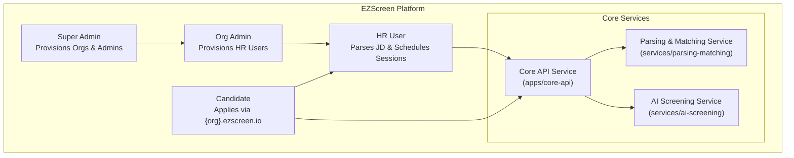
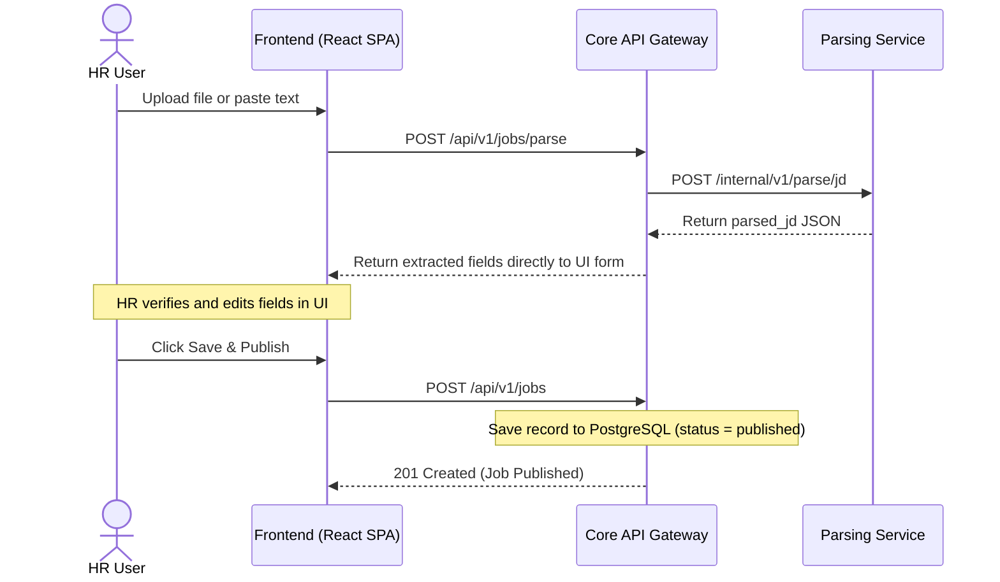
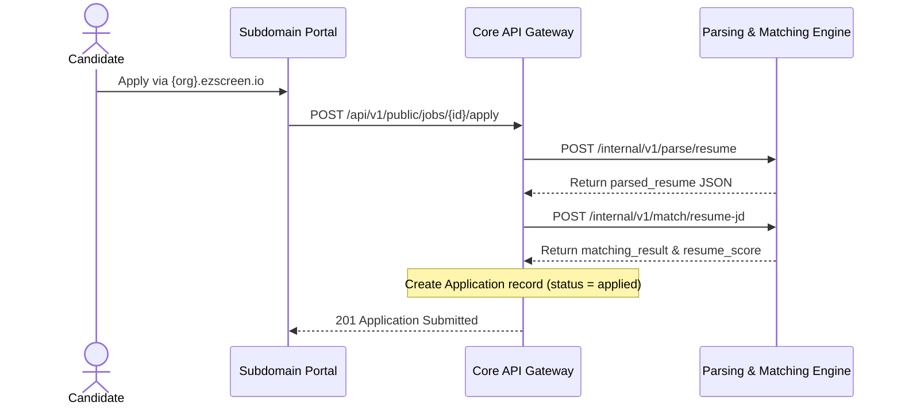
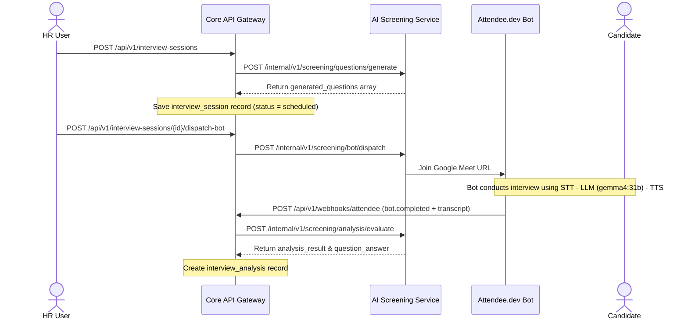

# EZScreen - AI-Powered Screening & Automated Interview Requirements

## Document Information
- **Project**: EZScreen - Multi-Tenant AI Recruitment & Automated Interview Platform
- **Scope**: AI Assessment Pipeline (Direct JD Parsing, Candidate Application & Resume Matching, Automated AI Interview Sessions & Transcript Analysis)
- **Version**: 2.0
- **Date**: August 5, 2026
- **Status**: Active Requirements Definition

---

## Table of Contents
1. [Overview](#1-overview)
2. [Context & Scope](#2-context--scope)
3. [User Stories](#3-user-stories)
4. [Functional Requirements - JD Processing (Direct In-Memory Parsing)](#4-functional-requirements---jd-processing-direct-in-memory-parsing)
5. [Functional Requirements - Resume Processing & Matching](#5-functional-requirements---resume-processing--matching)
6. [Functional Requirements - HR Dashboard & Candidate Ranking](#6-functional-requirements---hr-dashboard--candidate-ranking)
7. [Functional Requirements - AI Interview Sessions & Attendee Meeting Bot](#7-functional-requirements---ai-interview-sessions--attendee-meeting-bot)
8. [Non-Functional Requirements](#8-non-functional-requirements)
9. [Data Requirements & State Machines](#9-data-requirements--state-machines)
10. [Acceptance Criteria](#10-acceptance-criteria)

---

## 1. Overview

### What this document covers

This document specifies the requirements for the **automated AI assessment and interview pipeline** powering EZScreen. It covers three core workflows:

1. **Direct JD Parsing & Publishing**: HR uploads a JD file (PDF/DOCX) or pastes text. The system parses it in-memory via `POST /api/v1/jobs/parse`, displays extracted requirements directly on the UI form for HR verification/editing, and saves it to PostgreSQL via `POST /api/v1/jobs`.

2. **Resume Parsing & Candidate Matching**: A candidate applies to a job via the subdomain portal (`{org}.ezscreen.io`) with their resume. The system extracts structured resume data (`parsed_resume`), evaluates it against `parsed_jd` using the matching algorithm, and saves `matching_result` JSONB + `resume_score` (0–100).

3. **Automated AI Interview Sessions & Screening Analysis**: HR schedules an AI screening interview (`interview_session`). The system auto-generates static questions (`generated_questions`). At call time, the Attendee.dev meeting bot is dispatched (`POST /api/v1/interview-sessions/{id}/dispatch-bot`) to join Google Meet. After call completion, the transcript is evaluated via `gemma4:31b` to populate `interview_analysis` (`analysis_result` + `question_answer` transcript scoring + `recording_url`).

---

## 2. Context & Scope

### Platform Architecture Overview



### Roles & Responsibilities Matrix

| Role | Scope | Key Capabilities |
| :--- | :--- | :--- |
| **`super_admin`** | Platform Scope (`organization_id NULL`) | Platform owner. Creates Organizations (`organizations`); provisions `organization_admin` and `hr` users. |
| **`organization_admin`** | Organization Scope (`organization_id NOT NULL`) | Organization Administrator. Bound strictly to one organization. Provisions secondary `organization_admin` and `hr` users. |
| **`hr`** | Organization Scope (`organization_id NOT NULL`) | Operational HR user. Bound strictly to one organization. Direct JD parsing & publishing, views applicant scores, schedules AI interview sessions, dispatches meeting bots, and reviews screening reports. |
| **`candidate`** | Candidate Scope (`organization_id NULL`) | Guest / Candidate applicant. Browses published jobs via organization subdomain (`{org}.ezscreen.io`) and submits resume applications. |

---

## 3. User Stories

### HR & Admin
* **US-101**: As an HR user, I want to upload or paste a JD document so the system parses requirements in-memory and populates the UI form directly without requiring pre-signed storage URLs.
* **US-102**: As an HR user, I want to review and edit AI-extracted JD fields before publishing so I maintain full control over requirement criteria.
* **US-103**: As an HR user, I want a single unified update endpoint (`PUT /api/v1/jobs/{id}`) to modify job details and change job status (`draft`, `published`, `closed`).
* **US-104**: As an HR user, I want to see candidate applications ranked by `resume_score` DESC with detailed score breakdowns (`matching_result`).
* **US-105**: As an HR user, I want to schedule an AI screening interview session that automatically generates candidate-specific static questions (`generated_questions`).
* **US-106**: As an HR user, I want to dispatch an Attendee.dev meeting bot to Google Meet to conduct the interview, record dual-channel audio, and generate transcript analysis (`interview_analysis`).

### Candidate
* **US-201**: As a candidate, I want to browse published jobs on the organization's custom subdomain (`{org}.ezscreen.io`) without needing an account.
* **US-202**: As a candidate, I want to submit my resume and application details in a single step and receive instant confirmation.

---

## 4. Functional Requirements - JD Processing (Direct In-Memory Parsing)

### Workflow Sequence



### Functional Specifications
* **FR-101 (Direct Parsing Endpoint)**: `POST /api/v1/jobs/parse` accepts raw text or uploaded PDF/DOCX binary, parses requirements in-memory via `services/parsing-matching`, and returns extracted `parsed_jd` fields directly to the UI.
* **FR-102 (Job Creation & Save)**: `POST /api/v1/jobs` accepts HR-verified fields (`title`, `description`, `job_type`, `work_type`, `location`, `experience_min`, `experience_max`, `skills`, `parsed_jd`, `status`) and saves the record in `job_descriptions`.
* **FR-103 (Unified Update Endpoint)**: `PUT /api/v1/jobs/{id}` serves as the single unified route to update job fields, `parsed_jd` requirements, and/or status (`draft`, `published`, `closed`).
* **FR-104 (Subdomain Resolution)**: `GET /api/v1/public/jobs` filters published jobs dynamically based on the HTTP Host Header (`{org}.ezscreen.io`).

---

## 5. Functional Requirements - Resume Processing & Matching

### Workflow Sequence



### Functional Specifications
* **FR-201 (Candidate Portal Application)**: Candidates apply via `POST /api/v1/public/jobs/{id}/apply` with `first_name`, `last_name`, `email`, `phone`, and `resume` file binary.
* **FR-202 (Resume Extraction)**: `services/parsing-matching` extracts `candidate_name`, `email`, `phone`, `experience_years`, `skills`, `education`, and `summary` into `parsed_resume` JSONB.
* **FR-203 (Matching Algorithm)**: Evaluates `parsed_resume` against `parsed_jd` and calculates `resume_score` (0.0 to 100.0) based on weighted formula:
  $$\text{resume\_score} = (\text{skills\_score} \times 0.40 + \text{experience\_score} \times 0.35 + \text{education\_score} \times 0.25) \times 100$$
* **FR-204 (Denormalised Sorting Columns)**: Stores `resume_score` and `candidate_yoe` directly as typed columns on `applications` table for instant sorting without JSON parsing.

---

## 6. Functional Requirements - HR Dashboard & Candidate Ranking

### Functional Specifications
* **FR-301 (Ranked Applicant List)**: `GET /api/v1/jobs/{id}/applicants` returns all candidate applications for a posting sorted by `resume_score` DESC by default.
* **FR-302 (Match Matrix Breakdown)**: `GET /api/v1/applications/{id}` provides full candidate details, including `parsed_resume` and `matching_result` (matched skills, missing skills, score breakdown, and fit reasoning).
* **FR-303 (Application Status Lifecycle)**: HR updates candidate application status via `PATCH /api/v1/applications/{id}/status` (`applied` $\rightarrow$ `interview_scheduled` $\rightarrow$ `interview_completed` $\rightarrow$ `shortlist_for_l1` / `rejected`).

---

## 7. Functional Requirements - AI Interview Sessions & Attendee Meeting Bot

### Workflow Sequence



### Functional Specifications
* **FR-401 (Session Scheduling & Question Auto-Gen)**: `POST /api/v1/interview-sessions` schedules an AI interview session and invokes `services/ai-screening` to generate static candidate-tailored questions (`generated_questions`). Each question item contains `id`, `question`, `expected_keywords`, `example_depth`, and `follow_up`.
* **FR-402 (Attendee Bot Dispatching)**: `POST /api/v1/interview-sessions/{id}/dispatch-bot` dispatches the Attendee.dev meeting bot to join the Google Meet URL 5 minutes prior to start time.
* **FR-403 (Live Interview Execution Pipeline)**:
  * **STT**: Converts candidate audio stream into real-time transcript tokens.
  * **LLM Engine (`gemma4:31b`)**: Asks questions sequentially from `generated_questions`, evaluates real-time response depth, and asks follow-ups if response is brief.
  * **TTS**: Synthesizes AI question text into natural voice audio spoken by the bot inside Google Meet.


---

## 8. Non-Functional Requirements

| Requirement | Target Standard |
| :--- | :--- |
| **API Response Time** | `< 500ms` for API requests; `< 2s` for direct in-memory JD parsing. |
| **Multi-Tenant Isolation** | Strict organization boundary enforced via JWT claims (`organization_id`) and subdomain routing. |
| **AI LLM Performance** | `gemma4:31b` open-weight model deployed via Ollama/Hosted API for structured JSON generation. |
| **Reliability & Webhooks** | Automatic signature validation (`X-Attendee-Signature`) and idempotent webhook processing. |

---

## 9. Data Requirements & State Machines

### Database Entities Summary

| Entity | Table Name | Key Purpose & JSONB Payload Schemas |
| :--- | :--- | :--- |
| **Organizations** | `organizations` | Multi-tenant organization records (`id`, `name`, `domain`, `logo_url`, `is_active`). |
| **Users** | `users` | All user accounts (`super_admin`, `organization_admin`, `hr`, `candidate`). |
| **Job Descriptions** | `job_descriptions` | JD records with `parsed_jd` JSONB for AI-extracted requirement criteria. |
| **Applications** | `applications` | Applications with `parsed_resume` JSONB & `matching_result` JSONB. |
| **Interview Sessions** | `interview_session` | Session scheduling metadata & static question set (`generated_questions` JSONB). |
| **Interview Analysis** | `interview_analysis` | AI screening evaluation (`analysis_result` JSONB, `question_answer` JSONB, `recording_url`). |

### State Machines (Enums)

```
user_status: active | inactive | suspended
user_role: super_admin | organization_admin | hr | candidate
job_status: draft | published | closed
work_type: onsite | hybrid | remote
job_type: part_time | full_time | contract
application_status: applied | interview_scheduled | interview_completed | shortlist_for_l1 | rejected
interview_type: screening_ai
interview_status: scheduled | rescheduled | completed | no_show | cancelled | failed
```

---

## 10. Acceptance Criteria

### AC-001: Direct JD Parsing & Verification
* **Given** an HR user uploads a JD document or pastes text,
* **When** the parsing engine executes,
* **Then** extracted requirements (`parsed_jd`) are returned directly to the UI form within 2 seconds for HR verification.

### AC-002: Candidate Application & Scoring
* **Given** a published job posting on `{org}.ezscreen.io`,
* **When** a candidate submits their resume,
* **Then** an `applications` record is created, `parsed_resume` & `matching_result` JSONB are populated, and `resume_score` (0–100) is stored for instant sorting.

### AC-003: AI Interview Bot Scheduling & Analysis
* **Given** a candidate application with `status = interview_scheduled`,
* **When** HR dispatches the Attendee.dev meeting bot,
* **Then** the meeting bot joins Google Meet, conducts the screening interview, and posts transcript completion webhooks to generate an `interview_analysis` report.

